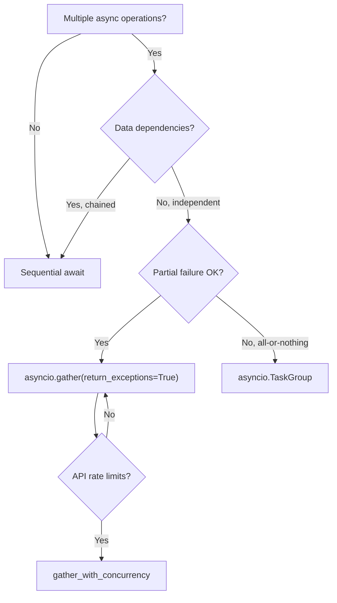
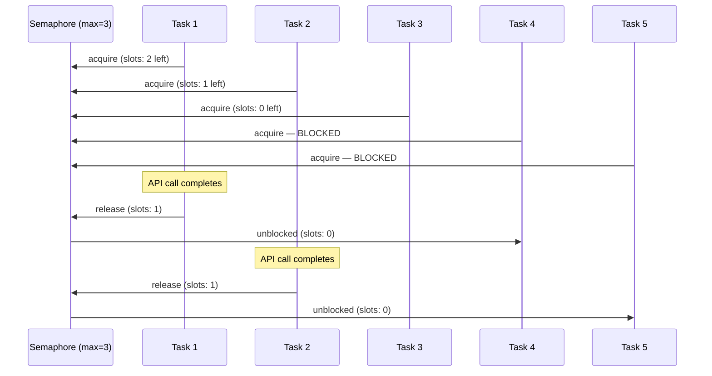
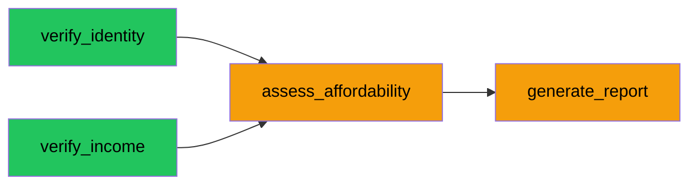
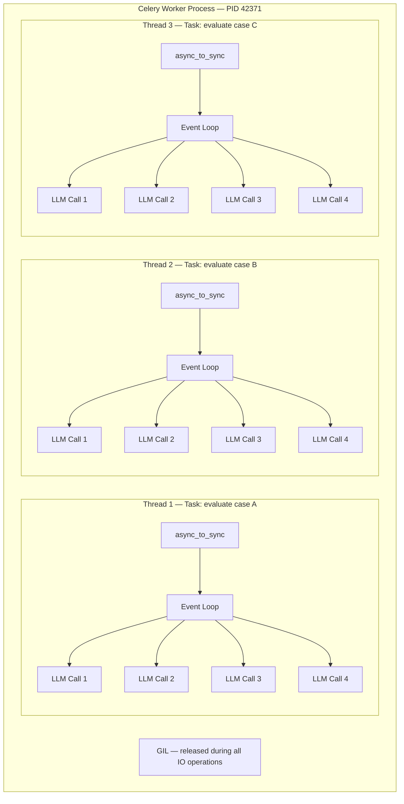
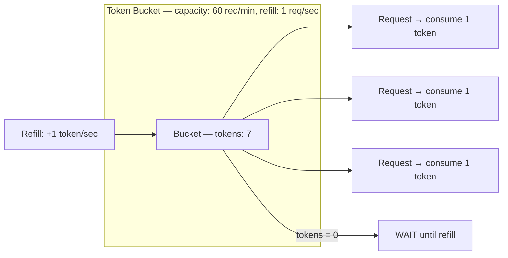
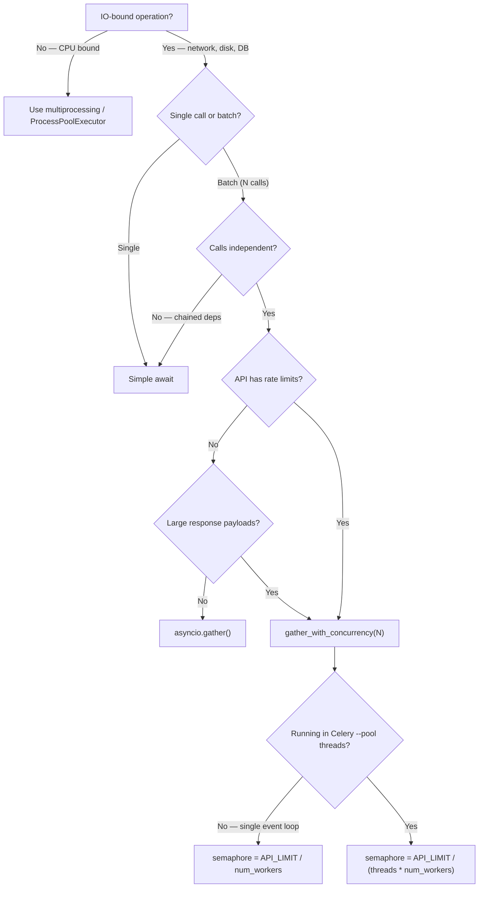

Our Estate OS screening pipeline runs about 15 sequential `await` calls per job — S3 downloads, OCR parsing, LLM classification, identity verification, income assessment, affordability scoring, report generation. Each `await` blocks the coroutine while the event loop sits idle. The amenity discovery feature is worse: 14 sequential HTTP calls to the Google Places API where none depends on the previous result. This is the article about why that happens, how to fix it, and what breaks when you push concurrency too far.

## Table of contents

## The cost of sequential awaits

When you write `for item in items: result = await do_io(item)`, each operation waits for the previous one to finish. If none of these operations depends on the result of the previous one, you are paying a latency tax for nothing.

Here is the amenity discovery use case from Estate OS. The service takes a property's coordinates and finds the nearest hospital, bank, grocery store, school, and so on — one category at a time:

```python
# discover_property_amenities.py — sequential version
async def execute(self, *, property_id: str) -> list[PropertyAmenity]:
    prop = await self.property_repo.get_by_id(UUID(property_id))
    # ...
    amenities: list[PropertyAmenity] = []

    for category in AmenityCategory:  # 9 categories
        try:
            if category == AmenityCategory.GROCERY:
                places = await self._discover_groceries(  # [!code hl]
                    prop.latitude, prop.longitude
                )
            else:
                place_type = CATEGORY_PLACE_TYPE_MAP[category]
                places = await self.places_service.find_nearby(  # [!code hl]
                    latitude=prop.latitude,
                    longitude=prop.longitude,
                    place_type=place_type,
                )
        except Exception:
            log.exception("discovery.category_failed", category=category.value)
            places = []

        # ... rank and collect results
```

Each `find_nearby` call is an HTTP round-trip to the Google Places API — roughly 200ms. Nine categories processed sequentially means ~1.8 seconds of wall time. The grocery discovery method makes 5 additional calls (one per chain) plus a generic search, adding another ~1.2 seconds. Total: ~3 seconds of pure waiting, single-threaded, with the event loop doing nothing between calls.

The same pattern appears in the batch document extraction pipeline:

```python
# process_batch_property_extraction.py — sequential S3 downloads
documents: list[bytes] = []
for key in job.document_keys:
    data = await self.document_storage.download(key)  # [!code hl]
    documents.append(data)
```

And again in the ID document extraction loop, where each iteration makes an LLM call:

```python
# process_batch_property_extraction.py — sequential LLM calls
id_owners: list[dict] = []
for doc_subtype, text in id_docs:
    owner_data = await self.document_data_extractor.extract_property_owner_data(  # [!code hl]
        text, doc_subtype
    )
    id_owners.append(owner_data)
```

None of these iterations depend on each other. The S3 downloads are independent files. The LLM extraction calls operate on different documents. The amenity categories query different place types. They could all run concurrently.

```mermaid
gantt
    title Amenity Discovery — Sequential vs Concurrent
    dateFormat X
    axisFormat %Lms
    section Sequential
    Hospital         :0, 200
    Bank             :200, 400
    Grocery          :400, 600
    School           :600, 800
    Laundry          :800, 1000
    Coffee Shop      :1000, 1200
    Pharmacy         :1200, 1400
    Gym              :1400, 1600
    Restaurant       :1600, 1800
    section Concurrent (max=5)
    Batch 1 (5 APIs) :0, 200
    Batch 2 (4 APIs) :200, 400
```



Sequential: ~1.8s. Concurrent with a limit of 5: ~400ms. Same results, same API calls, 4.5x faster.

## How Python's event loop actually works

To understand why concurrent awaits help, you need to understand what happens when a coroutine hits `await`.

Python's `asyncio` event loop is a single-threaded scheduler built on top of the operating system's IO multiplexing primitives — `epoll` on Linux, `kqueue` on macOS. It maintains a set of file descriptors (sockets, pipes) and a queue of ready-to-run coroutines. The core loop does three things:

1. **Poll** — call `epoll_wait()` / `kqueue()` to check which file descriptors have data ready
2. **Schedule** — mark the coroutines waiting on those descriptors as ready
3. **Run** — execute ready coroutines until they hit the next `await` (suspension point)

A coroutine is a state machine. Each `await` is a yield point where the coroutine saves its local state and returns control to the event loop. The loop is free to run another coroutine while the first one waits for IO.

```mermaid
sequenceDiagram
    participant Loop as Event Loop
    participant A as Coroutine A
    participant B as Coroutine B
    participant C as Coroutine C
    participant Net as Network (S3)

    Loop->>A: resume
    A->>Net: send HTTP request
    A-->>Loop: await (suspend)
    Loop->>B: resume
    B->>Net: send HTTP request
    B-->>Loop: await (suspend)
    Loop->>C: resume
    C->>Net: send HTTP request
    C-->>Loop: await (suspend)
    Note over Loop: poll() — all 3 sockets pending
    Net-->>Loop: A response ready
    Loop->>A: resume with data
    Net-->>Loop: B response ready
    Loop->>B: resume with data
    Net-->>Loop: C response ready
    Loop->>C: resume with data
```

The GIL does not matter here. Python's Global Interpreter Lock prevents multiple threads from executing Python bytecode simultaneously, but `await` does not execute bytecode — it suspends the coroutine and returns to the event loop, which calls into the OS kernel to wait for IO. The GIL is released during socket operations. Async concurrency is not about parallelism (running on multiple cores). It is about not wasting time waiting for network responses when you could be sending more requests.

The key mental model: **every `await` on a network call is an opportunity to do something else**. Sequential awaits in a loop waste those opportunities.

## asyncio.gather, TaskGroup, and when to use each

Python provides three ways to run coroutines concurrently. Each has different failure semantics.

### asyncio.gather

```python
import asyncio

async def fetch_all(urls: list[str]) -> list[Response]:
    coros = [http_client.get(url) for url in urls]
    results = await asyncio.gather(*coros, return_exceptions=True)

    responses = []
    for result in results:
        if isinstance(result, BaseException):
            log.error("Request failed", exc_info=result)
            continue
        responses.append(result)
    return responses
```

`gather` starts all coroutines immediately and returns results in the same order. With `return_exceptions=True`, individual failures become return values instead of propagating — you get partial results. This is what you want when 8 out of 9 amenity categories succeeding is better than failing the entire operation.

### asyncio.TaskGroup (Python 3.11+)

```python
async def fetch_all_or_fail(urls: list[str]) -> list[Response]:
    responses = []
    async with asyncio.TaskGroup() as tg:
        for url in urls:
            tg.create_task(fetch_and_append(url, responses))
    return responses  # only reached if ALL tasks succeeded
```

`TaskGroup` implements structured concurrency. If any task raises an exception, all other tasks are cancelled and the group re-raises an `ExceptionGroup`. This is the right choice when partial results are useless — for example, when you need all parts of a composite API response to build a valid object.

### Sequential awaits

```python
async def screening_pipeline(data: ScreeningInput) -> Report:
    identity = await verify_identity(data)         # step 1
    income = await verify_income(data)             # step 2 (needs data, not identity)
    affordability = await assess_affordability(     # step 3 (needs income result)
        income_result=income
    )
    return await generate_report(                   # step 4 (needs all previous)
        identity=identity,
        income=income,
        affordability=affordability,
    )
```

Sequential awaits are correct when there are data dependencies between steps. The screening pipeline in Estate OS uses LangGraph's `StateGraph` with explicit edges enforcing this order — `assess_affordability` needs the income result, and `generate_report` needs all three.

### Decision framework



## Semaphore-based concurrency control

Unbounded `gather()` is dangerous. If you have 100 documents to download from S3, firing 100 concurrent requests means 100 open TCP connections, 100 response buffers in memory, and likely connection pool exhaustion or rate limit errors from the API provider. For LLM APIs, the situation is worse — each request may consume thousands of tokens, and providers enforce both requests-per-minute (RPM) and tokens-per-minute (TPM) limits.

The fix is a semaphore — a counter that limits how many coroutines can execute their IO simultaneously. Here is the implementation from our case identification system, used in production across 10+ services:

```python
# core/utils.py
async def gather_with_concurrency[T](
    max_concurrency: int, *coroutines: Coroutine[Any, Any, T]
) -> list[T | BaseException]:
    """Run coroutines with bounded concurrency."""
    semaphore = asyncio.Semaphore(max_concurrency)

    async def sem_coroutine(coro: Coroutine[Any, Any, T]) -> T:
        async with semaphore:
            return await coro

    return await asyncio.gather(
        *(sem_coroutine(c) for c in coroutines),
        return_exceptions=True,
    )
```

Eight lines. The semaphore wraps each coroutine — when `max_concurrency` coroutines are already running their IO, the next one blocks at `async with semaphore` until a slot opens. All coroutines are scheduled immediately by `gather`, but only `max_concurrency` of them are executing their actual network call at any given time. The rest are suspended at the semaphore, consuming negligible resources.



### Production usage: 12 LLM assessments in parallel

In our case identification pipeline, each draft case needs 12 independent assessments — data breach detection, company ability to pay, scale of impact, sensitivity of data, and 8 more. Each assessment is a LangChain chain that calls GPT. Running them sequentially takes ~24 seconds (12 calls * ~2s each). Running them with `gather_with_concurrency(4)` takes ~6 seconds.

```python
# case_opportunity_evaluation.py
async_assessments: dict[RelevanceAssessmentResultKeyType, AsyncAssessmentFn] = {
    RelevanceAssessmentResultKeyType.DATA_BREACH: async_assess_if_data_breach,
    RelevanceAssessmentResultKeyType.ABILITY_TO_PAY: async_assess_company_ability_to_pay,
    RelevanceAssessmentResultKeyType.SCALE_OF_IMPACT: async_assess_scale_of_impact,
    RelevanceAssessmentResultKeyType.SENSITIVITY_OF_DATA: async_assess_sensitivity_of_data,
    RelevanceAssessmentResultKeyType.LAWSUIT_FILED: async_assess_if_lawsuit_has_been_filed,
    # ... 7 more assessments
}


async def async_run_assessments(
    *,
    draft_case_evaluation: DraftCaseEvaluation,
    context: DraftCaseContext,
) -> None:
    """Run all assessments concurrently using async I/O."""

    async def _run_single(
        name: RelevanceAssessmentResultKeyType,
        assess_fn: AsyncAssessmentFn,
    ) -> tuple[RelevanceAssessmentResultKeyType, AssessmentResult]:
        try:
            _, result = await assess_fn(context=context)
            return name, result
        except Exception as e:
            logger.exception(f"Error assessing {name}")
            return name, AssessmentResult(
                passed=False,
                reasoning="Error assessing assessment",
                confidence_score=0,
                error=str(e),
            )

    coroutines = [
        _run_single(name, fn)
        for name, fn in async_assessments.items()
    ]
    results = await gather_with_concurrency(4, *coroutines)  # [!code hl]

    for result in results:
        if isinstance(result, BaseException):
            logger.exception(
                "Assessment coroutine raised an exception",
                exc_info=result,
            )
            continue
        name, assessment_response = result
        draft_case_evaluation.agg_result[name.value] = (
            assessment_response.model_dump()
        )
    await draft_case_evaluation.asave(update_fields=["agg_result"])
```

The pattern is consistent: wrap each coroutine in a try/except that returns a typed result, run them through `gather_with_concurrency`, then iterate over results checking for `BaseException`. Individual failures are logged but do not crash the batch.

### Tuning the concurrency value

The right semaphore value depends on the target API:

| Target | Concurrency | Reason |
|--------|-------------|--------|
| LLM APIs (OpenAI) | 3-4 | Token-per-minute limits, high cost per request |
| Web scraping (ScrapingBee) | 5 | Service has its own concurrency limits |
| Content scraping (RSS, HTTP) | 10 | Cheap requests, servers handle parallel well |
| S3 downloads | 5-10 | S3 scales well, bounded by connection pool |
| Embedding generation | 10 | Batch-friendly, lower per-request cost |

Start with a conservative value (3-5), monitor for 429 (Too Many Requests) responses, and increase gradually. If you see memory growth under load, the value is too high.

## Applied: speeding up Estate OS

Three concrete refactors that would bring controlled concurrency to the estate-os-service codebase. These are not applied yet — this section shows the target state.

### 1. Parallel amenity discovery

Before: 9 sequential HTTP calls (~1.8s). After: bounded concurrent calls (~400ms).

```python
# discover_property_amenities.py — concurrent version
async def execute(self, *, property_id: str) -> list[PropertyAmenity]:
    prop = await self.property_repo.get_by_id(UUID(property_id))
    if not prop:
        raise PropertyNotFoundError(property_id)
    if prop.latitude is None or prop.longitude is None:
        raise PropertyMissingCoordinatesError(property_id)

    async def _discover_category(
        category: AmenityCategory,
    ) -> tuple[AmenityCategory, list[Place]]:
        try:
            if category == AmenityCategory.GROCERY:
                places = await self._discover_groceries(
                    prop.latitude, prop.longitude
                )
            else:
                place_type = CATEGORY_PLACE_TYPE_MAP[category]
                places = await self.places_service.find_nearby(
                    latitude=prop.latitude,
                    longitude=prop.longitude,
                    place_type=place_type,
                )
            return category, places
        except Exception:
            log.exception("discovery.category_failed", category=category.value)
            return category, []

    results = await gather_with_concurrency(  # [!code hl]
        5,  # [!code hl]
        *(_discover_category(cat) for cat in AmenityCategory),  # [!code hl]
    )  # [!code hl]

    amenities: list[PropertyAmenity] = []
    now = datetime.now(timezone.utc)
    for result in results:
        if isinstance(result, BaseException):
            log.exception("discovery.coroutine_failed", exc_info=result)
            continue
        category, places = result
        if not places:
            continue
        best = rank_places(places, category)
        top = rank_top_places(places, category, limit=TOP_PLACES_LIMIT)
        amenities.append(PropertyAmenity(
            id=uuid4(),
            property_id=prop.id,
            category=category,
            nearest_name=best.name,
            nearest_distance_meters=best.distance_meters,
            # ... remaining fields
        ))

    await self.amenity_repo.delete_by_property_id(prop.id)
    if amenities:
        amenities = await self.amenity_repo.save_batch(amenities)
    return amenities
```

### 2. Parallel S3 downloads

Before: sequential download loop. After: concurrent with a limit of 5.

```python
# process_batch_property_extraction.py — before
documents: list[bytes] = []
for key in job.document_keys:
    data = await self.document_storage.download(key)  # [!code --]
    documents.append(data)

# after
results = await gather_with_concurrency(  # [!code ++]
    5,  # [!code ++]
    *(self.document_storage.download(key) for key in job.document_keys),  # [!code ++]
)  # [!code ++]
documents = [r for r in results if not isinstance(r, BaseException)]  # [!code ++]
```

S3 has no meaningful rate limit at this scale, and each download is an independent HTTP request. The limit of 5 is to bound peak memory — 5 concurrent PDFs instead of potentially 20.

### 3. Parallel ID document extraction

Before: sequential LLM calls per document. After: concurrent with a limit of 3.

```python
# process_batch_property_extraction.py — before
id_owners: list[dict] = []
for doc_subtype, text in id_docs:
    owner_data = await self.document_data_extractor.extract_property_owner_data(  # [!code --]
        text, doc_subtype  # [!code --]
    )  # [!code --]
    id_owners.append(owner_data)

# after
results = await gather_with_concurrency(  # [!code ++]
    3,  # [!code ++]
    *(  # [!code ++]
        self.document_data_extractor.extract_property_owner_data(text, subtype)  # [!code ++]
        for subtype, text in id_docs  # [!code ++]
    ),  # [!code ++]
)  # [!code ++]
id_owners = [r for r in results if not isinstance(r, BaseException)]  # [!code ++]
```

Concurrency of 3 because each call hits GPT and we want to respect token-per-minute limits. With a typical batch of 2-4 ID documents, this turns 4-8 seconds of sequential LLM calls into ~2 seconds.

### What NOT to parallelize

The LangGraph screening pipeline has real data dependencies:



`verify_identity` and `verify_income` are actually independent — both read from `extracted_data`, neither reads the other's result. In theory, they could run in parallel. But `assess_affordability` needs the income result, and `generate_report` needs all three outputs. The current LangGraph `StateGraph` enforces sequential execution through `add_edge`:

```python
graph.set_entry_point("verify_identity")
graph.add_edge("verify_identity", "verify_income")
graph.add_edge("verify_income", "assess_affordability")
graph.add_edge("assess_affordability", "generate_report")
graph.add_edge("generate_report", END)
```

A custom topology could run identity and income in parallel using LangGraph's branching, but the savings (~2 seconds) do not justify the added complexity for a pipeline that runs once per applicant. Not every sequential await is a problem. Only optimize the hot paths where the multiplier is significant.

## How threads work in Python and Celery thread pool mode

The estate-os-service uses SQS workers with `asyncio.run()` — fully async, single-threaded, no Celery. But many Python services use Celery with thread pool workers, which introduces a different concurrency model. Understanding how threads interact with async code is critical when you combine both.

### Celery's thread pool

When you run `celery -A app worker --pool threads --concurrency 4`, Celery spawns 4 worker threads in a single process. All threads share:

- The same **PID** (process ID)
- The same **memory space** (heap, global variables, module-level state)
- The same **GIL** (Global Interpreter Lock)

The GIL ensures only one thread executes Python bytecode at a time. But for IO-bound Celery tasks, this is fine — while one thread waits for a network response, the GIL is released and another thread can run. This is the same principle as async, but at the OS thread level instead of the coroutine level.

### Bridging sync Celery tasks with async code

Celery task functions are synchronous. To run async code inside them, you use `asgiref.sync.async_to_sync` or `asyncio.run()`. The `async_to_sync` bridge creates a **new event loop in a new background thread** for each invocation:

```python
from asgiref.sync import async_to_sync
from celery import shared_task

@shared_task
def evaluate_case_task(draft_case_uuid: str) -> None:
    # This runs in a Celery worker thread (synchronous context)
    async_to_sync(async_run_single_case_opportunity_evaluation)(
        draft_case_uuid=draft_case_uuid,
    )
```

Each Celery worker thread that calls `async_to_sync` gets its own event loop. Inside that event loop, `gather_with_concurrency` runs N coroutines concurrently.



The effective API concurrency from a single Celery worker is:

**Total concurrent API calls = worker threads * coroutine concurrency per thread**

With 4 threads and `gather_with_concurrency(4)`, that is 16 simultaneous LLM API requests from one process. With 8 threads: 32 requests. This multiplier is invisible if you only look at the semaphore value inside a single task.

## LangChain in threaded Celery: what breaks and why

LangChain objects carry mutable state. When multiple Celery threads share the same LangChain instance, things break in subtle ways.

### ChatOpenAI is not thread-safe

In estate-os-service, the screening assessor creates the LLM instance once in `__init__`:

```python
# langchain_screening.py — instance created once
class LangChainScreeningAssessor:
    def __init__(self, openai_api_key: str, langfuse_config: LangfuseConfig):
        self._llm = ChatOpenAI(  # [!code hl]
            model="gpt-5.4",  # [!code hl]
            api_key=openai_api_key,  # [!code hl]
        )  # [!code hl]
        self._graph = self._build_graph()
```

In the current SQS-worker architecture, this is safe — each message creates a fresh dependency container, so each invocation gets its own `ChatOpenAI` instance. But if this class were used in a Celery thread pool with a shared container, multiple threads would call `self._llm.ainvoke()` on the same object simultaneously. The `ChatOpenAI` client internally tracks request state, retry counters, and callback handlers that are not designed for concurrent mutation.

### The correct pattern: create per-invocation

In the case identification system, LLM instances are created inside each assessment function — never shared across calls:

```python
# Correct: LLM created inside the function, scoped to one invocation
async def async_assess_if_data_breach(
    *, context: DraftCaseContext
) -> tuple[str, AssessmentResult]:
    llm = init_chat_model(model="o3-mini", temperature=0.0)  # [!code hl]
    handler = LangfuseCallbackHandler(  # [!code hl]
        trace_name="assess_data_breach",  # [!code hl]
    )  # [!code hl]
    chain = prompt | llm | parser
    result = await chain.ainvoke(
        input_data,
        config={"callbacks": [handler]},
    )
    return "data_breach", result
```

```python
# Dangerous: LLM shared across threads
class AssessmentService:
    def __init__(self):
        self.llm = ChatOpenAI(model="gpt-5.4")  # shared instance

    async def assess(self, context):  # called from multiple threads
        return await (prompt | self.llm | parser).ainvoke(context)
```

The same applies to `LangfuseCallbackHandler` — it accumulates spans and trace data per-invocation. If two threads share the same handler, their spans interleave and traces become corrupted. Create a fresh handler for each assessment call.

### Event loop isolation

Each Celery thread that calls `async_to_sync()` gets its own event loop in a background thread. This means:

- Coroutines from Thread 1's task run on Event Loop 1
- Coroutines from Thread 2's task run on Event Loop 2
- They never share an event loop, so `asyncio` primitives (like the semaphore in `gather_with_concurrency`) are scoped to a single task

This is important: the `asyncio.Semaphore` inside `gather_with_concurrency` only limits concurrency **within a single task's event loop**. It does not coordinate across threads. Thread 1's semaphore(4) and Thread 2's semaphore(4) are completely independent — the process can still fire 8 concurrent requests.

## Rate limiting and token budgets

When M threads each run N concurrent coroutines, your process sends M * N requests to the same API. OpenAI enforces two types of limits:

- **RPM** (requests per minute) — how many API calls you can make
- **TPM** (tokens per minute) — total input + output tokens across all requests

A single Celery worker with 4 threads and `gather_with_concurrency(4)` can burst 16 requests in under a second. If each request uses ~2,000 tokens, that is 32,000 tokens in one burst. At scale — multiple Celery workers on multiple machines — this hits TPM limits fast.

### Per-thread semaphore is not enough

The semaphore in `gather_with_concurrency` limits concurrency within one event loop (one thread). But the API does not care which thread sent the request. You need process-wide or cluster-wide coordination.

**Process-wide**: Use a `threading.Semaphore` (not `asyncio.Semaphore`) shared across all threads. This requires passing the semaphore into the async code, which breaks the clean separation of `gather_with_concurrency`.

**Cluster-wide**: Use a distributed rate limiter backed by Redis. Each worker checks a shared counter before making an API call. Libraries like `limits` or `redis-rate-limiter` implement the token bucket algorithm:



The token bucket allows bursts (up to bucket capacity) while enforcing a steady-state rate. It maps directly to how OpenAI's rate limits work — you can burst up to RPM, but TPM accumulates over the minute window.

### Practical tuning

For most services, the empirical approach works:

1. Start with `gather_with_concurrency(3)` for LLM calls
2. Monitor for HTTP 429 responses in your logs
3. If no 429s under normal load, increase to 4 or 5
4. If 429s appear, reduce by 1 or add jitter between batches
5. For multi-machine setups, instrument the total RPM across all workers and compare to your API quota

The OpenAI Python client has built-in exponential backoff with retry (configurable via `max_retries`). Combining a semaphore (to prevent bursts) with the client's retry logic (to handle occasional rate limit responses) is usually sufficient for single-process deployments.

## Memory considerations

Each coroutine holds its own stack frame, local variables, and awaited response objects. When you run N coroutines concurrently, you hold N sets of these in memory simultaneously.

For small responses (like LLM assessment results — a few KB of JSON), this is negligible. For large payloads, it adds up:

| Operation | Per-call memory | Concurrent (N=5) | Sequential peak |
|-----------|----------------|-------------------|-----------------|
| S3 PDF download (10MB) | ~10 MB | ~50 MB | ~10 MB |
| LLM assessment result | ~5 KB | ~25 KB | ~5 KB |
| Article scraping (HTML) | ~500 KB | ~2.5 MB | ~500 KB |
| OpenAI embedding batch | ~50 KB | ~250 KB | ~50 KB |

The semaphore in `gather_with_concurrency` naturally bounds peak memory. With concurrency=5, at most 5 response objects exist simultaneously, regardless of how many coroutines are queued. This is a second reason to use bounded concurrency even when the API has no rate limit.

For memory-sensitive workloads, choose the semaphore value based on available memory:

```python
import psutil

def compute_max_concurrency(
    per_call_bytes: int,
    memory_budget_fraction: float = 0.25,
) -> int:
    """Compute max concurrency based on available memory."""
    available = psutil.virtual_memory().available
    budget = int(available * memory_budget_fraction)
    max_concurrent = budget // per_call_bytes
    return max(1, min(max_concurrent, 20))  # clamp to [1, 20]

# Example: 10MB PDFs, use at most 25% of available memory
concurrency = compute_max_concurrency(per_call_bytes=10 * 1024 * 1024)
results = await gather_with_concurrency(concurrency, *download_coros)
```

In Celery thread pool mode, remember that all threads share the same heap. If 4 threads each run `gather_with_concurrency(5)` downloading 10MB PDFs, the process could hold 4 * 5 * 10MB = 200MB of PDF data simultaneously. Set the per-thread concurrency based on the **total** memory budget divided by the number of worker threads.

## Putting it together: a decision framework



The formula: **semaphore value = API rate limit / (threads per worker * number of worker processes)**. If your OpenAI quota is 60 RPM and you have 2 Celery workers each with 4 threads, the per-thread semaphore should be `60 / (4 * 2) = ~7`. In practice, leave headroom — use 5.

## Key takeaways

1. **Sequential `await` in a loop is the async equivalent of synchronous blocking.** The event loop is idle while you wait for one network response when it could be dispatching five.

2. **`asyncio.gather()` with `return_exceptions=True` is the workhorse for independent IO operations.** It gives you partial results, preserves ordering, and the failure of one call does not crash the batch.

3. **Always bound concurrency with a semaphore when hitting external APIs.** The `gather_with_concurrency` pattern is 8 lines of code and belongs in every async Python project. Start conservative (3-5), tune based on 429s.

4. **In Celery thread pool mode, total API concurrency = threads * coroutine concurrency per thread.** A semaphore value of 4 in your code means 16 concurrent requests if you have 4 worker threads. Tune the semaphore based on the process-wide budget, not the per-task budget.

5. **LangChain and LangFuse objects are not thread-safe.** Create LLM instances and callback handlers inside each task invocation. Never share them across threads or store them as class-level attributes in a threaded environment.

6. **The semaphore bounds both API pressure and peak memory.** For large payloads (S3 downloads, document parsing), the memory ceiling is often a tighter constraint than the rate limit.

7. **Not everything should be parallelized.** If step N needs the result of step N-1, sequential `await` is correct. Optimize the hot paths where the latency multiplier is significant — a loop of 9 independent API calls is worth parallelizing; a chain of 4 dependent LLM steps is not.

## References

- [Python asyncio documentation](https://docs.python.org/3/library/asyncio.html) — event loop, `gather`, `TaskGroup`, `Semaphore`
- [PEP 3156 — Asynchronous IO Support Rebooted](https://peps.python.org/pep-3156/) — the foundational PEP behind `asyncio`
- [Celery — Concurrency with Eventlet and Gevent](https://docs.celeryq.dev/en/stable/userguide/concurrency/index.html) — thread pool mode and worker concurrency
- [OpenAI Rate Limits](https://platform.openai.com/docs/guides/rate-limits) — RPM, TPM, and how they apply to concurrent requests
- [Notes on structured concurrency, or: Go statement considered harmful](https://vorpus.org/blog/notes-on-structured-concurrency-or-go-statement-considered-harmful/) — Nathaniel J. Smith's essay on why TaskGroup semantics matter
- [Real Python — Async IO in Python: A Complete Walkthrough](https://realpython.com/async-io-python/) — comprehensive guide for the event loop mental model
- [asgiref source — async_to_sync](https://github.com/django/asgiref/blob/main/asgiref/sync.py) — how the sync-to-async bridge creates event loops per thread
