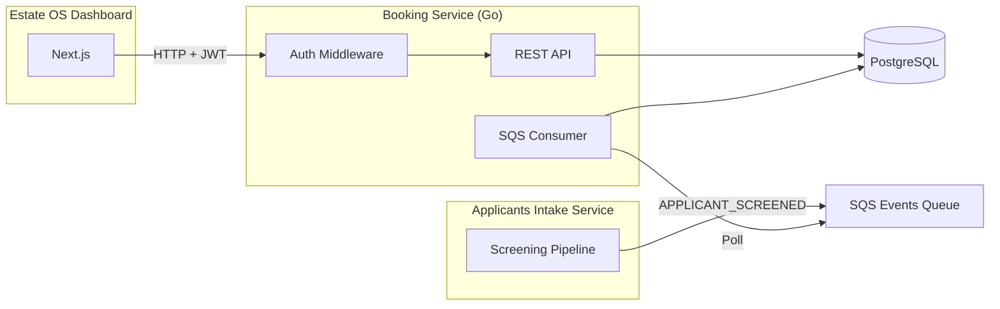
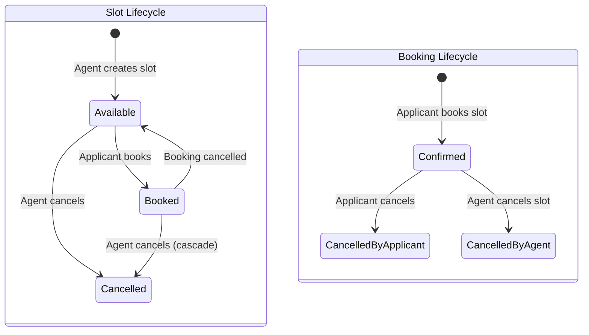
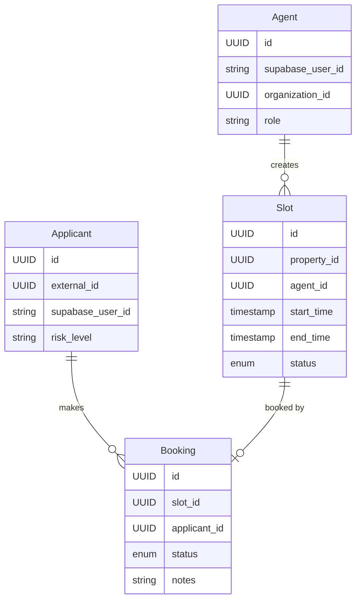

How we built the booking service — the first Go service in the Predileto ecosystem — covering slot management, optimistic locking to prevent double-bookings, SQS-driven applicant ingestion, JWT auth with dual-role resolution, and E2E tests against real PostgreSQL using testcontainers.

## Table of contents

## Why Go for this service

The Python services in Predileto (property ingestion, applicant screening, contract intelligence) are AI-heavy — they spend most of their time waiting on Reducto OCR and GPT-5.4 calls. Async Python with FastAPI is a natural fit there.

The booking service is different. No AI, no document processing. It's a CRUD-heavy API with strict concurrency requirements — two applicants booking the same slot at the same time must result in exactly one booking and one conflict error. Go's type system, explicit error handling, and performance characteristics make it a better fit for this kind of service.

The tech stack:

- **Go 1.26** with standard library HTTP server
- **PostgreSQL 16** with pgx driver and sqlc for type-safe queries
- **oapi-codegen** for OpenAPI-first server generation
- **counterfeiter** for mock generation
- **testcontainers-go** for E2E tests with real PostgreSQL
- **Supabase JWT** for authentication (shared with the Next.js frontend)

## Architecture overview

The booking service handles property visit scheduling. Agents create available time slots for their properties, and screened applicants book those slots.



The service consumes `APPLICANT_SCREENED` events from the applicants intake service via SQS. When a tenant passes screening (LOW or MEDIUM risk), the booking service creates a local applicant record so they can authenticate and book visits.



## Project structure

```
booking-management-service/
├── cmd/
│   └── rest-server/
│       └── main.go                  # Composition root
├── internal/
│   ├── booking.go                   # Booking entity + state machine
│   ├── slot.go                      # Slot entity + state machine
│   ├── agent.go                     # Agent entity
│   ├── applicant.go                 # Applicant entity + screening event
│   ├── auth.go                      # AuthClaims + CallerRole
│   ├── errors.go                    # Typed error codes
│   ├── service/
│   │   ├── ports.go                 # Repository + notification interfaces
│   │   ├── booking.go               # BookingService
│   │   ├── slot.go                  # SlotService
│   │   ├── applicant.go             # ApplicantService
│   │   └── servicetesting/          # Generated mocks (counterfeiter)
│   ├── postgresql/
│   │   ├── booking.go               # Booking repository
│   │   ├── slot.go                  # Slot repository (optimistic lock)
│   │   ├── query/                   # SQL source files
│   │   └── db/                      # Generated sqlc code
│   ├── rest/
│   │   ├── handler.go               # HTTP handlers
│   │   ├── middleware.go            # JWT auth + identity resolution
│   │   ├── server.gen.go           # Generated OpenAPI server
│   │   └── *_e2e_test.go           # E2E tests with testcontainers
│   ├── notification/
│   │   └── notification.go          # LogNotifier (MVP placeholder)
│   └── sqs/
│       └── consumer.go              # APPLICANT_SCREENED consumer
├── db/migrations/
│   └── 001_create_booking_tables.sql
├── openapi/
│   └── openapi3.yaml                # API spec (source of truth)
└── compose.yml                       # Local dev: PostgreSQL + Tern migrations
```

The Go convention of a flat `internal/` package keeps domain entities at the top level. Services depend on repository interfaces defined in `service/ports.go`, and adapters implement those interfaces in `postgresql/`, `sqs/`, and `notification/`.

## Domain models

### Slot

A slot represents a time window when an agent is available for a property visit:

```go
type SlotStatus int8

const (
    SlotStatusAvailable SlotStatus = iota
    SlotStatusBooked
    SlotStatusCancelled
)

type Slot struct {
    ID             string
    PropertyID     string
    AgentID        string
    OrganizationID string
    StartTime      time.Time
    EndTime        time.Time
    Status         SlotStatus
    BookingID      *string
    CreatedAt      time.Time
    UpdatedAt      time.Time
}

func (s *Slot) Book(bookingID string) error {
    if s.Status != SlotStatusAvailable {
        return NewErrorf(ErrorCodeConflict, "slot is not available")
    }
    s.Status = SlotStatusBooked
    s.BookingID = &bookingID
    return nil
}

func (s *Slot) Cancel() error {
    if s.Status == SlotStatusCancelled {
        return NewErrorf(ErrorCodeConflict, "slot is already cancelled")
    }
    s.Status = SlotStatusCancelled
    return nil
}

func (s *Slot) Release() error {
    if s.Status != SlotStatusBooked {
        return NewErrorf(ErrorCodeConflict, "slot is not booked")
    }
    s.Status = SlotStatusAvailable
    s.BookingID = nil
    return nil
}
```

The factory validates parameters at construction time:

```go
type CreateSlotParams struct {
    PropertyID     string
    AgentID        string
    OrganizationID string
    StartTime      time.Time
    EndTime        time.Time
}

func (p CreateSlotParams) Validate() error {
    // Validates: required fields, EndTime > StartTime, no past times
}

func NewSlot(params CreateSlotParams) (Slot, error) {
    if err := params.Validate(); err != nil {
        return Slot{}, err
    }
    return Slot{
        ID:             uuid.NewString(),
        PropertyID:     params.PropertyID,
        AgentID:        params.AgentID,
        OrganizationID: params.OrganizationID,
        StartTime:      params.StartTime,
        EndTime:        params.EndTime,
        Status:         SlotStatusAvailable,
    }, nil
}
```

### Booking

A booking links an applicant to a slot. It can only be created from an available slot:

```go
type BookingStatus int8

const (
    BookingStatusConfirmed BookingStatus = iota
    BookingStatusCancelledByApplicant
    BookingStatusCancelledByAgent
)

type Booking struct {
    ID             string
    SlotID         string
    ApplicantID    string
    PropertyID     string
    OrganizationID string
    Status         BookingStatus
    Notes          string
    CreatedAt      time.Time
    UpdatedAt      time.Time
}

func NewBooking(slot Slot, applicantID, notes string) (Booking, error) {
    if !slot.IsAvailable() {
        return Booking{}, NewErrorf(ErrorCodeConflict, "slot is not available")
    }
    return Booking{
        ID:             uuid.NewString(),
        SlotID:         slot.ID,
        ApplicantID:    applicantID,
        PropertyID:     slot.PropertyID,
        OrganizationID: slot.OrganizationID,
        Status:         BookingStatusConfirmed,
        Notes:          notes,
    }, nil
}

func (b *Booking) CancelByApplicant() error {
    if !b.IsConfirmed() {
        return NewErrorf(ErrorCodeConflict, "booking is not confirmed")
    }
    b.Status = BookingStatusCancelledByApplicant
    return nil
}

func (b *Booking) CancelByAgent() error {
    if !b.IsConfirmed() {
        return NewErrorf(ErrorCodeConflict, "booking is not confirmed")
    }
    b.Status = BookingStatusCancelledByAgent
    return nil
}
```

The cancellation distinguishes between who cancelled — this matters for notifications and audit.

### Applicant

Applicants are created from screening events. Only LOW and MEDIUM risk applicants are accepted:

```go
type RiskLevel string

const (
    RiskLevelLow    RiskLevel = "LOW"
    RiskLevelMedium RiskLevel = "MEDIUM"
    RiskLevelHigh   RiskLevel = "HIGH"
)

type Applicant struct {
    ID             string
    ExternalID     string      // From screening service
    SupabaseUserID *string     // Null until first login
    OrganizationID string
    Name           string
    Email          string
    RiskLevel      RiskLevel
    CreatedAt      time.Time
}

func NewApplicantFromScreening(event ApplicantScreenedEvent) (Applicant, error) {
    if event.RiskLevel == RiskLevelHigh {
        return Applicant{}, NewErrorf(ErrorCodeInvalidArgument,
            "high risk applicants cannot be registered")
    }
    return Applicant{
        ID:             uuid.NewString(),
        ExternalID:     event.ApplicantID,
        OrganizationID: event.OrganizationID,
        Name:           event.Name,
        Email:          event.Email,
        RiskLevel:      event.RiskLevel,
    }, nil
}
```

The `SupabaseUserID` is null when the applicant is first created from an SQS event. It gets linked when they authenticate for the first time via the auth middleware.

### Dual-role auth

The system has two caller roles — agents and applicants — sharing the same Supabase JWT:

```go
type CallerRole int8

const (
    CallerRoleAgent CallerRole = iota
    CallerRoleApplicant
)

type AuthClaims struct {
    UserID         string
    OrganizationID string
    Role           CallerRole
    Email          string
}

func (c *AuthClaims) IsAgent() bool     { return c.Role == CallerRoleAgent }
func (c *AuthClaims) IsApplicant() bool { return c.Role == CallerRoleApplicant }
```

## Optimistic locking for slot booking

The critical design challenge: two applicants trying to book the same slot at the same time. We solve this with optimistic locking at the SQL level.

### The SQL

```sql
-- Only succeeds if slot is currently 'available'
UPDATE slots
SET status = 'booked', updated_at = now()
WHERE id = $1 AND status = 'available'
RETURNING id;
```

If another transaction already changed the status to `booked`, this returns zero rows. The repository maps that to a conflict error:

```go
func (s *Slot) MarkBooked(ctx context.Context, slotID string) error {
    _, err := s.q.MarkSlotBooked(ctx, uuid.MustParse(slotID))
    if err != nil {
        if errors.Is(err, pgx.ErrNoRows) {
            return internal.NewErrorf(internal.ErrorCodeConflict,
                "slot is no longer available")
        }
    }
    return err
}
```

### The service orchestration

```go
func (s *BookingService) Create(
    ctx context.Context, slotID, applicantID, notes string,
) (internal.Booking, error) {
    // 1. Fetch and validate slot
    slot, err := s.slotRepo.Find(ctx, slotID)
    if err != nil {
        return internal.Booking{}, err
    }

    // 2. Domain validates slot is available
    booking, err := internal.NewBooking(slot, applicantID, notes)
    if err != nil {
        return internal.Booking{}, err
    }

    // 3. Atomically mark slot as booked (optimistic lock)
    if err := s.slotRepo.MarkBooked(ctx, slotID); err != nil {
        return internal.Booking{}, err
    }

    // 4. Insert booking record
    created, err := s.bookingRepo.Create(ctx, booking)
    if err != nil {
        // Rollback: release slot
        _ = s.slotRepo.MarkAvailable(ctx, slotID)
        return internal.Booking{}, err
    }

    // 5. Fire-and-forget notification
    _ = s.notifier.BookingConfirmed(ctx, created)

    return created, nil
}
```

The database constraint `UNIQUE(slot_id)` on the bookings table provides a second layer of protection. Even if the optimistic lock somehow fails, the unique constraint prevents duplicate bookings.

## JWT auth with identity resolution

Both agents and applicants authenticate with Supabase JWTs. The middleware resolves which role the caller has:

```go
func (m *AuthMiddleware) resolveIdentity(
    ctx context.Context, supabaseUserID, email, orgID string,
) (*internal.AuthClaims, error) {
    // 1. Try to find agent
    agent, err := m.agentRepo.FindBySupabaseUserID(ctx, supabaseUserID)
    if err == nil {
        return &internal.AuthClaims{
            UserID:         agent.ID,
            OrganizationID: agent.OrganizationID,
            Role:           internal.CallerRoleAgent,
            Email:          agent.Email,
        }, nil
    }

    // 2. Try to find applicant
    applicant, err := m.appRepo.FindBySupabaseUserID(ctx, supabaseUserID)
    if err == nil {
        return &internal.AuthClaims{
            UserID:         applicant.ID,
            OrganizationID: applicant.OrganizationID,
            Role:           internal.CallerRoleApplicant,
            Email:          applicant.Email,
        }, nil
    }

    // 3. JIT create agent if org ID provided
    if orgID != "" && email != "" {
        newAgent, _ := internal.NewAgent(supabaseUserID, orgID, email, email)
        created, createErr := m.agentRepo.Create(ctx, newAgent)
        if createErr != nil {
            return nil, createErr
        }
        return &internal.AuthClaims{
            UserID:         created.ID,
            OrganizationID: created.OrganizationID,
            Role:           internal.CallerRoleAgent,
            Email:          created.Email,
        }, nil
    }

    return nil, internal.NewErrorf(internal.ErrorCodeUnauthorized, "user not found")
}
```

The resolution order matters: agent first, then applicant, then JIT agent creation. This means the first time an agent from the Estate OS dashboard calls the booking API, their agent record is created automatically.

## SQS event consumption

The booking service consumes `APPLICANT_SCREENED` events published by the applicants intake service:

```go
type Consumer struct {
    client       SQSClient
    queueURL     string
    applicantSvc *service.ApplicantService
    logger       *zap.Logger
}

func (c *Consumer) Run(ctx context.Context) error {
    for {
        select {
        case <-ctx.Done():
            return nil
        default:
        }

        messages, err := c.client.ReceiveMessages(ctx, c.queueURL, 10, 20)
        if err != nil {
            c.logger.Error("sqs receive error", zap.Error(err))
            continue
        }

        for _, msg := range messages {
            c.processMessage(ctx, msg)
        }
    }
}

func (c *Consumer) processMessage(ctx context.Context, msg Message) {
    var envelope sqsEventEnvelope
    if err := json.Unmarshal([]byte(msg.Body), &envelope); err != nil {
        _ = c.client.DeleteMessage(ctx, c.queueURL, msg.ReceiptHandle)
        return
    }

    if envelope.EventType != "APPLICANT_SCREENED" {
        _ = c.client.DeleteMessage(ctx, c.queueURL, msg.ReceiptHandle)
        return
    }

    _, err := c.applicantSvc.CreateFromScreening(ctx, envelope.ApplicantScreenedEvent)
    if err != nil {
        // Don't delete — SQS will retry after visibility timeout
        return
    }

    _ = c.client.DeleteMessage(ctx, c.queueURL, msg.ReceiptHandle)
}
```

The consumer runs as a goroutine alongside the HTTP server. Long-polling with a 20-second wait keeps SQS costs minimal. Idempotency is handled by the `ApplicantService` — duplicate events for the same `external_id` are silently ignored.

## The database schema

```sql
CREATE TABLE agents (
    id                UUID DEFAULT gen_random_uuid() PRIMARY KEY,
    supabase_user_id  TEXT NOT NULL UNIQUE,
    organization_id   UUID NOT NULL,
    name              TEXT NOT NULL,
    email             TEXT NOT NULL,
    role              TEXT NOT NULL DEFAULT 'member',
    created_at        TIMESTAMP WITH TIME ZONE DEFAULT now() NOT NULL
);

CREATE TABLE applicants (
    id                UUID DEFAULT gen_random_uuid() PRIMARY KEY,
    external_id       UUID NOT NULL UNIQUE,
    supabase_user_id  TEXT,
    organization_id   UUID NOT NULL,
    name              TEXT NOT NULL,
    email             TEXT NOT NULL,
    risk_level        TEXT NOT NULL DEFAULT 'LOW',
    created_at        TIMESTAMP WITH TIME ZONE DEFAULT now() NOT NULL
);

CREATE TYPE slot_status AS ENUM ('available', 'booked', 'cancelled');

CREATE TABLE slots (
    id                UUID DEFAULT gen_random_uuid() PRIMARY KEY,
    property_id       UUID NOT NULL,
    agent_id          UUID NOT NULL REFERENCES agents(id),
    organization_id   UUID NOT NULL,
    start_time        TIMESTAMP WITH TIME ZONE NOT NULL,
    end_time          TIMESTAMP WITH TIME ZONE NOT NULL,
    status            slot_status DEFAULT 'available' NOT NULL,
    created_at        TIMESTAMP WITH TIME ZONE DEFAULT now() NOT NULL,
    updated_at        TIMESTAMP WITH TIME ZONE DEFAULT now() NOT NULL,
    CONSTRAINT valid_time_range CHECK (end_time > start_time)
);

CREATE TYPE booking_status AS ENUM (
    'confirmed', 'cancelled_by_applicant', 'cancelled_by_agent'
);

CREATE TABLE bookings (
    id                UUID DEFAULT gen_random_uuid() PRIMARY KEY,
    slot_id           UUID NOT NULL REFERENCES slots(id) UNIQUE,
    applicant_id      UUID NOT NULL REFERENCES applicants(id),
    property_id       UUID NOT NULL,
    organization_id   UUID NOT NULL,
    status            booking_status DEFAULT 'confirmed' NOT NULL,
    notes             TEXT DEFAULT '' NOT NULL,
    created_at        TIMESTAMP WITH TIME ZONE DEFAULT now() NOT NULL,
    updated_at        TIMESTAMP WITH TIME ZONE DEFAULT now() NOT NULL
);
```

Key constraints:
- `bookings.slot_id` is `UNIQUE` — one booking per slot, enforced at the database level
- `slots` has a `CHECK` constraint: `end_time > start_time`
- `applicants.external_id` is `UNIQUE` — prevents duplicate ingestion from SQS

Indexes on `property_id + status`, `agent_id`, `organization_id`, and `start_time` support the most common query patterns.

## OpenAPI-first development

The API spec in `openapi/openapi3.yaml` is the source of truth. Server stubs are generated with oapi-codegen:

```
openapi3.yaml → oapi-codegen → server.gen.go (types + strict handler interface)
```

The handler implements the generated interface:

```go
type BookingHandler struct {
    slotSvc    *service.SlotService
    bookingSvc *service.BookingService
}

func (h *BookingHandler) CreateBooking(
    ctx context.Context, req CreateBookingRequestObject,
) (CreateBookingResponseObject, error) {
    claims := AuthFromContext(ctx)
    if claims == nil || !claims.IsApplicant() {
        return CreateBooking401JSONResponse{Error: "unauthorized"}, nil
    }

    booking, err := h.bookingSvc.Create(
        ctx, req.Body.SlotID.String(), claims.UserID, *req.Body.Notes,
    )
    if err != nil {
        return CreateBooking409JSONResponse{Error: err.Error()}, nil
    }

    return CreateBooking201JSONResponse{
        BookingResponseJSONResponse{Booking: bookingToAPI(booking)},
    }, nil
}
```

The generated code ensures type safety between the OpenAPI spec and the handler implementation. If the spec changes, the handler won't compile until it matches.

### API endpoints

| Method | Path | Role | Description |
|--------|------|------|-------------|
| `POST` | `/api/v1/slots` | Agent | Create available time slot |
| `GET` | `/api/v1/slots` | Agent | List agent's slots |
| `GET` | `/api/v1/slots/{id}` | Any | Get slot details |
| `DELETE` | `/api/v1/slots/{id}` | Agent | Cancel slot (cascades to booking) |
| `GET` | `/api/v1/properties/{id}/slots` | Any | List available slots for property |
| `POST` | `/api/v1/bookings` | Applicant | Book a slot |
| `GET` | `/api/v1/bookings` | Any | List bookings (by role) |
| `GET` | `/api/v1/bookings/{id}` | Any | Get booking details |
| `DELETE` | `/api/v1/bookings/{id}` | Applicant | Cancel booking |

## Slot cancellation with cascade

When an agent cancels a slot that has an active booking, the booking must be cancelled too:

```go
func (s *SlotService) Cancel(ctx context.Context, slotID, agentID string) error {
    slot, err := s.slotRepo.Find(ctx, slotID)
    if err != nil {
        return err
    }

    if !slot.BelongsToAgent(agentID) {
        return internal.NewErrorf(internal.ErrorCodeForbidden,
            "slot does not belong to agent")
    }

    // If booked, cascade cancel the booking
    var booking *internal.Booking
    if slot.Status == internal.SlotStatusBooked {
        b, findErr := s.bookingRepo.FindBySlotID(ctx, slotID)
        if findErr == nil {
            if err := b.CancelByAgent(); err == nil {
                _ = s.bookingRepo.Cancel(ctx, b.ID, b.Status)
                booking = &b
            }
        }
    }

    if err := slot.Cancel(); err != nil {
        return err
    }

    if err := s.slotRepo.Cancel(ctx, slotID); err != nil {
        return err
    }

    _ = s.notifier.SlotCancelled(ctx, slot, booking)
    return nil
}
```

The notification receives both the slot and the optional booking, so it can inform the applicant if their visit was cancelled by the agent.

## E2E tests with testcontainers

Every E2E test spins up a real PostgreSQL instance using testcontainers-go, runs the migration, wires the full handler stack, and makes HTTP requests against it.

### Test server setup

```go
func newTestServer(tb testing.TB) *testServer {
    ctx := context.Background()

    pgContainer, err := tpostgres.Run(ctx,
        "postgres:16.2-bullseye",
        tpostgres.WithDatabase("testdb"),
        tpostgres.WithUsername("testuser"),
        tpostgres.WithPassword("testpass"),
        tpostgres.BasicWaitStrategies(),
    )
    require.NoError(tb, err)
    tb.Cleanup(func() { pgContainer.Terminate(ctx) })

    pool, err := pgxpool.New(ctx, pgContainer.MustConnectionString(ctx))
    require.NoError(tb, err)

    runMigrations(tb, pool)

    // Wire full handler stack (same as production)
    agentRepo := postgresql.NewAgent(pool)
    applicantRepo := postgresql.NewApplicant(pool)
    slotRepo := postgresql.NewSlot(pool)
    bookingRepo := postgresql.NewBooking(pool)
    notifier := notification.NewLogNotifier(logger)

    slotSvc := service.NewSlotService(logger, slotRepo, bookingRepo, notifier)
    bookingSvc := service.NewBookingService(logger, bookingRepo, slotRepo, notifier)

    handler := rest.NewBookingHandler(slotSvc, bookingSvc)
    authMw := rest.NewAuthMiddleware(testJWTSecret, agentRepo, applicantRepo, logger)

    // httptest.Server with full middleware chain
    srv := httptest.NewServer(/* ... */)
    return &testServer{Server: srv, pool: pool}
}
```

### Test fixtures

Seed helpers create test data directly through repositories:

```go
func (ts *testServer) seedAgent(
    tb testing.TB, supabaseUserID, orgID, name, email string,
) internal.Agent {
    repo := postgresql.NewAgent(ts.pool)
    agent, err := internal.NewAgent(supabaseUserID, orgID, name, email)
    require.NoError(tb, err)
    created, err := repo.Create(context.Background(), agent)
    require.NoError(tb, err)
    return created
}

func (ts *testServer) seedSlot(
    tb testing.TB, agentID, orgID, propertyID string,
) internal.Slot {
    // Creates slot 24-25 hours in the future
}
```

### JWT helpers

Tests generate valid Supabase-compatible JWTs:

```go
func makeJWT(secret, sub, email string) string {
    claims := jwt.MapClaims{
        "sub":   sub,
        "email": email,
        "aud":   "authenticated",
        "exp":   time.Now().Add(time.Hour).Unix(),
        "iat":   time.Now().Unix(),
    }
    token := jwt.NewWithClaims(jwt.SigningMethodHS256, claims)
    tokenStr, _ := token.SignedString([]byte(secret))
    return tokenStr
}
```

### Test cases

The E2E suite covers the critical paths:

```go
func TestCreateBooking_Applicant(t *testing.T) {
    ts := newTestServer(t)
    orgID := newUUID()
    propertyID := newUUID()

    // Setup
    agent := ts.seedAgent(t, newUUID(), orgID, "Agent Smith", "agent@test.com")
    slot := ts.seedSlot(t, agent.ID, orgID, propertyID)
    applicantUID := newUUID()
    ts.seedApplicant(t, newUUID(), applicantUID, orgID, "Tenant", "tenant@test.com")

    // Act: book the slot
    body := map[string]any{"slot_id": slot.ID, "notes": "Looking forward to it!"}
    resp := doJSON("POST", ts.URL+"/api/v1/bookings", body,
        applicantToken(applicantUID, "tenant@test.com"), "")

    // Assert
    assert.Equal(t, http.StatusCreated, resp.StatusCode)
    result := decodeJSON[map[string]any](t, resp)
    assert.Equal(t, "confirmed", result["booking"].(map[string]any)["status"])
}

func TestCreateBooking_DoubleBookingConflict(t *testing.T) {
    ts := newTestServer(t)
    // ... seed slot, 2 applicants

    // First booking succeeds
    resp1 := doJSON("POST", ts.URL+"/api/v1/bookings", body1, token1, "")
    assert.Equal(t, http.StatusCreated, resp1.StatusCode)

    // Second booking on same slot returns 409
    resp2 := doJSON("POST", ts.URL+"/api/v1/bookings", body2, token2, "")
    assert.Equal(t, http.StatusConflict, resp2.StatusCode)
}

func TestCancelSlot_OtherAgentForbidden(t *testing.T) {
    // Agent 1 creates slot, Agent 2 tries to cancel -> 403
}

func TestCancelBooking_ReleasesSlot(t *testing.T) {
    // Book a slot, cancel it, verify slot is available again
}
```

The double-booking test is the most important — it proves the optimistic locking works end-to-end through the full HTTP stack with a real PostgreSQL instance.

## Composition root

All dependencies are wired in `main.go` — no service locator, no reflection, just constructor injection:

```go
func newServer(conf serverConfig) *http.Server {
    agentRepo := postgresql.NewAgent(conf.DB)
    applicantRepo := postgresql.NewApplicant(conf.DB)
    slotRepo := postgresql.NewSlot(conf.DB)
    bookingRepo := postgresql.NewBooking(conf.DB)

    notifier := notification.NewLogNotifier(conf.Logger)

    slotSvc := service.NewSlotService(conf.Logger, slotRepo, bookingRepo, notifier)
    bookingSvc := service.NewBookingService(conf.Logger, bookingRepo, slotRepo, notifier)

    handler := rest.NewBookingHandler(slotSvc, bookingSvc)
    authMw := rest.NewAuthMiddleware(
        conf.JWTSecret, agentRepo, applicantRepo, conf.Logger,
    )

    strictHandler := rest.NewStrictHandler(handler, nil)

    options := rest.StdHTTPServerOptions{
        Middlewares: []rest.MiddlewareFunc{logging, authMw.Middleware},
    }

    return &http.Server{
        Handler:           rest.HandlerWithOptions(strictHandler, options),
        Addr:              conf.Address,
        ReadTimeout:       5 * time.Second,
        ReadHeaderTimeout: 5 * time.Second,
        WriteTimeout:      10 * time.Second,
        IdleTimeout:       30 * time.Second,
    }
}
```

The SQS consumer starts as a separate goroutine, with the same applicant repository wired through the service layer.

## Entity relationships



## Key takeaways

- **Optimistic locking at SQL level prevents double-bookings** — `UPDATE ... WHERE status = 'available' RETURNING id` is atomic and race-free. If two transactions compete, exactly one wins and the other gets zero rows. No distributed locks, no Redis, just PostgreSQL.
- **OpenAPI-first with code generation catches contract drift** — the generated strict handler interface means the compiler enforces API compatibility. If someone changes the spec, the handler won't compile until it matches. This is more reliable than runtime validation.
- **Dual-role auth with JIT creation simplifies onboarding** — agents are created on first API call, applicants are created from SQS events. No separate registration flow needed for either role. The auth middleware resolves identity transparently.
- **Testcontainers give real E2E confidence** — spinning up PostgreSQL 16 in a container for each test is slower than mocks, but it catches SQL bugs, constraint violations, and migration issues that mocks would miss. The double-booking test wouldn't work with a mock.
- **sqlc turns SQL into type-safe Go** — instead of an ORM guessing your queries, you write SQL and sqlc generates typed Go functions. The `MarkSlotBooked` query with its `WHERE status = 'available'` clause is exactly what runs in production.
- **SQS event consumption with idempotency makes cross-service integration safe** — duplicate `APPLICANT_SCREENED` events are silently ignored thanks to the `external_id` unique constraint. Messages that fail processing stay in the queue for automatic retry.
- **Fire-and-forget notifications keep the critical path fast** — the booking service doesn't wait for email delivery. The `NotificationSender` port is a log-only stub now, but swapping it for SES or a webhook requires changing one adapter.
