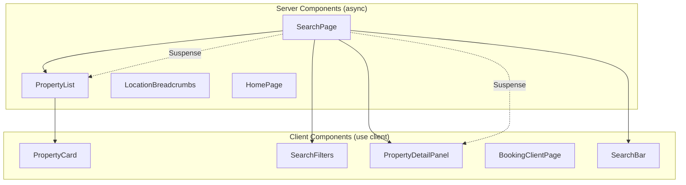
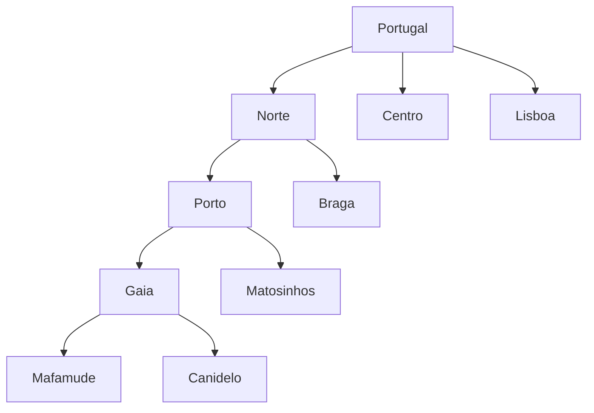
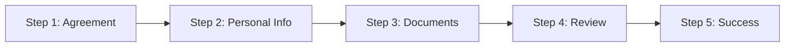

How we built the consumer-facing property search portal — a Next.js 16 application with hybrid server/client rendering, URL-driven state management, Portugal's full location hierarchy as a navigation system, and comprehensive test coverage with Cypress E2E and Jest component tests.

## Table of contents

## Tech stack

- **Next.js 16.1** with App Router and React 19
- **TypeScript** in strict mode
- **Tailwind CSS v4** with custom theme properties
- **Supabase** for PostgreSQL queries (property listings)
- **Elasticsearch** for full-text search
- **react-hook-form** + **Zod** for form validation
- **Framer Motion** for step transitions in the booking flow
- **PostHog** for analytics and error tracking
- **MSW** (Mock Service Worker) for API mocking in tests
- **Cypress 15** for E2E tests
- **Jest 30** + **Testing Library** for component tests

## Project structure

```
src/
├── app/
│   ├── [locale]/
│   │   ├── layout.tsx                    # Root layout with locale context
│   │   ├── (main)/                       # Route group: search & listings
│   │   │   ├── page.tsx                  # Homepage (server)
│   │   │   ├── comprar/[...location]/    # Buy search (server)
│   │   │   ├── arrendar/[...location]/   # Rent search (server)
│   │   │   ├── imovel/[id]/             # Property detail (server → client)
│   │   │   └── blog/                     # Blog pages (server)
│   │   └── (booking)/
│   │       └── agendar/[propertyId]/     # Booking wizard (server → client)
│   └── api/
│       ├── property/[id]/route.ts        # Property API
│       ├── property/[id]/nearby/route.ts # Amenities API
│       └── booking/route.ts              # Booking submission
├── components/
│   ├── ui/                               # Primitives: button, badge, select, text
│   ├── search-page.tsx                   # Search layout orchestrator (server)
│   ├── search-filters.tsx                # Filter sidebar (client)
│   ├── search-bar.tsx                    # Location autocomplete (client)
│   ├── property-list.tsx                 # Property grid (server)
│   ├── property-card.tsx                 # Card with selection (client)
│   ├── property-detail-panel.tsx         # Right sidebar detail (client)
│   ├── booking/                          # 5-step booking wizard
│   └── __tests__/                        # Jest component tests
├── lib/
│   ├── types.ts                          # Core TypeScript interfaces
│   ├── api.ts                            # Supabase + Elasticsearch queries
│   ├── elasticsearch.ts                  # ES query builder
│   ├── locations.ts                      # Location hierarchy resolver
│   ├── utils.ts                          # Formatting utilities
│   ├── metrics.ts                        # PostHog analytics
│   └── __tests__/                        # Jest library tests
├── dictionaries/                         # i18n: pt.json, en.json
├── data/
│   └── portugal-locations.json           # Full location hierarchy
└── __tests__/
    ├── test-utils.tsx                    # Jest setup, renderWithProviders
    └── mocks/                            # MSW server + handlers
```

Two route groups separate concerns: `(main)` for the search experience and `(booking)` for the visit scheduling wizard, each with its own layout.

## Hybrid rendering strategy

The portal splits rendering based on what each component needs. Server components handle data fetching and initial HTML. Client components handle interactivity.



The search page is the clearest example of this split:

```tsx
<div className="grid grid-cols-1 lg:grid-cols-12 gap-4">
  {/* Desktop: filter sidebar (2 cols) — client component */}
  <div className="lg:col-span-2">
    <SearchFilters />
  </div>

  {/* Main content (6 cols) — server component */}
  <div className="lg:col-span-6">
    <SearchBar />
    <LocationBreadcrumbs />
    <Suspense fallback={<PropertyListSkeleton />}>
      <ResultsSection />   {/* Async: fetches properties server-side */}
      <Pagination />
    </Suspense>
  </div>

  {/* Detail panel (4 cols) — client component, sticky */}
  <div className="lg:col-span-4">
    <Suspense>
      <PropertyDetailPanel />
    </Suspense>
  </div>
</div>
```

`ResultsSection` is a server component that calls `getProperties()` and renders `PropertyList` with the results. The user sees a skeleton while the data loads. Once it arrives, the property cards hydrate as client components for click handling.

## URL-driven state management

No Redux. No Zustand. No global stores. Every piece of UI state lives in the URL:

| State | URL Parameter | Example |
|-------|--------------|---------|
| Location filter | Path segments | `/pt/comprar/norte/porto/gaia` |
| Sort order | `?sort=` | `?sort=price-desc` |
| Property type | `?propertyType=` | `?propertyType=apartment` |
| Bedrooms | `?bedrooms=` | `?bedrooms=2` |
| Price range | `?minPrice=&maxPrice=` | `?minPrice=100000&maxPrice=300000` |
| Page | `?page=` | `?page=3` |
| Selected property | `?selected=` | `?selected=abc-123` |
| Booking step | `?step=` | `?step=2` |

The `updateParam` helper keeps filter changes atomic:

```typescript
const updateParam = useCallback(
  (key: string, value: string) => {
    const params = new URLSearchParams(searchParams.toString())
    if (value) params.set(key, value)
    else params.delete(key)
    params.delete("page")  // Reset pagination on filter change
    router.push(`${pathname}?${params.toString()}`)
  },
  [searchParams, router, pathname],
)
```

Every filter change resets the page to 1. The browser's back/forward buttons work as undo/redo for filter state. URLs are shareable — sending someone a link preserves the exact search context.

## Hierarchical location system

Portugal's administrative hierarchy has four levels: region, district, municipality, and parish. The portal models this as a nested tree loaded from a static JSON file.



The catch-all route `[...location]` maps slug arrays to location nodes:

```typescript
const regionBySlug = new Map<string, LocationNode>()
const districtBySlug = new Map<string, { district: LocationNode; region: LocationNode }>()
const municipalityBySlug = new Map<string, {
  municipality: LocationNode; district: LocationNode; region: LocationNode
}>()

export function resolveLocationFromSlugs(slugs: string[]): ResolvedLocation {
  const region = regionBySlug.get(slugs[0])
  const district = region?.children.find(d => d.slug === slugs[1])
  const municipality = district?.children.find(m => m.slug === slugs[2])
  const parish = municipality?.children.find(p => p.slug === slugs[3])
  return { region, district, municipality, parish, valid: !!region }
}
```

Pre-built `Map` lookups give O(1) resolution from URL slugs to location nodes. Breadcrumbs are generated from the resolved location chain, and each breadcrumb links to its parent level — clicking "Porto" from a parish page takes you back to the district listing.

The search bar uses prefix-matching against this same hierarchy for autocomplete, with diacritic-insensitive comparison to handle Portuguese characters.

## Search and filtering

Two data sources power the search:

```typescript
export async function getProperties(
  params: PropertySearchParams
): Promise<PaginatedResult<Property>> {
  // 1. Try Elasticsearch if text query or hierarchical location filters
  if (params.q || params.region) {
    return searchElasticsearch(params)
  }
  // 2. Fall back to Supabase direct query
  return querySupabase(params)
}
```

Elasticsearch handles full-text search across `title`, `description`, and `address` fields, plus hierarchical location filtering (a region query filters by all its child districts). Supabase handles structured queries — sort by price, filter by bedrooms, paginate with `range()`.

### Progressive data loading

The `PropertyDetailPanel` loads property data and nearby amenities as two independent fetches:

```typescript
// Property unblocks quickly
fetch(`/api/property/${selectedId}`)
  .then(res => res.json())
  .then(json => { setProperty(json); setLoading(false) })

// Nearby is slower, cached client-side
const cached = nearbyCache.get(selectedId)
if (cached) {
  setNearby(cached)
} else {
  fetch(`/api/property/${selectedId}/nearby`)
    .then(res => res.json())
    .then(json => {
      nearbyCache.set(selectedId, json)
      setNearby(json)
    })
}
```

The `Map`-based cache prevents redundant fetches when the user clicks back to a previously viewed property. The UI renders property details immediately while amenities fill in asynchronously.

## Multi-step booking flow

The booking wizard is a 5-step form with animated transitions:



### State and persistence

The current step lives in three places simultaneously:
- **URL**: `?step=2` for deep linking and refresh survival
- **Cookie**: `booking-step-{propertyId}` with 7-day expiry for session resumption
- **React state**: `useState(step)` for immediate UI updates

### Form validation with Zod

Step 2 validates personal information:

```typescript
const personalInfoSchema = z.object({
  name: z.string().min(1, "required").max(100),
  nif: z.string().regex(/^\d{9}$/, "nif_invalid"),
})

type PersonalInfoFormData = z.infer<typeof personalInfoSchema>

const {
  register,
  handleSubmit,
  formState: { errors },
} = useForm<PersonalInfoFormData>({
  resolver: zodResolver(personalInfoSchema),
  defaultValues: { name: data.name, nif: data.nif },
})

const onSubmit = (formData: PersonalInfoFormData) => {
  updateData(formData)
  onNext()
}
```

### Step transitions with Framer Motion

```typescript
const variants = {
  enter: (dir: number) => ({ x: dir > 0 ? 80 : -80, opacity: 0 }),
  center: { x: 0, opacity: 1 },
  exit: (dir: number) => ({ x: dir > 0 ? -80 : 80, opacity: 0 }),
}

<AnimatePresence mode="wait" custom={direction}>
  <motion.div
    key={step}
    custom={direction}
    variants={variants}
    initial="enter"
    animate="center"
    exit="exit"
    transition={{ duration: 0.2, ease: "easeInOut" }}
  >
    {stepContent}
  </motion.div>
</AnimatePresence>
```

The direction determines whether the slide goes left-to-right (forward) or right-to-left (back). The `key={step}` forces a full remount, triggering the enter/exit animations.

## Internationalization

Static JSON dictionaries for Portuguese and English, loaded per-route:

```typescript
const locales = ["pt", "en"] as const
const defaultLocale: Locale = "pt"

const dictionaries: Record<Locale, () => Promise<Dictionary>> = {
  pt: () => import("@/dictionaries/pt.json"),
  en: () => import("@/dictionaries/en.json"),
}

export async function getDictionary(locale: Locale): Promise<Dictionary> {
  return await dictionaries[locale]()
}
```

Server components load the dictionary asynchronously. Client components access it through a context provider:

```typescript
const DictionaryContext = createContext<Dictionary | null>(null)

export function useDictionary(): Dictionary {
  const dict = useContext(DictionaryContext)
  if (!dict) throw new Error("useDictionary must be inside DictionaryProvider")
  return dict
}
```

The root layout wraps client components with `DictionaryProvider`, passing the server-fetched dictionary down. This avoids fetching the dictionary on the client — it's already available from the server render.

## Testing with Cypress

Cypress E2E tests cover the full user flows against a running Next.js server with mocked API responses.

### Custom commands

```typescript
// cypress/support/commands.ts
Cypress.Commands.add("interceptPropertyApi", () => {
  cy.intercept("GET", "/api/property/*", { fixture: "property.json" }).as("propertyApi")
  cy.intercept("GET", "/api/property/*/nearby", { fixture: "nearby.json" }).as("nearbyApi")
})

Cypress.Commands.add("interceptBookingApi", () => {
  cy.intercept("POST", "/api/booking", {
    statusCode: 200,
    fixture: "booking.json",
    delay: 200,
  }).as("bookingApi")
})
```

### Search and filtering tests

```typescript
// cypress/e2e/filters.cy.ts
it("filters by property type via URL param", () => {
  cy.visit("/pt/comprar/norte?propertyType=apartment")
  cy.get("[data-testid='property-type-select']").should("have.value", "apartment")
  cy.get("[data-testid='property-card']").should("exist")
})

it("resets page param on filter change", () => {
  cy.visit("/pt/comprar/norte?page=3")
  cy.get("[data-testid='sort-select']").select("price-desc")
  cy.url().should("not.include", "page=3")
  cy.url().should("include", "sort=price-desc")
})

it("autocomplete shows suggestions when typing location", () => {
  cy.visit("/pt/comprar")
  cy.get("[data-testid='search-input']").type("por")
  cy.get("[data-testid='suggestion-item']").should("have.length.greaterThan", 0)
})
```

### Property detail tests

```typescript
// cypress/e2e/property-detail.cy.ts
it("loads and displays property details when selected via URL", () => {
  cy.interceptPropertyApi()
  cy.visit("/pt/comprar/norte?selected=test-property-id")
  cy.wait("@propertyApi")
  cy.get("[data-testid='detail-panel']").should("contain", "Beautiful Apartment")
})

it("shows nearby amenities after loading", () => {
  cy.interceptPropertyApi()
  cy.visit("/pt/comprar/norte?selected=test-property-id")
  cy.wait("@nearbyApi")
  cy.get("[data-testid='amenity-count']").should("exist")
})
```

### Full booking flow test

```typescript
// cypress/e2e/booking.cy.ts
it("completes the full booking flow", () => {
  cy.interceptPropertyApi()
  cy.interceptBookingApi()
  cy.visit("/pt/agendar/test-property-id")

  // Step 1: Agreement
  cy.get("[data-testid='agreement-checkbox']").check()
  cy.get("[data-testid='continue-btn']").click()

  // Step 2: Personal info
  cy.get("[data-testid='name-input']").type("João Silva")
  cy.get("[data-testid='nif-input']").type("123456789")
  cy.get("[data-testid='continue-btn']").click()

  // Step 3: Documents (skip)
  cy.get("[data-testid='continue-btn']").click()

  // Step 4: Review
  cy.contains("João Silva")
  cy.contains("123456789")
  cy.get("[data-testid='submit-btn']").click()

  // Step 5: Success
  cy.wait("@bookingApi")
  cy.get("[data-testid='success-message']").should("be.visible")
})

it("shows validation errors on step 2 when fields are empty", () => {
  cy.visit("/pt/agendar/test-property-id?step=2")
  cy.get("[data-testid='continue-btn']").click()
  cy.get("[data-testid='error-message']").should("exist")
})

it("continue button is disabled until checkbox is checked", () => {
  cy.visit("/pt/agendar/test-property-id")
  cy.get("[data-testid='continue-btn']").should("be.disabled")
  cy.get("[data-testid='agreement-checkbox']").check()
  cy.get("[data-testid='continue-btn']").should("not.be.disabled")
})
```

### Navigation and pagination tests

```typescript
// cypress/e2e/navigation.cy.ts
it("navigates through LocationBrowser hierarchy", () => {
  cy.visit("/pt/comprar")
  cy.get("[data-testid='location-link']").first().click()
  cy.url().should("include", "/comprar/")
  cy.get("[data-testid='breadcrumb']").should("exist")
})

// cypress/e2e/pagination.cy.ts
it("preserves filter params when paginating", () => {
  cy.visit("/pt/comprar/norte?sort=price-desc&propertyType=apartment")
  cy.get("[data-testid='next-page']").click()
  cy.url().should("include", "page=2")
  cy.url().should("include", "sort=price-desc")
  cy.url().should("include", "propertyType=apartment")
})
```

## Testing with Jest

Component and library tests use Jest with Testing Library and MSW for API mocking.

### Test utilities

```typescript
// src/__tests__/test-utils.tsx
const mockRouter = {
  push: jest.fn(),
  replace: jest.fn(),
  back: jest.fn(),
  forward: jest.fn(),
  refresh: jest.fn(),
  prefetch: jest.fn(),
}

jest.mock("next/navigation", () => ({
  useRouter: () => mockRouter,
  usePathname: () => mockPathname,
  useSearchParams: () => mockSearchParams,
}))

function renderWithProviders(ui: React.ReactElement, options?: RenderOptions) {
  return render(ui, {
    wrapper: ({ children }) => (
      <DictionaryProvider dictionary={enDict}>
        {children}
      </DictionaryProvider>
    ),
    ...options,
  })
}
```

### MSW handlers

```typescript
// src/__tests__/mocks/handlers.ts
export const handlers = [
  http.get("/api/property/:id", () => {
    return HttpResponse.json(mockProperty)
  }),
  http.get("/api/property/:id/nearby", () => {
    return HttpResponse.json(mockNearbyData)
  }),
  http.post("/api/booking", async () => {
    return HttpResponse.json({ success: true, bookingId: "mock-test-123" })
  }),
  http.get("/api/property/not-found", () => {
    return HttpResponse.json({ error: "Not found" }, { status: 404 })
  }),
]
```

### PropertyCard tests

```typescript
// src/components/__tests__/property-card.test.tsx
it("renders title, price, and address", () => {
  renderWithProviders(<PropertyCard property={mockProperty} selected={false} />)
  expect(screen.getByText("Beautiful Apartment")).toBeInTheDocument()
  expect(screen.getByText("250 000 €")).toBeInTheDocument()
})

it("applies selected styles when selected=true", () => {
  const { container } = renderWithProviders(
    <PropertyCard property={mockProperty} selected={true} />
  )
  expect(container.firstChild).toHaveClass("border-gray-900")
})

it("applies unselected styles when selected=false", () => {
  const { container } = renderWithProviders(
    <PropertyCard property={mockProperty} selected={false} />
  )
  expect(container.firstChild).toHaveClass("border-gray-200")
})

it("calls router.push with ?selected={id} on click", async () => {
  renderWithProviders(<PropertyCard property={mockProperty} selected={false} />)
  await userEvent.click(screen.getByRole("article"))
  expect(mockRouter.push).toHaveBeenCalledWith(
    expect.stringContaining(`selected=${mockProperty.id}`)
  )
})

it("preserves existing search params when clicking", async () => {
  mockSearchParams = new URLSearchParams("sort=price-desc&page=2")
  renderWithProviders(<PropertyCard property={mockProperty} selected={false} />)
  await userEvent.click(screen.getByRole("article"))
  expect(mockRouter.push).toHaveBeenCalledWith(
    expect.stringContaining("sort=price-desc")
  )
})
```

### SearchFilters tests

```typescript
// src/components/__tests__/search-filters.test.tsx
it("updates sort param on select change", async () => {
  renderWithProviders(<SearchFilters />)
  await userEvent.selectOptions(
    screen.getByTestId("sort-select"), "price-desc"
  )
  expect(mockRouter.push).toHaveBeenCalledWith(
    expect.stringContaining("sort=price-desc")
  )
})

it("resets page param when filter changes", async () => {
  mockSearchParams = new URLSearchParams("page=3")
  renderWithProviders(<SearchFilters />)
  await userEvent.selectOptions(
    screen.getByTestId("sort-select"), "newest"
  )
  expect(mockRouter.push).toHaveBeenCalledWith(
    expect.not.stringContaining("page=")
  )
})
```

### PropertyDetailPanel tests

```typescript
// src/components/__tests__/property-detail-panel.test.tsx
it("renders nothing when no selected param", () => {
  mockSearchParams = new URLSearchParams()
  const { container } = renderWithProviders(<PropertyDetailPanel />)
  expect(container).toBeEmptyDOMElement()
})

it("shows loading skeleton during fetch", () => {
  mockSearchParams = new URLSearchParams("selected=test-id")
  renderWithProviders(<PropertyDetailPanel />)
  expect(screen.getByTestId("detail-skeleton")).toBeInTheDocument()
})

it("renders property details after fetch", async () => {
  mockSearchParams = new URLSearchParams("selected=test-id")
  renderWithProviders(<PropertyDetailPanel />)
  await waitFor(() => {
    expect(screen.getByText("Beautiful Apartment")).toBeInTheDocument()
  })
})

it("renders nearby amenities with counts", async () => {
  mockSearchParams = new URLSearchParams("selected=test-id")
  renderWithProviders(<PropertyDetailPanel />)
  await waitFor(() => {
    expect(screen.getByText("15")).toBeInTheDocument()  // restaurants
  })
})
```

### Library tests

```typescript
// src/lib/__tests__/locations.test.ts
it("resolves location from slugs", () => {
  const result = resolveLocationFromSlugs(["norte", "porto", "gaia"])
  expect(result.valid).toBe(true)
  expect(result.region?.name).toBe("Norte")
  expect(result.district?.name).toBe("Porto")
  expect(result.municipality?.name).toBe("Gaia")
})

it("returns invalid for unknown slugs", () => {
  const result = resolveLocationFromSlugs(["unknown"])
  expect(result.valid).toBe(false)
})

// src/lib/__tests__/utils.test.ts
it("formats price with euro sign", () => {
  expect(formatPrice(250000)).toBe("250 000 €")
})

it("formats area with m²", () => {
  expect(formatArea(85)).toBe("85 m²")
})
```

## Analytics and error tracking

PostHog tracks the booking funnel through a metrics service:

```typescript
class PostHogMetricsService implements MetricsService {
  trackBookingStarted(propertyId: string) {
    posthog.capture("booking_started", { propertyId })
  }
  trackBookingStep(propertyId: string, step: number) {
    posthog.capture("booking_step", { propertyId, step })
  }
  trackBookingCompleted(propertyId: string) {
    posthog.capture("booking_completed", { propertyId })
  }
  trackBookingAbandoned(propertyId: string, lastStep: number) {
    posthog.capture("booking_abandoned", { propertyId, lastStep })
  }
}
```

The `BookingClientPage` calls `trackBookingStarted` on mount and `trackBookingAbandoned` on unmount if the user hasn't reached step 5. This gives us a complete funnel: how many users start booking, where they drop off, and how many complete it.

Errors in the detail panel are captured with context:

```typescript
posthog.captureException(
  err instanceof Error ? err : new Error("Unknown error"),
  { property_id: selectedId }
)
```

## Key takeaways

- **URL-driven state eliminates state management complexity.** No Redux, no Zustand, no context sprawl. Every filter, pagination state, and selection lives in the URL. The browser handles undo/redo (back/forward), deep linking works for free, and server components can read search params without hydration.
- **Hybrid rendering splits work where it belongs.** Server components fetch data and render HTML — no loading spinners for the initial page. Client components handle clicks, selections, and form state. Suspense boundaries with skeleton fallbacks bridge the gap.
- **Hierarchical location resolution with pre-built maps gives O(1) lookups.** Instead of querying a database for location data on every request, a static JSON file builds lookup maps at import time. URL slugs resolve to location nodes instantly, enabling breadcrumbs, parent filtering, and autocomplete.
- **Progressive data loading improves perceived performance.** The detail panel loads property data and amenities as two independent requests. Property details render immediately; amenities fill in asynchronously from a client-side `Map` cache. Re-selecting a property is instant.
- **Cypress tests cover real user flows, not implementation details.** The booking test walks through all 5 steps, fills forms, clicks buttons, and asserts on visible text. Fixtures mock API responses at the network level. Custom commands (`interceptPropertyApi`) keep tests readable.
- **Jest + MSW + Testing Library test components in isolation.** MSW intercepts `fetch` calls at the service worker level — components don't know they're being tested. The `renderWithProviders` wrapper handles the dictionary context, and `mockRouter` captures navigation calls without a real router.
- **Form validation at the schema level catches errors early.** Zod schemas define the shape and constraints once. react-hook-form uses the resolver to validate on submit. TypeScript infers the form data type from the schema. No manual validation logic, no divergence between types and runtime checks.
