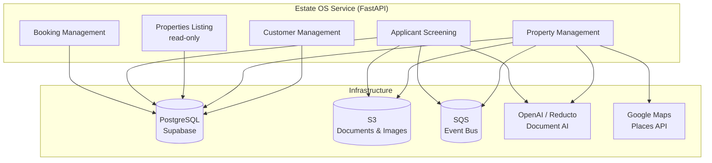
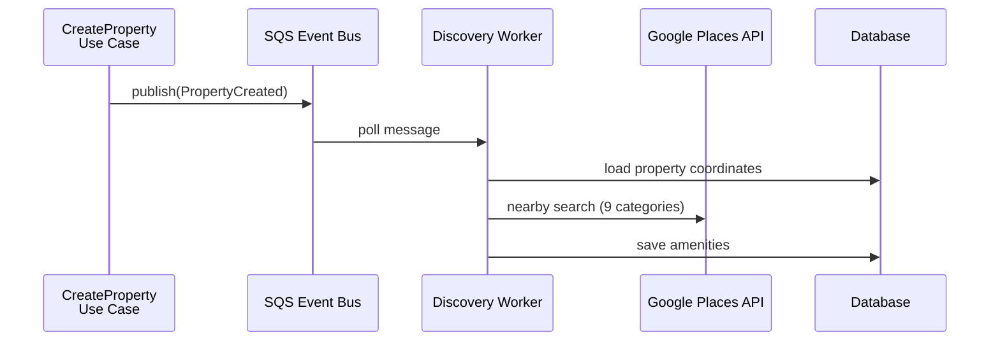

The Estate OS Service is the main backend for Predileto's real estate platform. It manages customers, properties, applicant screening, property listings, and visit bookings — all inside a single deployable FastAPI application, structured as five isolated bounded contexts following hexagonal architecture. This post walks through the actual code, the patterns we chose, and the trade-offs we accepted.

## Table of contents

## The big picture

The service handles five distinct business domains. Rather than splitting them into separate microservices (operational overhead for a small team) or lumping them into a flat module structure (coupling risk), we use **bounded contexts inside a single deployable unit**. Each context is a self-contained package with its own domain, application, and adapter layers.



Each bounded context follows the same internal structure:

```
customer_management/
├── domain/           # Pure business logic, no dependencies
│   ├── models/       # Entities, value objects, aggregates
│   ├── events.py     # Domain events (frozen dataclasses)
│   └── exceptions.py # Domain-specific exceptions
├── application/      # Orchestration layer
│   ├── ports/        # Abstract interfaces (ABCs)
│   └── use_cases/    # Single-purpose command handlers
├── adapters/         # Concrete implementations
│   ├── api/          # FastAPI routes (inbound)
│   ├── database/     # SQLAlchemy repositories (outbound)
│   ├── persistence/  # Supabase repositories (outbound)
│   └── inmemory/     # Test doubles
└── container.py      # Dependency injection wiring
```

The dependency rule is strict: **domain imports nothing from application or adapters. Application imports from domain. Adapters import from application and domain.** No context imports from another context.

## Domain layer: where business rules live

### Entities and value objects

Domain models are plain Python dataclasses. Entities are mutable (they have identity and lifecycle). Value objects are frozen (immutable, compared by value).

```python
# customer_management/domain/models/value_objects.py

@dataclass(frozen=True)
class PhoneNumber:
    country_code: str  # "+351", "+34"
    number: str

    def __post_init__(self) -> None:
        if not self.country_code.startswith("+"):
            raise ValueError(f"Country code must start with '+', got '{self.country_code}'")
        if not self.number.strip():
            raise ValueError("Phone number cannot be empty")


@dataclass(frozen=True)
class Address:
    street: str
    parish: str | None      # Freguesia (PT)
    municipality: str | None # Concelho (PT) / Municipio (ES)
    district: str | None     # Distrito (PT) / Provincia (ES)
    postal_code: str | None
    country: str             # "PT" or "ES"

    def __post_init__(self) -> None:
        if self.country not in ("PT", "ES"):
            raise ValueError(f"Country must be 'PT' or 'ES', got '{self.country}'")
```

`frozen=True` makes these immutable. Validation happens in `__post_init__` — if you construct a `PhoneNumber` with an invalid country code, it raises immediately. No separate validation layer needed.

Entities carry behavior. The `Property` model is an **aggregate root** — it manages its child collections (owners, prices, images) through explicit methods:

```python
# property_management/domain/models/property.py

@dataclass
class Property:
    id: UUID
    organization_id: UUID
    address: str
    listing_type: ListingType
    typology: Typology
    status: PropertyStatus
    description: str | None
    created_at: datetime
    updated_at: datetime
    characteristics: PropertyCharacteristics | None = None
    owners: list[PropertyOwner] = field(default_factory=list)
    prices: list[PropertyPrice] = field(default_factory=list)
    images: list[PropertyImage] = field(default_factory=list)

    def add_owner(self, owner: PropertyOwner) -> None:
        owner.property_id = self.id
        self.owners.append(owner)

    def add_image(self, image: PropertyImage) -> None:
        image.property_id = self.id
        self.images.append(image)

    def remove_image(self, image_id: UUID) -> PropertyImage | None:
        image = self.get_image(image_id)
        if image:
            self.images.remove(image)
        return image
```

The `ExtractionJob` entity uses a state machine pattern for status transitions, encapsulating the rules about which transitions are valid:

```python
# property_management/domain/models/extraction_job.py

@dataclass
class ExtractionJob:
    id: UUID
    user_id: UUID
    organization_id: UUID
    status: ExtractionJobStatus
    document_keys: list[str] = field(default_factory=list)
    property_id: UUID | None = None
    error_message: str | None = None

    def mark_processing(self) -> None:
        self.status = ExtractionJobStatus.PROCESSING
        self.updated_at = datetime.now(timezone.utc)

    def mark_completed(self, property_id: UUID) -> None:
        self.status = ExtractionJobStatus.COMPLETED
        self.property_id = property_id
        self.updated_at = datetime.now(timezone.utc)

    def mark_failed(self, error_message: str) -> None:
        self.status = ExtractionJobStatus.FAILED
        self.error_message = error_message
        self.updated_at = datetime.now(timezone.utc)
```

The domain never imports SQLAlchemy, FastAPI, or any framework. It's testable with zero setup.

### Domain services

When business logic doesn't belong to a single entity, it goes into a domain service. The amenity ranker decides which nearby place is "best" for a property, using brand-weighted scoring for Portuguese-market amenities:

```python
# property_management/domain/services/amenity_ranker.py

KNOWN_BRANDS: dict[AmenityCategory, list[str]] = {
    AmenityCategory.BANK: ["Millennium", "BCP", "CGD", "Caixa Geral", "Santander", "BPI"],
    AmenityCategory.GROCERY: ["Continente", "Lidl", "Pingo Doce", "Intermarché", "Mercadona"],
}

KNOWN_BRAND_WEIGHT = 1.5

def _score_place(place: NearbyPlace, category: AmenityCategory) -> float:
    weight = KNOWN_BRAND_WEIGHT if _is_known_brand(place.name, category) else 1.0
    return weight / (1 + place.distance_meters)

def rank_places(places: list[NearbyPlace], category: AmenityCategory) -> NearbyPlace:
    if category not in KNOWN_BRANDS:
        return min(places, key=lambda p: p.distance_meters)
    return max(places, key=lambda p: _score_place(p, category))
```

Pure function, no dependencies, trivially testable. A Pingo Doce 300m away ranks higher than an unknown grocery 200m away — that's domain knowledge encoded in code.

### Domain events

Each context defines its own typed, frozen events:

```python
# customer_management/domain/events.py

@dataclass(frozen=True)
class DomainEvent:
    event_id: UUID = field(default_factory=uuid4)
    occurred_at: datetime = field(default_factory=lambda: datetime.now(timezone.utc))

@dataclass(frozen=True)
class UserRegistered(DomainEvent):
    user_id: UUID = field(default_factory=uuid4)
    email: str = ""
    organization_id: UUID = field(default_factory=uuid4)

@dataclass(frozen=True)
class MemberRoleChanged(DomainEvent):
    membership_id: UUID = field(default_factory=uuid4)
    user_id: UUID = field(default_factory=uuid4)
    organization_id: UUID = field(default_factory=uuid4)
    old_role: str = ""
    new_role: str = ""
```

Property management follows the same pattern with events like `PropertyCreated` and `PropertyExtractionRequested`. Events carry only IDs and minimal data — consumers fetch what they need.

## Application layer: ports and use cases

### Ports (abstract interfaces)

Every external dependency is defined as an ABC in `application/ports/`. This is the core of hexagonal architecture — the application layer defines **what it needs**, not **how it's implemented**.

```python
# customer_management/application/ports/repositories/user_repository.py

class UserRepository(ABC):
    @abstractmethod
    async def get_by_id(self, user_id: UUID) -> User | None: ...

    @abstractmethod
    async def get_by_supabase_id(self, supabase_user_id: str) -> User | None: ...

    @abstractmethod
    async def get_by_email(self, email: str) -> User | None: ...

    @abstractmethod
    async def save(self, user: User) -> User: ...

    @abstractmethod
    async def update(self, user: User) -> User: ...
```

Every method is async. The port accepts and returns **domain models**, never ORM models or dicts. This means use cases are fully decoupled from the database.

### Use cases

Each use case is a single class with one `execute()` method. It receives ports through its constructor and orchestrates the business flow:

```python
# customer_management/application/use_cases/register_user.py

class RegisterUser:
    def __init__(
        self,
        user_repo: UserRepository,
        organization_repo: OrganizationRepository,
        subscription_repo: SubscriptionRepository,
        membership_repo: MembershipRepository,
        invitation_repo: InvitationRepository,
        event_bus: EventBus,
    ) -> None:
        self.user_repo = user_repo
        self.organization_repo = organization_repo
        # ...

    async def execute(
        self, *, supabase_user_id: str, email: str, name: str, **kwargs
    ) -> User:
        existing = await self.user_repo.get_by_supabase_id(supabase_user_id)
        if existing:
            raise UserAlreadyExistsError(email)

        # Check for pending invitation
        invitation = await self.invitation_repo.get_pending_by_email(email)

        if invitation:
            # Invited user — join existing organization
            organization_id = invitation.organization_id
            role = invitation.role
            invitation.status = InvitationStatus.ACCEPTED
            await self.invitation_repo.update(invitation)
        else:
            # New user — create organization + freemium subscription
            organization = Organization(id=uuid4(), ...)
            organization = await self.organization_repo.save(organization)
            organization_id = organization.id
            role = MembershipRole.OWNER

            subscription = Subscription(
                plan=SubscriptionPlan.FREEMIUM,
                status=SubscriptionStatus.ACTIVE, ...
            )
            await self.subscription_repo.save(subscription)

        user = User(id=uuid4(), email=email, name=name, ...)
        user = await self.user_repo.save(user)

        membership = Membership(user_id=user.id, organization_id=organization_id, role=role, ...)
        await self.membership_repo.save(membership)

        await self.event_bus.publish(
            UserRegistered(user_id=user.id, email=email, organization_id=organization_id)
        )
        return user
```

The use case contains **orchestration logic** (create org, then user, then membership, then publish event) but no business rules — those live in the domain. It depends entirely on port abstractions.

## Adapter layer: connecting to the real world

### Inbound adapters (routes)

FastAPI routes are thin inbound adapters. They handle HTTP concerns (status codes, request parsing, error mapping) and delegate everything to use cases:

```python
# customer_management/adapters/api/routes/users.py

@router.get("/me", response_model=UserWithOrganizationResponse)
async def get_user_profile(
    request: Request,
    supabase_user_id: str = Depends(get_supabase_user_id),
):
    get_profile_uc = request.app.state.container.get_user_profile

    try:
        user, organization, membership = await get_profile_uc.execute(
            supabase_user_id=supabase_user_id
        )
    except UserNotFoundError:
        raise HTTPException(status_code=404, detail="User not found")

    return {
        "user": _user_response(user),
        "organization": _organization_response(organization),
        "role": membership.role.value if membership else None,
    }
```

The route knows about HTTP. It doesn't know about databases, SQS, or any other infrastructure. Domain exceptions (`UserNotFoundError`) are caught and mapped to HTTP status codes at this boundary.

### Outbound adapters (repositories)

Database repositories implement the port interfaces. A critical pattern: `_to_domain()` and `_to_model()` methods create a clean mapping boundary between ORM models and domain models.

```python
# customer_management/adapters/database/repositories.py

class SqlAlchemyUserRepository(UserRepository):
    def __init__(self, session: AsyncSession) -> None:
        self._session = session

    @staticmethod
    def _to_domain(m: UserModel) -> User:
        return User(
            id=UUID(m.id),
            supabase_user_id=m.supabase_user_id,
            email=m.email,
            name=m.name,
            phone=PhoneNumber(country_code=m.phone_country_code, number=m.phone_number)
                  if m.phone_country_code else None,
            organization_id=UUID(m.organization_id) if m.organization_id else None,
            # ...
        )

    async def get_by_supabase_id(self, supabase_user_id: str) -> User | None:
        result = await self._session.execute(
            select(UserModel).where(UserModel.supabase_user_id == supabase_user_id)
        )
        row = result.scalar_one_or_none()
        return self._to_domain(row) if row else None
```

ORM models (`UserModel`) live in `adapters/database/models.py` — never in the domain. The domain `User` dataclass is reconstructed from the ORM row, including value objects like `PhoneNumber`.

### In-memory test doubles

Every port has an in-memory implementation for unit testing:

```python
# customer_management/adapters/inmemory/inmemory_user_repo.py

class InMemoryUserRepository(UserRepository):
    def __init__(self) -> None:
        self._users: dict[UUID, User] = {}

    async def get_by_id(self, user_id: UUID) -> User | None:
        return self._users.get(user_id)

    async def save(self, user: User) -> User:
        self._users[user.id] = user
        return user
```

These are not mocks — they implement the full port contract. Unit tests exercise real business logic with real in-memory state, catching bugs that mock-based tests miss.

## Dependency injection: the composition root

Each context has a `Container` class that wires ports to use cases:

```python
# customer_management/container.py

class Container:
    def __init__(
        self,
        user_repo: UserRepository,
        organization_repo: OrganizationRepository,
        subscription_repo: SubscriptionRepository,
        membership_repo: MembershipRepository,
        invitation_repo: InvitationRepository,
        email_service: EmailService,
        event_bus: EventBus,
        # ...
    ) -> None:
        # Store ports
        self.email_service = email_service

        # Wire use cases
        self.register_user = RegisterUser(
            user_repo=user_repo,
            organization_repo=organization_repo,
            subscription_repo=subscription_repo,
            membership_repo=membership_repo,
            invitation_repo=invitation_repo,
            event_bus=event_bus,
        )
        self.get_user_profile = GetUserProfile(
            user_repo=user_repo,
            organization_repo=organization_repo,
            membership_repo=membership_repo,
        )
        # ... 15+ more use cases
```

The **bootstrap module** (`shared/entrypoints/bootstrap.py`) is the only place that instantiates concrete adapters:

```python
# shared/entrypoints/bootstrap.py

async def get_container() -> Container:
    client = await acreate_client(settings.supabase_url, settings.supabase_service_role_key)

    return Container(
        user_repo=SupabaseUserRepository(client),
        organization_repo=SupabaseOrganizationRepository(client),
        email_service=ResendEmailService(settings.resend_api_key),
        event_bus=InMemoryEventBus(),
        # ...
    )

async def get_property_container() -> PropertyContainer:
    # Different adapters for a different context
    return PropertyContainer(
        property_repo=SupabasePropertyRepository(client),
        document_storage=S3DocumentStorage(...),
        event_bus=SQSEventBus(queue_url=settings.sqs_property_extraction_queue_url, ...),
        property_extractor=ReductoOpenAIPropertyExtractor(...),
        # ...
    )
```

We use manual constructor injection — no DI framework. It's verbose but explicit. You can read `container.py` and know exactly what every use case depends on.

## The read model: properties_listing

The `properties_listing` context is a **read-only bounded context**. It serves public property listings with no authentication required. It has its own domain models, independent from `property_management`:

```python
# properties_listing/domain/models.py

@dataclass
class ListedProperty:
    """Read-only property view for public listing. No owners."""
    id: UUID
    organization_id: UUID
    address: str
    listing_type: ListingType
    typology: Typology
    description: str | None
    characteristics: PropertyCharacteristics | None
    latitude: float | None
    longitude: float | None
    prices: list[PropertyPrice] = field(default_factory=list)
    images: list[PropertyImage] = field(default_factory=list)
```

Notice: no `owners` field. The public listing intentionally excludes private data. Even though it reads from the same database tables as `property_management`, it defines its own ORM models and domain types — no cross-context imports.

This is a deliberate trade-off. Two sets of ORM models for the same tables means some duplication. But it means changing `property_management`'s schema never accidentally breaks the public API. The bounded context boundary is real, even with a shared database.

## Cross-context communication

Contexts communicate through **domain events over SQS**. When a property is created, `property_management` publishes a `PropertyCreated` event. A separate worker process picks it up and triggers amenity discovery.



Event handlers use a registry pattern instead of if/elif chains:

```python
# customer_management/adapters/workers/event_processor.py

HANDLERS: dict[str, EventHandler] = {
    "APPLICANT_SCREENED": _handle_applicant_screened,
}

async def process_event(message_body: dict, container: Any) -> None:
    event_type = message_body.get("event_type", "")
    handler = HANDLERS.get(event_type)
    if handler:
        await handler(message_body.get("data", {}), container)
    else:
        log.warning("unknown_event_type", event_type=event_type)
```

Adding a new event handler is one line in the registry dict.

## Trade-offs we accepted

**Manual DI over a framework.** The `Container` class is verbose — the property management container takes 12 constructor parameters. A DI framework like `dependency-injector` would reduce boilerplate. We chose explicit wiring because the codebase is small enough that readability outweighs convenience, and there's no magic to debug.

**Shared database across contexts.** All five bounded contexts share one PostgreSQL instance with one Alembic migration chain. This means foreign keys can reference across contexts (properties reference organizations). A purist DDD approach would use separate databases. We accepted the coupling because: (1) it's one service with one deployment, (2) eventual consistency between contexts would add complexity without clear benefit at our scale, and (3) the isolation happens at the code level — contexts never import each other's models.

**Supabase client and SQLAlchemy coexisting.** Customer management and property management use the Supabase Python client for persistence, while applicant screening and properties listing use SQLAlchemy. This happened organically — the first contexts were built with Supabase's API, and later contexts used SQLAlchemy for better transaction management. Both work. Migrating to a single approach is planned but not urgent.

**Duplicated enums between contexts.** `ListingType`, `Typology`, and `PropertyStatus` are defined independently in `property_management` and `properties_listing`. This is intentional — sharing these types would create a coupling channel between contexts. The enums are small and stable, so the duplication cost is minimal.

**In-memory event bus for customer management.** The customer management context uses an `InMemoryEventBus` in production — events are published but not consumed by an external process yet. The abstraction is in place so we can swap to SQS when we need inter-service communication. Building the infrastructure before the need would be premature.

## Testing strategy

The hexagonal architecture pays for itself in testing. Unit tests use in-memory adapters — no database, no network, sub-millisecond execution:

```python
# tests/unit/test_submit_property_extraction.py

@pytest.fixture
def use_case(storage, job_repo, bus):
    return SubmitPropertyExtraction(
        document_storage=InMemoryDocumentStorage(),
        extraction_job_repo=InMemoryExtractionJobRepository(),
        event_bus=InMemoryEventBus(),
    )

async def test_happy_path(self, use_case, storage, job_repo, bus):
    for key in keys:
        await storage.upload(key, b"fake-pdf", "application/pdf")

    job = await use_case.execute(
        job_id=job_id, user_id=TEST_USER_ID,
        organization_id=TEST_ORGANIZATION_ID,
        document_keys=keys, listing_type="sale", typology="apartment",
    )

    assert job.status == ExtractionJobStatus.PENDING
    assert len(bus.events) == 1
    assert isinstance(bus.events[0], PropertyExtractionRequested)
    assert bus.events[0].job_id == job_id
```

Integration tests use real databases (via testcontainers) and real SQS (via LocalStack). The same `Container` class is used in both cases — only the adapter implementations change.

## Key takeaways

- **Bounded contexts are code boundaries, not deployment boundaries.** Five contexts in one service gives isolation without operational overhead. The boundary is enforced by import discipline, not network calls.
- **Ports as ABCs make testing trivial.** Every external dependency has an in-memory double. Unit tests run in milliseconds and catch real bugs.
- **Domain models are just dataclasses.** No ORM inheritance, no framework base classes. Value objects are `frozen=True` with validation in `__post_init__`. Entities have behavior methods. That's it.
- **The composition root is the only place that knows about concrete implementations.** Routes don't know about databases. Use cases don't know about HTTP. The bootstrap module is the single point where everything gets wired together.
- **Duplication between contexts is a feature.** Two contexts defining the same enum independently is cheaper than the coupling that sharing would create. Optimize for independence, not DRY.
- **Start with the simplest adapter that works.** In-memory event bus in production is fine when you don't need persistence. Supabase client is fine when you don't need transactions. Upgrade when the pain is real, not when the architecture diagram says you should.
