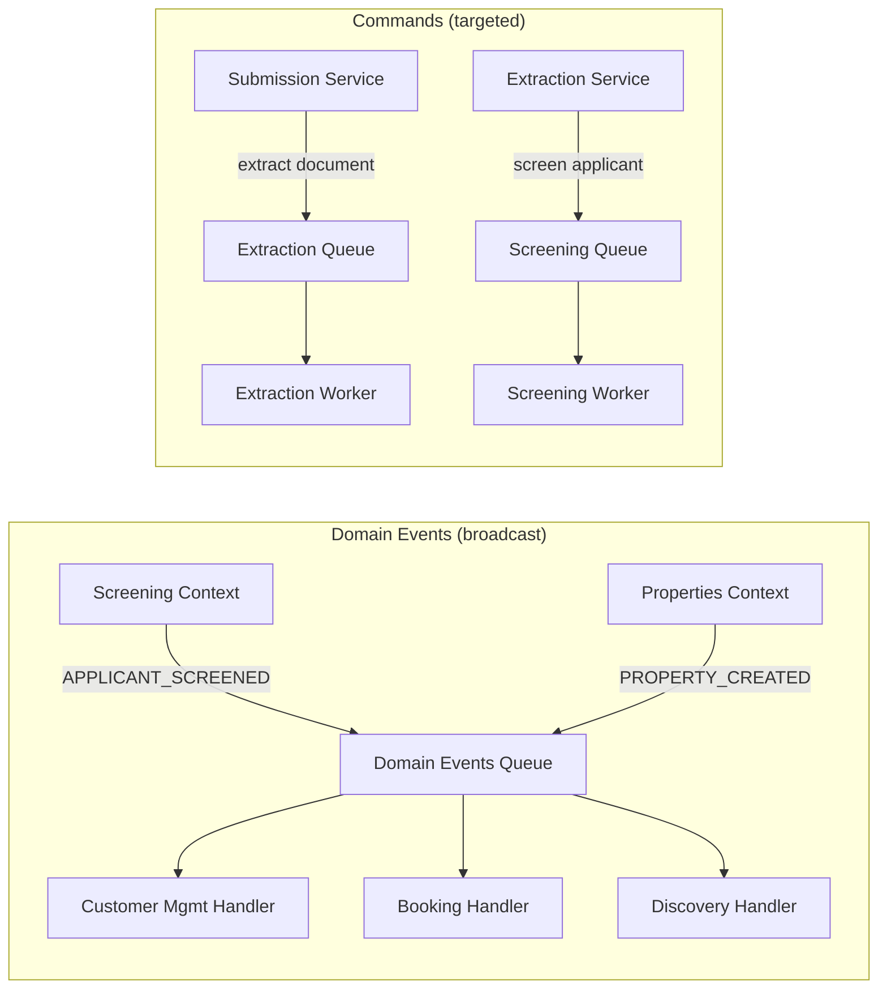
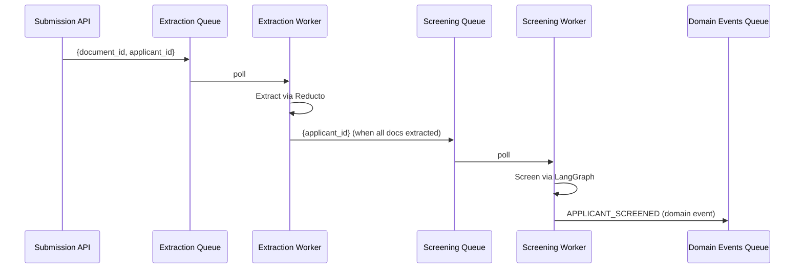

We started with six SQS queues, three serialization formats, and events scattered across five bounded contexts. A single business fact — "this applicant was screened" — had to reach the customer management context (send an email notification) and the booking management context (create a booking applicant record). We had ad-hoc Lambda forwards, duplicated SQS subscriptions, and no shared message structure. This post is the story of how we consolidated all of it into two clean concepts: **domain events** (cross-context, broadcast) and **commands** (internal pipeline, targeted) — and the exact code that implements them.

We documented this as [ADR-006](https://github.com/predileto/estate-os-service/blob/main/docs/adr/006-unified-domain-events-bus.md) in the codebase. This post goes deeper into the reasoning, walks through every line of code, and discusses the trade-offs we live with.

## Table of contents

## The problem: six queues, three formats

Our backend is a single FastAPI application with five bounded contexts: customer management, property management, applicant screening, properties listing (read-only), and booking management. Each context that needed async processing had its own SQS queue and its own message format.

The extraction queue sent flat payloads:

```json
{"document_id": "abc-123", "applicant_id": "def-456"}
```

The screening queue sent even simpler payloads:

```json
{"applicant_id": "def-456"}
```

The domain events queue sent an envelope, but the `data` field was a Pydantic `.model_dump()` with datetime objects serialized as strings, UUIDs as strings, and nested models flattened:

```json
{
  "event_type": "APPLICANT_SCREENED",
  "data": {"applicant_id": "def-456", "risk_level": "LOW", "name": "Joao Silva", ...}
}
```

And the contract intelligence pipeline had its own pair of queues (ingestion and analysis) with yet another format.

The real pain point was not the format diversity itself — it was the cross-context routing. When the screening context finished processing an applicant, the resulting event needed to reach two different bounded contexts. We were handling this with a Lambda that received the message and forwarded it to multiple handlers, but the Lambda had to know about all consumers, and adding a new consumer meant modifying the forwarding logic.

## Domain events vs commands

Before writing any code, we needed to draw a clear conceptual line. Not everything that goes on a queue is an event. We identified two fundamentally different message types in our system:

### Domain events: things that happened

A domain event records a fact that has already occurred. It is past tense, immutable, and broadcast.

- `APPLICANT_SCREENED` — the screening pipeline finished; the risk level was determined.
- `PROPERTY_CREATED` — a new property was registered in the system.
- `CONTRACT_ANALYZED` — the contract intelligence pipeline completed analysis.

The producer publishes the event and does not know or care who listens. There might be zero consumers, one, or ten. The producer's job is done the moment the event is on the queue. There is no return value, no acknowledgment, no callback.

Multiple bounded contexts can react to the same event independently. `APPLICANT_SCREENED` triggers an email notification in customer management AND creates a booking applicant record in booking management. These two consumers know nothing about each other. They just happen to care about the same fact.

### Commands: work to be done

A command is an imperative instruction directed at exactly one consumer. It is present tense, targeted, and expects the consumer to do something.

- "Extract document `abc-123` for applicant `def-456`" — one extraction worker picks this up and calls the Reducto API.
- "Screen applicant `def-456`" — one screening worker picks this up and runs the LangGraph pipeline.
- "Ingest document `abc-123`" — one contract ingestion worker picks this up and parses the PDF.

Commands have a single consumer. If two workers are running, only one of them processes each command (SQS handles this with visibility timeouts). The consumer does specific, well-defined work. The producer knows exactly which queue to publish to and what the consumer will do.

### Why this distinction matters

The distinction is not academic. It drives three concrete architectural decisions:

**Scaling.** Extraction is CPU-heavy and slow (Reducto API calls, large PDF parsing). The extraction queue might need 5 workers. Event routing is fast (database writes, HTTP calls to email services). The events queue needs 1 worker. If events and commands share a queue, you cannot scale them independently.

**Failure handling.** If the email notification handler fails for `APPLICANT_SCREENED`, the booking handler should not be affected. But if extraction fails for a document, that specific extraction should be retried — not some unrelated screening command. Separate queues mean separate retry policies and separate dead-letter queues.

**Coupling.** Commands create a direct dependency: the producer knows the consumer exists and what it does. Domain events create no dependency: the producer broadcasts a fact and walks away. This is the difference between "tell the extraction worker to extract this document" (command, tight coupling to the extraction context) and "an applicant was screened" (event, zero coupling to any consumer).



## The unified envelope

Every domain event in our system is wrapped in a `DomainEvent` dataclass. This is the canonical structure — every producer creates one, every consumer receives one. Let me walk through it line by line.

```python
@dataclass(frozen=True)
class DomainEvent:
    event_type: str
    data: dict[str, Any]
    event_id: str = field(default_factory=lambda: str(uuid4()))
    occurred_at: str = field(
        default_factory=lambda: datetime.now(timezone.utc).isoformat()
    )
```

**`@dataclass(frozen=True)`** — The event is immutable. Once created, no field can be changed. This is a deliberate constraint: a domain event represents something that already happened, and you cannot change the past. If you need to correct an event, you publish a new compensating event. The `frozen=True` flag also makes instances hashable, which is useful if you ever need to deduplicate events in a set.

**`event_type: str`** — A plain string, not an enum. We considered using a Python `Enum` here and rejected it. Enums require the consumer to import the producer's type definition, which creates a coupling between bounded contexts. With strings, the `customers` context can check `event_type == "APPLICANT_SCREENED"` without importing anything from the `screening` context. The string constants live in `shared/events/types.py` for convenience, but consumers are not required to use them. A new context could simply hardcode the string.

**`data: dict[str, Any]`** — The event payload is an untyped dictionary. This is the most controversial design choice. We could have defined typed Pydantic models per event (`ApplicantScreenedData`, `PropertyCreatedData`), which would give us compile-time safety and auto-generated documentation. We chose `dict` instead because: (a) each consumer only cares about a subset of the fields, and (b) adding a new field to an event should not require updating a shared type definition that all consumers import. The trade-off is real — consumers must handle missing keys gracefully, and there is no schema validation at the boundary. We accept this.

**`event_id: str`** — A UUID generated at creation time. This serves two purposes: logging (every log line includes the event ID, so you can trace a single event through the entire system) and idempotency (consumers can use the event ID to deduplicate if they receive the same event twice, which happens with SQS at-least-once delivery). The `default_factory` uses a lambda because `field(default=uuid4())` would generate the UUID once at class definition time, not once per instance.

**`occurred_at: str`** — An ISO 8601 timestamp string. We store it as a string rather than a `datetime` object because JSON serialization is trivial (no custom encoders needed) and because the timestamp is informational — consumers log it and store it, but they do not perform date arithmetic on it. Using a string avoids the timezone-aware vs timezone-naive pitfalls that plague Python datetime handling.

The class also has serialization methods:

```python
def to_dict(self) -> dict[str, Any]:
    return {
        "event_type": self.event_type,
        "event_id": self.event_id,
        "occurred_at": self.occurred_at,
        "data": self.data,
    }

def to_json(self) -> str:
    return json.dumps(self.to_dict(), default=str)

@classmethod
def from_dict(cls, d: dict[str, Any]) -> "DomainEvent":
    return cls(
        event_type=d["event_type"],
        data=d.get("data", {}),
        event_id=d.get("event_id", str(uuid4())),
        occurred_at=d.get("occurred_at", datetime.now(timezone.utc).isoformat()),
    )
```

**`to_dict()`** returns a plain dictionary. **`to_json()`** calls `to_dict()` and serializes to JSON with `default=str` as a safety net — if any value in `data` is a UUID, datetime, or Decimal, it gets converted to a string rather than raising a `TypeError`. This is defensive serialization: we would rather lose type fidelity than crash at publish time.

**`from_dict()`** is a classmethod factory. It uses `.get()` with defaults for `event_id` and `occurred_at` so that messages from legacy producers (which might not include these fields) still deserialize correctly. If a message arrives without an `event_id`, we generate one on the consumer side — we lose the idempotency guarantee for that specific message, but we do not crash.

## The publisher port

```python
from abc import ABC, abstractmethod
from shared.events.base import DomainEvent

class DomainEventPublisher(ABC):
    @abstractmethod
    async def publish(self, event: DomainEvent) -> None: ...
```

Three lines of actual code. This is the port — the interface that services depend on. It lives in `shared/events/publisher.py`, part of the shared kernel that all bounded contexts can import.

Why an ABC and not a `typing.Protocol`? Most of our ports use Protocol (our hexagonal architecture guide recommends it), but for the domain event publisher we chose ABC because: (a) there is exactly one method with a clear contract, (b) we want to enforce that implementations explicitly inherit from `DomainEventPublisher` (making it visible in the class hierarchy), and (c) Protocol's structural subtyping adds no value when every implementation is wired through a composition root that explicitly constructs the publisher.

Why does it live in `shared/` and not in a specific bounded context? Because domain event publishing is a cross-cutting concern. The screening context publishes `APPLICANT_SCREENED`. The properties context publishes `PROPERTY_CREATED`. Both depend on the same publisher interface. Placing it in `shared/events/` signals that this is infrastructure shared across all contexts, not owned by any single one.

Why do services depend on this port and not on SQS directly? Testability and substitutability. In unit tests, we pass a mock publisher. In integration tests, we might use an in-memory publisher that collects events in a list. In production, we use the SQS implementation. The service code is identical in all three environments.

## The SQS implementation

```python
class SQSDomainEventPublisher(DomainEventPublisher):
    def __init__(
        self,
        session: aioboto3.Session,
        queue_url: str,
        endpoint_url: str | None = None,
    ) -> None:
        self._session = session
        self._queue_url = queue_url
        self._endpoint_url = endpoint_url
```

The constructor takes three arguments. **`session`** is an `aioboto3.Session` — not a client. We store the session and create a client per publish call. This is deliberate: aioboto3 clients are async context managers that must be entered and exited. Storing a long-lived client would require managing its lifecycle across the application, and a stale client can accumulate connection issues. Creating a fresh client per call is slightly more overhead but vastly simpler to reason about.

**`queue_url`** is injected at construction, not hardcoded. The URL comes from configuration (`Settings.sqs_domain_events_queue_url`) and is different per environment (LocalStack in development, real SQS in production). This is the difference between the domain event publisher (bound to one queue) and the command publisher (which accepts `queue_url` per call) — a design choice that reflects their different semantics.

**`endpoint_url`** is optional and only set in development (pointing to LocalStack). In production it is `None` and the default AWS endpoint is used.

```python
def _client_kwargs(self) -> dict:
    kwargs: dict = {}
    if self._endpoint_url:
        kwargs["endpoint_url"] = self._endpoint_url
    return kwargs

async def publish(self, event: DomainEvent) -> None:
    async with self._session.client("sqs", **self._client_kwargs()) as sqs:
        await sqs.send_message(
            QueueUrl=self._queue_url,
            MessageBody=event.to_json(),
        )
    logger.info(
        "domain_event_published",
        event_type=event.event_type,
        event_id=event.event_id,
    )
```

**`_client_kwargs()`** conditionally adds the `endpoint_url`. We use `**kwargs` unpacking rather than passing `endpoint_url=None` because `botocore` treats `endpoint_url=None` differently from omitting it entirely on some operations (it logs a warning about resolving a `None` endpoint). The helper method avoids this.

**`publish()`** opens an async context manager to get an SQS client, sends the message, and exits the context manager (which closes the HTTP connection). The message body is the JSON serialization of the event envelope. After successful publish, we log the event type and ID with structlog. This structured log line is how we trace events in production — we can search for `event_id=abc-123` and find the publish log, the receive log, and every handler log for that event.

Note what is NOT here: no retry logic, no batch sending, no message attributes, no deduplication ID. SQS standard queues handle retries at the transport level. We send one message at a time because domain events are published after individual business operations, not in batches. We do not use SQS message attributes because the `event_type` is inside the message body (the router needs to deserialize the body anyway). We do not set a deduplication ID because we use standard queues, not FIFO queues.

## The EventRouter

The router is the dispatch mechanism that connects event types to handler functions. Here is the complete implementation:

```python
from collections import defaultdict
from collections.abc import Callable, Coroutine
from typing import Any

import structlog

from shared.events.base import DomainEvent

logger = structlog.get_logger()

HandlerFn = Callable[[dict[str, Any], Any], Coroutine[Any, Any, None]]


class EventRouter:
    def __init__(self) -> None:
        self._handlers: dict[str, list[HandlerFn]] = defaultdict(list)

    def on(self, event_type: str, handler: HandlerFn) -> None:
        self._handlers[event_type].append(handler)

    async def dispatch(self, event: DomainEvent, context: Any) -> None:
        handlers = self._handlers.get(event.event_type, [])
        if not handlers:
            logger.warning("no_handler_for_event", event_type=event.event_type)
            return

        for handler in handlers:
            try:
                await handler(event.data, context)
            except Exception:
                logger.exception(
                    "event_handler_failed",
                    event_type=event.event_type,
                    event_id=event.event_id,
                )
                raise
```

**`HandlerFn`** is a type alias for an async function that takes `(data: dict, context: Any) -> None`. Every handler across every bounded context conforms to this signature. The `data` parameter is the event's `data` dict (not the full `DomainEvent`), and `context` is a dict of containers (more on this below).

**`self._handlers`** uses `defaultdict(list)`. When you call `router.on("APPLICANT_SCREENED", handler)`, it appends `handler` to the list for that event type. Multiple calls with the same event type build up a list of handlers. This is the core of the fan-out mechanism: one event type can have many handlers.

**`on(event_type, handler)`** is the registration method. It is called at startup time in `_build_router()`, not at request time. Registration is synchronous and happens once. The router is then passed to the worker, which calls `dispatch()` for every received message.

**`dispatch(event, context)`** looks up handlers for the event type. If no handlers are registered, it logs a warning and returns — the message is still deleted from the queue (it is not an error to receive an event nobody cares about; it just means no handler was registered for it yet). If handlers exist, it iterates through them sequentially, awaiting each one.

The error handling deserves close attention. When a handler raises an exception, we:
1. Log the exception with full traceback, event type, and event ID (for debugging).
2. Re-raise the exception.

Re-raising is critical. It propagates up to the worker, which does NOT delete the message from the queue. SQS will make the message visible again after the visibility timeout, and the worker will process it again. This gives us automatic retries for transient failures (database timeouts, network errors).

The downside is equally important: if two handlers are registered for `APPLICANT_SCREENED` and the second one fails, the first one has already run successfully. When the message is retried, BOTH handlers run again. The first handler must be idempotent — it must handle being called twice for the same event without creating duplicate data. This is a fundamental trade-off of the sequential dispatch model. We accept it because the alternative (parallel dispatch with per-handler error tracking) adds significant complexity for a problem that rarely occurs in practice.

## Handler registration

The `_build_router()` function in `shared/entrypoints/events_worker.py` is where all cross-context event subscriptions are defined. This is our composition root for event routing:

```python
def _build_router() -> EventRouter:
    """Register all cross-context event handlers."""
    from bookings.adapters.events.handlers import handle_applicant_screened
    from customers.adapters.workers.event_processor import (
        _handle_applicant_screened as cm_handle_applicant_screened,
    )
    from properties.adapters.workers.discovery_processor import (
        handle_property_created,
    )

    router = EventRouter()
    router.on(APPLICANT_SCREENED, cm_handle_applicant_screened)  # email notification
    router.on(APPLICANT_SCREENED, handle_applicant_screened)      # create booking applicant
    router.on(PROPERTY_CREATED, handle_property_created)          # discover amenities
    return router
```

The imports are inside the function body, not at the top of the module. This is deliberate: the events worker module is imported during worker startup, and the bounded context modules might have heavy initialization (database connections, external client setup). By deferring imports to function call time, we avoid importing all contexts when only the module is loaded.

Look at the `APPLICANT_SCREENED` registration: two handlers from two different bounded contexts.

**`cm_handle_applicant_screened`** comes from `customers.adapters.workers.event_processor`. It sends an email notification to the property owner informing them that an applicant has been screened. It reaches into the `context["customer"]` container to get the email service.

**`handle_applicant_screened`** comes from `bookings.adapters.events.handlers`. It creates a booking applicant record so the screened applicant can be offered property viewing slots. It reaches into the `context["booking"]` container.

Neither handler knows about the other. They were written by the same developer (me), but they could have been written by different teams in different sprints. The screening context that publishes the event has no idea these handlers exist. This is the decoupling that domain events buy us.

**`handle_property_created`** comes from `properties.adapters.workers.discovery_processor`. When a new property is created, it triggers an amenity discovery process (calling the Google Maps Places API to find nearby amenities). This is a single-handler event today, but the registration pattern means we can add more handlers (e.g., "notify subscribed users about new properties in their area") without touching the properties context.

Each handler has the same signature: `async def handler(data: dict, context) -> None`. The context is a dictionary of containers, one per bounded context:

```python
async def _build_context() -> dict:
    from shared.entrypoints.bootstrap import (
        get_booking_container,
        get_container,
        get_property_container,
    )

    return {
        "customer": await get_container(),
        "property": await get_property_container(),
        "booking": await get_booking_container(),
    }
```

Why a dict and not a typed object? Because each handler only needs one container, and different handlers need different containers. A typed context object would need to know about every bounded context, creating a God object. A dict is looser but more practical — each handler extracts its own container by key and ignores the rest.

## The unified worker

The `DomainEventsWorker` is the process that ties everything together. It is a long-running async loop that polls SQS, deserializes events, dispatches them through the router, and handles errors.

```python
class DomainEventsWorker:
    def __init__(
        self,
        session: aioboto3.Session,
        queue_url: str,
        router: EventRouter,
        context: dict,
        endpoint_url: str | None = None,
    ) -> None:
        self._session = session
        self._queue_url = queue_url
        self._router = router
        self._context = context
        self._endpoint_url = endpoint_url
        self._running = True
```

The constructor receives all its dependencies. **`session`** and **`queue_url`** configure the SQS connection. **`router`** is the fully-wired `EventRouter` with all handlers registered. **`context`** is the dict of containers. **`self._running`** is the shutdown flag — when set to `False`, the polling loop exits.

```python
def _shutdown(self) -> None:
    log.info("domain_events_worker_shutting_down")
    self._running = False
```

The shutdown method is a callback registered with signal handlers. When the process receives SIGTERM (from a container orchestrator shutting down the pod) or SIGINT (from Ctrl+C during development), it sets `_running = False`. The current poll cycle completes (processing any in-flight message), and then the `while` loop exits cleanly. This is graceful shutdown: we do not kill the process mid-handler.

```python
async def run(self) -> None:
    log.info("domain_events_worker_started", queue_url=self._queue_url)

    loop = asyncio.get_event_loop()
    for sig in (signal.SIGTERM, signal.SIGINT):
        loop.add_signal_handler(sig, self._shutdown)
```

Signal handlers are registered on the event loop, not with the `signal` module directly. This is required for async applications because Python's `signal.signal()` can only be called from the main thread, and the handler runs in the signal's context which cannot interact with the event loop. `loop.add_signal_handler()` schedules the callback to run as a regular event loop callback, which is safe to use with asyncio.

```python
    while self._running:
        try:
            async with self._session.client("sqs", **self._client_kwargs()) as sqs:
                response = await sqs.receive_message(
                    QueueUrl=self._queue_url,
                    MaxNumberOfMessages=1,
                    WaitTimeSeconds=20,
                )
```

**`MaxNumberOfMessages=1`** — We process one message at a time. This is intentional: our handlers are not designed for concurrent execution (they share database connections through the context containers). Processing one at a time is simpler and avoids concurrent write conflicts. If throughput becomes a bottleneck, we would run multiple worker processes rather than process multiple messages per poll.

**`WaitTimeSeconds=20`** — This is SQS long polling. Instead of returning immediately when the queue is empty (which would cause the worker to spin in a tight loop making thousands of empty requests per minute), the API call blocks for up to 20 seconds waiting for a message to arrive. This reduces SQS API costs (you pay per request) and reduces latency (the message is delivered as soon as it arrives, not on the next poll cycle). 20 seconds is the maximum value SQS allows.

```python
                messages = response.get("Messages", [])
                for msg in messages:
                    body = json.loads(msg["Body"])
                    event = DomainEvent.from_dict(body)
                    log.info(
                        "domain_event_received",
                        event_type=event.event_type,
                        event_id=event.event_id,
                    )
                    await self._router.dispatch(event, self._context)
                    await sqs.delete_message(
                        QueueUrl=self._queue_url,
                        ReceiptHandle=msg["ReceiptHandle"],
                    )
                    log.info(
                        "domain_event_processed",
                        event_type=event.event_type,
                        event_id=event.event_id,
                    )
```

The processing flow for each message:

1. **Deserialize the body** from JSON string to dict, then to `DomainEvent`. If the JSON is malformed, this raises an exception and the message is not deleted (it will be retried or sent to the DLQ after max receives).
2. **Log receipt** with the event type and ID. This is the first breadcrumb in the trace.
3. **Dispatch through the router**. All registered handlers for this event type run sequentially. If any handler raises, the exception propagates out of this block.
4. **Delete the message** from SQS. This is the acknowledgment — it tells SQS the message was processed successfully and should not be delivered again. Crucially, this only happens AFTER all handlers succeed. If a handler fails, the message stays in the queue.
5. **Log completion**. This is the second breadcrumb. If we see "received" but not "processed" in the logs, we know a handler failed.

```python
        except Exception:
            log.exception("domain_events_worker_error")
            await asyncio.sleep(5)
```

The outer try/except catches everything: SQS connection failures, deserialization errors, handler exceptions, even unexpected errors in the delete call. We log the full exception with traceback and sleep for 5 seconds before the next iteration. The sleep prevents a tight error loop that would flood the logs and burn CPU. After the sleep, the `while self._running` check runs again — if a shutdown signal arrived during the sleep, the worker exits.

The entrypoint wires everything together:

```python
async def _main() -> None:
    settings = Settings()
    setup_logging(settings.log_level)

    router = _build_router()
    context = await _build_context()

    session = aioboto3.Session(
        aws_access_key_id=settings.aws_access_key_id,
        aws_secret_access_key=settings.aws_secret_access_key,
        region_name=settings.aws_region,
    )

    worker = DomainEventsWorker(
        session=session,
        queue_url=settings.sqs_domain_events_queue_url,
        router=router,
        context=context,
        endpoint_url=settings.aws_endpoint_url,
    )
    await worker.run()
```

This is the composition root. Settings come from environment variables (via pydantic-settings). The router is built with all handlers. The context is built with all containers (which initialize database connections, external clients, etc.). The worker is constructed with all dependencies and started. `worker.run()` blocks until a shutdown signal is received.

## Command queues: why they are separate

The domain events bus handles cross-context communication. But the screening pipeline has its own internal workflow: submission creates documents, documents need extraction, extracted documents need screening. These are commands, not events.



Commands use a different publisher interface:

```python
class MessagePublisher(ABC):
    @abstractmethod
    async def publish(self, queue_url: str, message: dict[str, Any]) -> None: ...
```

Notice the key difference from `DomainEventPublisher`: the `queue_url` is a parameter of `publish()`, not a constructor argument. A single `MessagePublisher` instance can send commands to different queues — extraction, screening, analysis — depending on the business operation. The domain event publisher is bound to one queue because all domain events go to the same place. The command publisher is flexible because different commands go to different places.

The SQS implementation is minimal:

```python
class SQSMessagePublisher:
    def __init__(self, session: aioboto3.Session, endpoint_url: str | None = None) -> None:
        self._session = session
        self._endpoint_url = endpoint_url

    async def publish(self, queue_url: str, message: dict[str, Any]) -> None:
        async with self._session.client("sqs", **self._client_kwargs()) as sqs:
            await sqs.send_message(QueueUrl=queue_url, MessageBody=json.dumps(message))
```

No envelope, no event type, no event ID. Commands are flat dictionaries with just the data the consumer needs. The extraction command is `{"document_id": "abc", "applicant_id": "def"}`. The screening command is `{"applicant_id": "def"}`. There is no metadata because commands are not broadcast — the consumer knows exactly what to expect.

Why separate queues instead of routing commands through the events bus?

**Independent scaling.** Extraction workers are slow (Reducto API calls can take 30+ seconds per document). We might run 5 extraction workers and 1 screening worker. With separate queues, each worker polls its own queue at its own pace.

**Different visibility timeouts.** Extraction might need a 5-minute visibility timeout (large PDFs take time). Screening might need 2 minutes. Domain event handlers run in seconds and need a 30-second timeout. With separate queues, each timeout is configured per queue.

**Different retry policies.** If extraction fails 3 times, we want to send it to a DLQ and alert the team. If a domain event handler fails 3 times, we might want a different alerting threshold. Per-queue DLQ configuration gives us this.

## Publishing after commit

This is one of the most important patterns in the entire system. When a service completes a business operation that produces an event or command, the message MUST be published AFTER the database transaction commits. Here is the pattern from the extraction service:

```python
async def _do_extract(self, document_id: UUID, applicant_id: UUID) -> None:
    should_publish = False

    async with self._uow:
        document = await self._uow.documents.get_by_id(document_id)
        # ... extract, save extracted data, update document status ...

        if all_extracted:
            event = events.documents_extracted(applicant_id=applicant_id, ...)
            await self._uow.events.save(event)
            should_publish = True

        await self._uow.commit()

    # Publish SQS message AFTER the transaction is committed
    if should_publish:
        await self._publisher.publish(
            self._screening_queue_url,
            {"applicant_id": str(applicant_id)},
        )
```

The `should_publish` flag is set inside the UoW block, but the actual publish happens outside it, after `commit()` has run and the `async with` block has exited. Why?

**The race condition.** If we publish the SQS message before committing, the screening worker might receive the message and query the database before the extraction transaction has committed. It would see stale data — documents still in EXTRACTING status, extracted data not yet visible. The screening worker would fail or produce incorrect results.

The sequence without the pattern:

1. Extraction service publishes `{applicant_id}` to screening queue.
2. Screening worker receives the message (SQS is fast, often sub-second).
3. Screening worker queries the database for extracted data.
4. Extraction service commits the transaction (the `await self._uow.commit()` line runs AFTER the publish).
5. The screening worker sees no extracted data and fails.

With the pattern, step 1 happens after step 4, and the race is eliminated.

The screening service uses the same pattern for domain events, with an even clearer illustration:

```python
async def _do_screen(self, applicant_id: UUID) -> None:
    screened_event: ApplicantScreenedEvent | None = None

    async with self._uow:
        # ... run screening, save report, update submission status ...
        await self._uow.commit()

        # Build enriched event for other services (after commit, data is safe)
        screened_event = ApplicantScreenedEvent(...)

    # Publish domain event AFTER the transaction is committed
    if screened_event:
        await self._domain_event_publisher.publish(
            DomainEvent(
                event_type="APPLICANT_SCREENED",
                data=screened_event.model_dump(mode="json"),
            )
        )
```

The `screened_event` is built inside the UoW block (because it needs data from the transaction — the applicant, documents, screening report). But the publish happens outside. The `if screened_event` check is the guard: if the UoW block raised an exception, `screened_event` is still `None`, and we do not publish.

This pattern has a gap: if the commit succeeds but the publish fails (SQS is down, network timeout), the database is updated but no event is published. The consumer never learns about the screening result. We accept this trade-off because: (a) SQS publish failures are rare in practice, (b) the `CreateProperty` use case wraps the publish in a try/except and logs the failure so we can detect and manually replay it, and (c) the alternative (the outbox pattern) adds significant complexity. If this gap becomes a real problem, we will implement an outbox table — write the event to the database in the same transaction, then asynchronously relay it to SQS.

## Trade-offs we accepted

Every architectural decision is a trade-off. Here are the ones we live with:

### At-least-once delivery

SQS standard queues guarantee at-least-once delivery, meaning a message can be delivered more than once. Our handlers must be idempotent. The screening service handles this with an explicit dedup check (`get_by_applicant_id` returns an existing report and skips re-screening). The booking handler uses a unique constraint in the database — inserting a duplicate booking applicant raises an integrity error that the handler catches and treats as success. Not all handlers have explicit dedup today. The email notification handler in customer management could send duplicate emails. In practice, SQS duplicate delivery is rare (it happens during infrastructure events like partition rebalancing), so we have not prioritized fixing every handler.

### No message ordering

SQS standard queues do not guarantee message order. If `PROPERTY_CREATED` and `APPLICANT_SCREENED` are published within milliseconds of each other, they might be delivered in reverse order. Our handlers are designed to be order-independent — each handler has all the data it needs in the event payload, and it does not assume any prior event has been processed. If we ever need ordering (e.g., "process events for the same applicant in order"), we would switch to SQS FIFO queues with `MessageGroupId` set to the applicant ID.

### No distributed transactions

The database commit and SQS publish are two separate operations with no transactional guarantee. If the publish fails after the commit, the event is lost. If the process crashes between the commit and the publish, the event is lost. We mitigate this with logging (so we can detect and manually replay lost events) and by accepting that the system is eventually consistent. The outbox pattern would fix this, but we have not needed it yet.

### Handler failures affect all handlers

If the booking handler for `APPLICANT_SCREENED` fails, the exception propagates, the message is not deleted, and SQS redelivers it. The customer management handler (which already succeeded) runs again. This is the cost of sequential dispatch with a single acknowledgment. The alternative is to track per-handler completion (e.g., in a database table) and skip already-completed handlers on retry. We have not needed this complexity because handler failures are rare and our handlers are designed to be safe to re-run.

### No dead-letter routing per handler

SQS dead-letter queues are configured per queue, not per handler. A poison message (one that always fails) blocks ALL handlers for that event type until it exhausts its max receives and moves to the DLQ. We monitor the DLQ and investigate poison messages quickly, but in the worst case, a bug in one handler can delay processing for all handlers of that event type.

## What we would change

If we were starting over or if our scale increased by 10x, here is what we would do differently:

**SNS fan-out.** Replace the single domain events SQS queue with an SNS topic. Each handler gets its own SQS queue subscribed to the topic. SNS delivers the event to all subscribed queues in parallel. Each queue has its own DLQ, its own visibility timeout, and its own retry policy. A failure in one handler does not affect any other handler. The trade-off is more infrastructure to manage (one queue per handler instead of one queue total), but the isolation is worth it at scale.

**Per-handler DLQs.** With SNS fan-out, each handler's queue gets its own DLQ. A poison message for the booking handler goes to the booking DLQ. The customer management handler is not affected. We can alert and investigate per handler, not per event type.

**Event schema registry.** Replace `data: dict[str, Any]` with typed Pydantic models per event type. A shared library defines `ApplicantScreenedData`, `PropertyCreatedData`, etc. Producers validate at publish time, consumers validate at consume time. Schema changes are versioned. The trade-off is coupling (all contexts depend on the shared schema library), but the safety and documentation benefits become worth it as the team grows.

**Outbox pattern.** Write events to a database outbox table in the same transaction as the business data. A background relay process reads the outbox and publishes to SQS. This eliminates the commit-then-publish gap and guarantees that every committed operation produces its event. The trade-off is complexity (another table, another process, cleanup of processed outbox rows) and latency (the relay adds a delay between commit and event delivery).

None of these changes are needed today. The current architecture handles our load, our team size (small), and our failure rates (low) well. But we know where the pressure points are, and we have clear upgrade paths when we need them.
