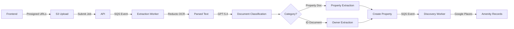
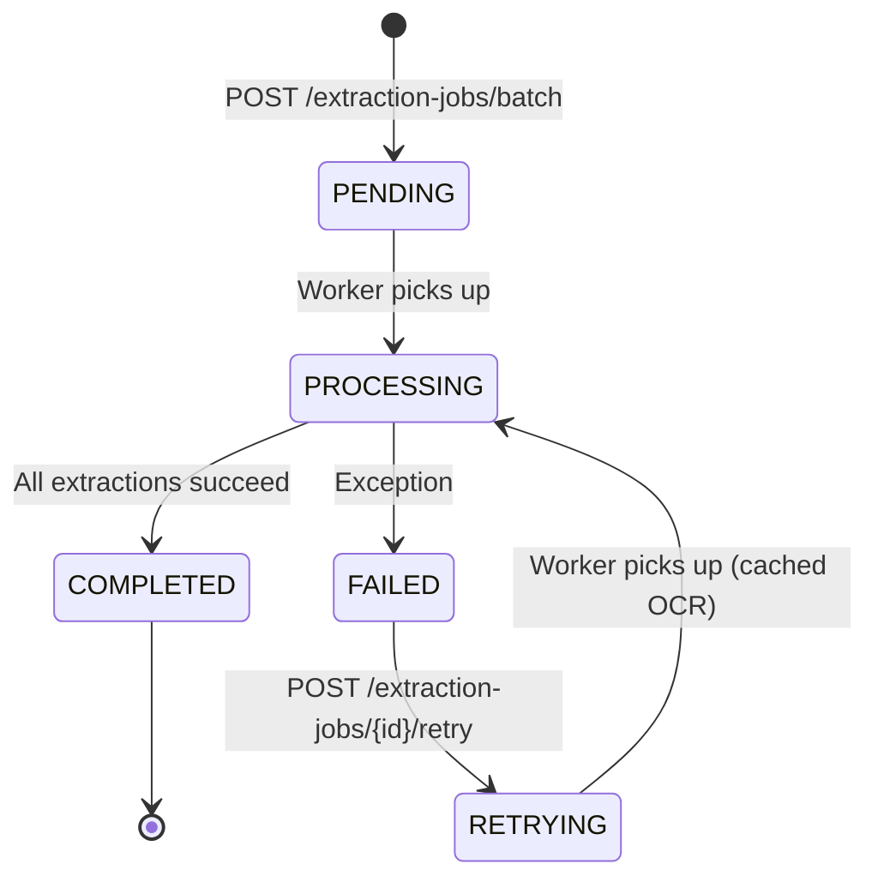
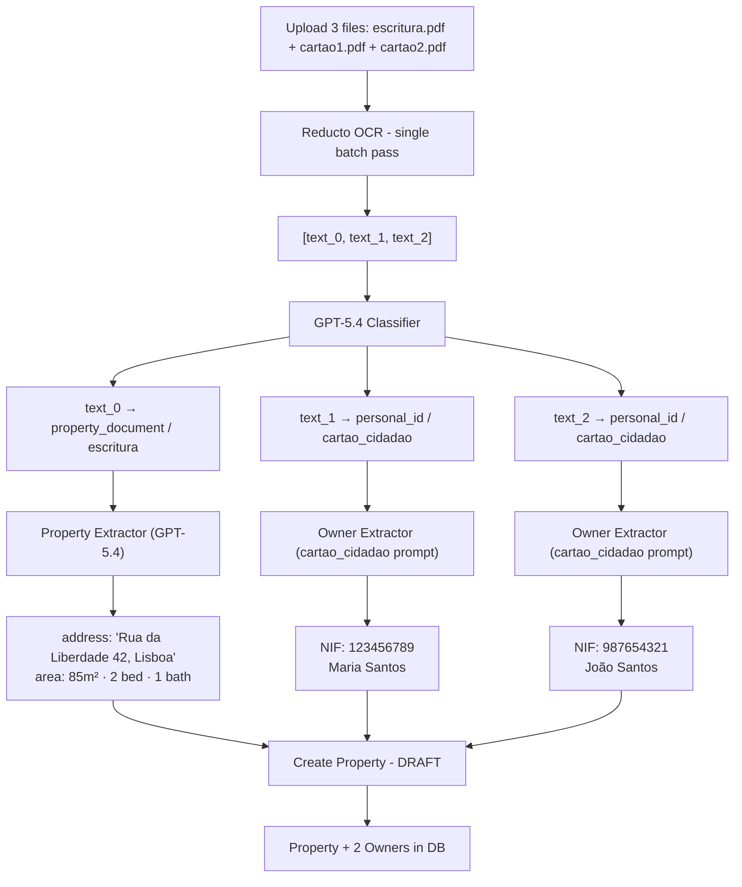
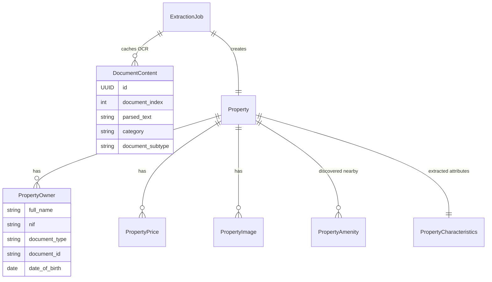

How we built a pipeline where a real-estate agent uploads property deeds and ID documents, and the system automatically registers the property and its owners into the database — using Reducto for OCR, GPT-5.4 for structured extraction, and document-type-aware prompts for each ID format.

## Table of contents

## The problem

Real-estate agents in Portugal deal with stacks of paperwork for every property listing: notarial deeds (escrituras), tax registrations (cadernetas prediais), land registry certificates (certidoes), citizen cards, passports, and residence permits. Manually copying addresses, NIF numbers, and property characteristics from these documents into a CRM is tedious and error-prone.

We needed a system that could:

1. Accept a mixed batch of property documents and identity documents (up to 5 files)
2. OCR everything in a single pass
3. Classify each document by type (property deed vs. citizen card vs. passport)
4. Extract structured property data (address, area, bedrooms, energy rating)
5. Extract owner data from each ID document using format-specific prompts
6. Deduplicate owners by NIF and register everything into the database

## Architecture overview

The property ingestion pipeline follows the same hexagonal architecture and SQS-based async processing from [Predileto #3](/posts/predileto/how-to-generate-contracts-with-rag). Two bounded contexts coexist in the Estate OS backend — Customer Management and Property Management. This post focuses on Property Management.



The full lifecycle of an extraction job:



## Project structure

```
src/property_management/
├── domain/
│   └── models/
│       ├── property.py              # Property entity + status enum
│       ├── property_owner.py        # Owner entity + NIF validation
│       ├── extraction_job.py        # Job state machine
│       ├── document_content.py      # Parsed text + classification
│       └── property_characteristics.py  # Frozen value object
├── application/
│   ├── ports/
│   │   ├── document_parser.py       # Reducto port
│   │   ├── property_extractor.py    # Property extraction port
│   │   ├── document_classifier.py   # Classification port
│   │   └── document_data_extractor.py  # ID extraction port
│   └── use_cases/
│       ├── submit_batch_property_extraction.py
│       └── process_batch_property_extraction.py
├── adapters/
│   ├── api/routes/
│   │   ├── extraction_jobs.py       # Presign, submit, status
│   │   └── property_owners.py       # CRUD + extract-from-document
│   ├── ai/
│   │   ├── reducto_document_parser.py
│   │   ├── reducto_openai_property_extractor.py
│   │   ├── openai_text_document_classifier.py
│   │   └── openai_id_document_extractor.py
│   ├── database/
│   │   ├── models.py                # SQLAlchemy models
│   │   └── repositories.py
│   └── workers/
│       └── extraction_processor.py
└── entrypoints/
    └── worker.py                    # SQS consumer CLI
```

Every external dependency — Reducto, OpenAI, S3, SQS — sits behind an abstract port in the application layer. The domain has zero framework imports.

## Domain models

### Property and PropertyOwner

The `Property` entity holds the extracted data and links to its owners:

```python
@dataclass
class Property:
    id: UUID
    organization_id: UUID
    address: str
    listing_type: ListingType      # "sale" | "purchase"
    typology: Typology             # "house" | "apartment" | "land" | "ruin"
    status: PropertyStatus         # "draft" | "active" | "sold" | "rented" | "withdrawn"
    description: str | None
    characteristics: PropertyCharacteristics | None = None
    latitude: float | None = None
    longitude: float | None = None
    owners: list[PropertyOwner] = field(default_factory=list)
    prices: list[PropertyPrice] = field(default_factory=list)
    images: list[PropertyImage] = field(default_factory=list)
```

Properties start in `DRAFT` status after extraction. The agent reviews the extracted data before activating the listing.

`PropertyOwner` captures Portuguese-specific identity fields with NIF validation at construction time:

```python
@dataclass
class PropertyOwner:
    id: UUID
    property_id: UUID
    full_name: str
    civil_status: CivilStatus | None  # "single" | "married" | "divorced" | ...
    address: str
    nif: str                          # Portuguese tax ID
    document_type: DocumentType | None  # "cartao_cidadao" | "passport" | ...
    document_id: str | None
    issued_by: str | None
    issuing_district: str | None
    date_of_birth: date | None
    email: str | None = None
    phone_number: str | None = None

    def __post_init__(self) -> None:
        if not self.nif.isdigit() or len(self.nif) != 9:
            raise InvalidNIFError(self.nif)
```

The `__post_init__` guard catches invalid NIFs before they reach the database. This is the domain's responsibility — not the API layer's.

### ExtractionJob state machine

The `ExtractionJob` entity tracks the lifecycle of a batch extraction:

```python
@dataclass
class ExtractionJob:
    id: UUID
    user_id: UUID
    organization_id: UUID
    status: ExtractionJobStatus  # "pending" | "processing" | "completed" | "failed" | "retrying"
    document_keys: list[str] = field(default_factory=list)
    listing_type: str | None = None
    typology: str | None = None
    property_id: UUID | None = None
    error_message: str | None = None

    def mark_processing(self) -> None: ...
    def mark_completed(self, property_id: UUID) -> None: ...
    def mark_failed(self, error_message: str) -> None: ...
    def mark_retrying(self) -> None: ...
```

### PropertyCharacteristics value object

A frozen dataclass stores the physical attributes extracted from property documents:

```python
@dataclass(frozen=True)
class PropertyCharacteristics:
    area_in_m2: float | None = None
    num_of_bedrooms: int | None = None
    num_of_bathrooms: int | None = None
    built_at: int | None = None
    energy_rating: str | None = None
    floor: int | None = None
    parking_spaces: int | None = None
    has_elevator: bool | None = None
    has_garden: bool | None = None
    has_pool: bool | None = None
```

Frozen because characteristics are immutable once extracted — any correction creates a new value object.

## The upload flow

The upload follows a presign-then-submit pattern to keep large files off the API server:

```
POST /api/v1/extraction-jobs/presign
  → { "job_id": "...", "files": [{"s3_key": "...", "upload_url": "..."}] }

# Client uploads directly to S3 using presigned URLs

POST /api/v1/extraction-jobs/batch
  → { "job_id": "...", "document_keys": [...], "listing_type": "sale", "typology": "apartment" }
  ← 202 { "status": "pending" }
```

The submit endpoint creates an `ExtractionJob` in `PENDING` status and publishes a `BATCH_PROPERTY_EXTRACTION_REQUESTED` event to SQS. The actual processing happens asynchronously in the extraction worker.

## Document parsing with Reducto

The first step in the pipeline is OCR. All documents go through Reducto in a single batch pass — this is the most expensive operation, so we do it once and cache the results.

### The port

```python
class DocumentParser(ABC):
    @abstractmethod
    async def parse(self, document_bytes: bytes) -> str: ...

    @abstractmethod
    async def parse_batch(self, documents: list[bytes]) -> list[str]: ...
```

### The adapter

```python
from reducto import Reducto

class ReductoDocumentParser(DocumentParser):
    def __init__(self, reducto_api_key: str) -> None:
        self._client = Reducto(api_key=reducto_api_key)

    async def parse(self, document_bytes: bytes) -> str:
        with tempfile.NamedTemporaryFile(suffix=".pdf", delete=False) as tmp:
            tmp.write(document_bytes)
            tmp_path = Path(tmp.name)
        try:
            upload = await asyncio.to_thread(self._client.upload, file=tmp_path)
            result = await asyncio.to_thread(self._client.parse.run, input=upload)
        finally:
            tmp_path.unlink(missing_ok=True)
        return "\n".join(chunk.content for chunk in result.result.chunks)

    async def parse_batch(self, documents: list[bytes]) -> list[str]:
        texts = []
        for i, doc_bytes in enumerate(documents):
            log.info("parsing.reducto_ocr", doc_index=i)
            text = await self.parse(doc_bytes)
            texts.append(text)
        return texts
```

Reducto's SDK is synchronous, so we wrap calls in `asyncio.to_thread` to avoid blocking the event loop. The parsed text from all chunks is concatenated — Reducto handles OCR, layout detection, and table extraction under the hood.

## Document classification with GPT-5.4

Once we have OCR text for each document, we need to know what we're looking at. Is it a property deed or a citizen card? The classifier runs on text only — no vision API needed, since Reducto already handled the visual parsing.

```python
CLASSIFICATION_PROMPT = """\
You are an expert at classifying Portuguese real estate and identity documents from their OCR text.

For each document below, determine:
1. **category**: either "property_document" or "personal_id"
2. **document_subtype**: the specific type of document

Property documents (category = "property_document"):
- "escritura" — notarial deed of purchase/sale
- "caderneta_predial" — property tax registration
- "certidao" — land registry certificate

Personal ID documents (category = "personal_id"):
- "cartao_cidadao" — Portuguese citizen card
- "passport" — passport
- "visto_residencia" — residence visa
- "titulo_residencia" — residence permit

Classify each document by its index (0-based).\
"""

class OpenAITextDocumentClassifier(DocumentClassifier):
    def __init__(self, api_key: str, model: str = "gpt-5.4") -> None:
        self._api_key = api_key
        self._model = model

    async def classify(self, document_texts: list[str]) -> list[ClassifiedDocument]:
        llm = ChatOpenAI(model=self._model, api_key=self._api_key)
        structured_llm = llm.with_structured_output(ClassificationResponse)

        labeled_texts = []
        for i, text in enumerate(document_texts):
            labeled_texts.append(f"--- Document {i} ---\n{text}")
        combined = "\n\n".join(labeled_texts)

        prompt = f"{CLASSIFICATION_PROMPT}\n\nDocuments:\n{combined}"
        result = await structured_llm.ainvoke(prompt, config=config)

        return [
            ClassifiedDocument(
                index=d.index,
                category=d.category,
                document_subtype=d.document_subtype,
            )
            for d in result.documents
        ]
```

The classification splits the batch into two groups: property documents go to the property extractor, and ID documents go to the owner extractor with subtype-specific prompts.

## Property extraction with structured output

Property documents (escrituras, cadernetas, certidoes) are fed into GPT-5.4 with a Pydantic schema that enforces the exact structure we need:

```python
class CharacteristicsSchema(BaseModel):
    area_in_m2: float | None = None
    num_of_bedrooms: int | None = None
    num_of_bathrooms: int | None = None
    built_at: int | None = None
    energy_rating: str | None = None
    floor: int | None = None
    parking_spaces: int | None = None
    has_elevator: bool | None = None
    has_garden: bool | None = None
    has_pool: bool | None = None

class PropertyExtractionSchema(BaseModel):
    address: str
    description: str | None = None
    characteristics: CharacteristicsSchema | None = None
    extraction_reasoning: str  # Portuguese explanation
```

The prompt asks the model to explain its reasoning in Portuguese — which document sections it used, what ambiguities it found, and how it resolved them:

```python
PROPERTY_EXTRACTION_PROMPT = """\
You are extracting structured data from Portuguese real estate documents \
(escrituras, cadernetas prediais, certidões).

Extract the property address, description, and physical characteristics.

In the extraction_reasoning field, explain in Portuguese your reasoning: which parts \
of the document(s) you used to extract each piece of data, any ambiguities you \
encountered, and how you resolved them. Be specific about page references or \
sections when possible.

Documents:
{documents_text}\
"""
```

LangChain's `with_structured_output()` enforces the Pydantic schema at the API level. The model must return valid JSON matching these types — no post-processing or regex parsing needed.

```python
class ReductoOpenAIPropertyExtractor(PropertyExtractorService):
    def __init__(self, openai_api_key: str, model: str = "gpt-5.4") -> None:
        self._openai_api_key = openai_api_key
        self._model = model

    async def extract(self, document_texts: list[str]) -> PropertyExtractionResult:
        llm = ChatOpenAI(model=self._model, api_key=self._openai_api_key)
        structured_llm = llm.with_structured_output(PropertyExtractionSchema)

        labeled = []
        for i, text in enumerate(document_texts):
            labeled.append(f"--- Document {i + 1} ---\n{text}")
        documents_text = "\n\n".join(labeled)

        prompt = PROPERTY_EXTRACTION_PROMPT.format(documents_text=documents_text)
        result = await structured_llm.ainvoke(prompt, config=config)

        return PropertyExtractionResult(
            address=result.address,
            description=result.description,
            characteristics=result.characteristics.model_dump() if result.characteristics else None,
            extraction_reasoning=result.extraction_reasoning,
        )
```

After property extraction, a second GPT-5.4 call resolves the address to geographic coordinates for the amenity discovery phase.

## Owner extraction with document-type-aware prompts

This is where the system gets specific. Each Portuguese ID document format has a different layout, different fields, and different conventions. A citizen card has an issuing district; a passport does not. A residence visa might not have a NIF yet.

Instead of one generic prompt, we route each document to a subtype-specific prompt:

```python
CARTAO_CIDADAO_PROMPT = """\
You are extracting personal data from a Portuguese Cartão de Cidadão (citizen card).

Extract the following fields from the OCR text:
- full_name: the holder's full name
- civil_status: if mentioned, use 'single', 'married', 'divorced', 'widowed', \
'civil_union', or 'separated'. If not present, use null.
- address: the holder's address if present, otherwise null
- nif: the NIF (número de identificação fiscal), 9 digits
- document_type: always 'cartao_cidadao'
- document_id: the document number (número do documento)
- issued_by: 'República Portuguesa'
- issuing_district: the issuing district if present
- date_of_birth: in ISO format YYYY-MM-DD

Document text:
{document_text}\
"""

ID_PROMPTS: dict[str, str] = {
    "cartao_cidadao": CARTAO_CIDADAO_PROMPT,
    "titulo_residencia": TITULO_RESIDENCIA_PROMPT,
    "visto_residencia": VISTO_RESIDENCIA_PROMPT,
    "passport": PASSPORT_PROMPT,
}
```

The extractor selects the right prompt based on the classification result:

```python
class OpenAIIdDocumentExtractor(DocumentDataExtractor):
    async def extract_property_owner_data(
        self, parsed_text: str, document_subtype: str
    ) -> dict:
        prompt_template = ID_PROMPTS.get(document_subtype)
        if not prompt_template:
            raise DocumentExtractionError(
                f"No extraction prompt for document subtype: {document_subtype}"
            )

        llm = ChatOpenAI(model=self._model, api_key=self._openai_api_key)
        structured_llm = llm.with_structured_output(IdOwnerSchema)

        prompt = prompt_template.format(document_text=parsed_text)
        result = await structured_llm.ainvoke(prompt, config=config)
        return result.model_dump()
```

Each prompt tells the model exactly what `document_type` to return, what fields are expected to be null for that format, and how to handle edge cases like missing NIFs on visa documents.

## The batch extraction orchestrator

The `ProcessBatchPropertyExtraction` use case ties everything together. The key design decision is **parse once, extract many** — Reducto OCR is the bottleneck, so we cache parsed text in the `document_contents` table for retry idempotency.

```python
class ProcessBatchPropertyExtraction:
    async def execute(self, *, job_id: str) -> ExtractionJob:
        job = await self._extraction_job_repo.get_by_id(UUID(job_id))
        job.mark_processing()
        await self._extraction_job_repo.update(job)

        try:
            # 1. Download all documents from S3
            documents = []
            for key in job.document_keys:
                data = await self._document_storage.download(key)
                documents.append(data)

            # 2. OCR all documents in one batch (Reducto)
            parsed_texts = await self._document_parser.parse_batch(documents)

            # 3. Cache parsed text for retry idempotency
            for i, (key, text) in enumerate(zip(job.document_keys, parsed_texts)):
                content = DocumentContent(
                    id=uuid4(), extraction_job_id=job.id,
                    document_index=i, document_key=key, parsed_text=text,
                )
                await self._document_content_repo.save(content)

            # 4. Classify documents from text
            classified = await self._document_classifier.classify(parsed_texts)

            # 5. Split by category
            property_texts = [
                parsed_texts[c.index] for c in classified
                if c.category == "property_document"
            ]
            id_docs = [
                (c.document_subtype, parsed_texts[c.index]) for c in classified
                if c.category == "personal_id"
            ]

            # 6. Extract property data from property documents
            property_result = await self._property_extractor.extract(property_texts)

            # 7. Extract owner data from each ID document
            owners_by_nif: dict[str, dict] = {}
            for subtype, text in id_docs:
                owner_data = await self._document_data_extractor \
                    .extract_property_owner_data(text, subtype)
                nif = owner_data.get("nif")
                if nif:
                    owners_by_nif[nif] = owner_data  # Dedup by NIF

            # 8. Geolocation (non-fatal)
            latitude, longitude = None, None
            try:
                geo = await self._property_extractor \
                    .extract_geolocation(property_result.address)
                latitude, longitude = geo.latitude, geo.longitude
            except Exception:
                log.warning("extraction.geolocation_failed")

            # 9. Create property + owners
            property_entity = Property(
                id=uuid4(), organization_id=job.organization_id,
                address=property_result.address,
                listing_type=ListingType(job.listing_type),
                typology=Typology(job.typology),
                status=PropertyStatus.DRAFT,
                description=property_result.description,
                characteristics=PropertyCharacteristics(**property_result.characteristics)
                    if property_result.characteristics else None,
                latitude=latitude, longitude=longitude,
            )
            await self._property_repo.save(property_entity)

            for owner_data in owners_by_nif.values():
                owner = PropertyOwner(
                    id=uuid4(), property_id=property_entity.id, **owner_data,
                )
                await self._property_repo.save_owner(owner)

            job.mark_completed(property_id=property_entity.id)
            await self._extraction_job_repo.update(job)

        except Exception as e:
            job.mark_failed(error_message=str(e))
            await self._extraction_job_repo.update(job)
            raise

        return job
```

On retry, the use case checks for existing `DocumentContent` records and skips the Reducto calls entirely — reusing the cached OCR text for classification and extraction.

## The data flow



## Observability

Every LLM call is traced through Langfuse with run names and tags:

```python
langfuse_handler = get_langfuse_handler()
config = {
    "callbacks": [langfuse_handler] if langfuse_handler else [],
    "run_name": "property_extraction",
    "metadata": {"langfuse_tags": ["property-extraction"]},
}
result = await structured_llm.ainvoke(prompt, config=config)
```

Each stage of the pipeline — classification, property extraction, owner extraction, geolocation — gets its own trace name. Combined with structlog's JSON output, we can track a single extraction job from upload to database insert across the API, SQS, and worker processes.

## Entity relationships



## Key takeaways

- **Parse once, extract many** — Reducto OCR is the most expensive operation. Caching parsed text in the database lets retries skip OCR entirely and go straight to classification and extraction.
- **Document-type-aware prompts beat generic extraction** — a citizen card prompt that says `document_type: always 'cartao_cidadao'` and `issued_by: 'Republica Portuguesa'` produces far more accurate results than a generic "extract owner data" prompt. Each Portuguese document format has different conventions.
- **Structured output eliminates post-processing** — Pydantic schemas with `with_structured_output()` guarantee the LLM returns valid, typed JSON. No regex parsing, no fallback logic, no "try to extract the NIF from this blob of text".
- **Classification from text, not vision** — since Reducto handles OCR and layout detection, the classifier only needs the extracted text. This avoids the cost and latency of vision API calls while maintaining accuracy.
- **NIF deduplication prevents duplicate owners** — when multiple ID documents reference the same person (e.g., a citizen card and a notarial deed both mention the same NIF), the ID extraction result takes precedence since it has more complete data.
- **Hexagonal architecture makes AI adapters swappable** — the domain and use cases depend on abstract ports. Swapping Reducto for another OCR provider or GPT-5.4 for another model means changing one adapter file, not the orchestration logic.
