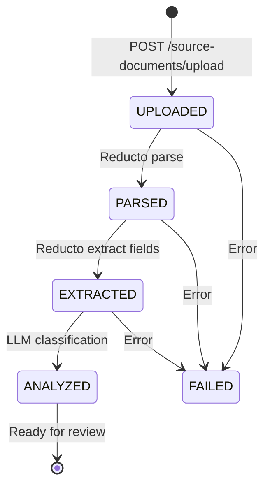
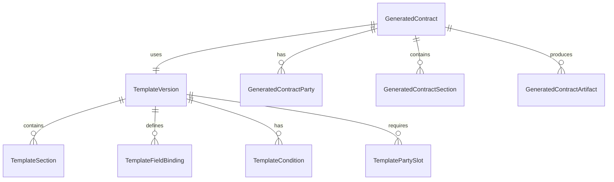

How we built a contract intelligence service that takes a raw PDF contract, extracts its structure with Reducto, classifies each section with an LLM, and produces reusable Jinja templates — all orchestrated through SQS workers with heartbeat-based visibility extension.

## Table of contents

## The problem

Real-estate agencies in Portugal deal with dozens of contract types — rental agreements, purchase contracts, promissory contracts. Each one follows a similar structure but varies in party details, clauses, and conditions. Drafting them manually is slow, error-prone, and doesn't scale.

We needed a system that could:

1. **Ingest** a source contract (PDF/DOCX) and understand its structure
2. **Analyze** each section to determine if it's static boilerplate, parameterized, conditional, or needs AI drafting
3. **Templatize** the analyzed sections into reusable Jinja templates
4. **Generate** new contracts by filling templates with CRM data

## Architecture overview


The service follows **hexagonal architecture** (ports & adapters) with async Python, FastAPI, and SQS-based workers.


The full pipeline flows through five phases:



## Project structure

```
src/contract_intelligence/
├── domain/
│   ├── entities/         # Pure dataclasses, state machines
│   ├── ports/            # Protocol interfaces
│   └── exceptions.py
├── application/
│   ├── config.py         # Settings (env vars)
│   ├── dtos/             # Pydantic request/response models
│   └── services/         # Use cases (ingestion, analysis, review)
├── adapters/
│   ├── inbound/
│   │   ├── api/          # FastAPI routes
│   │   └── workers/      # SQS consumers
│   └── outbound/
│       ├── llm/          # LangChain + OpenAI
│       ├── reducto/      # Document parsing
│       ├── persistence/  # SQLAlchemy repos
│       ├── storage/      # S3
│       └── sqs.py        # Message producer/consumer
└── entrypoints/
    ├── api.py            # FastAPI app factory
    └── worker.py         # Worker CLI
```

Every external dependency is behind a `Protocol` interface. The domain layer has zero imports from frameworks or SDKs.

## Phase 1: Document ingestion

When a user uploads a contract PDF, the API stores it in S3, computes a SHA-256 hash for deduplication, and publishes an SQS message.

The `IngestionWorker` picks it up and runs the document through [Reducto](https://reducto.ai) — a document intelligence pipeline that handles OCR, layout detection, section splitting, and field extraction in a single call.

### Domain model

The `SourceDocument` entity tracks the full lifecycle with an explicit state machine:

```python
class UploadStatus(StrEnum):
    UPLOADED = "uploaded"
    PARSED = "parsed"
    EXTRACTED = "extracted"
    ANALYZED = "analyzed"
    FAILED = "failed"

_UPLOAD_TRANSITIONS: dict[UploadStatus, set[UploadStatus]] = {
    UploadStatus.UPLOADED: {UploadStatus.PARSED, UploadStatus.EXTRACTED, UploadStatus.FAILED},
    UploadStatus.PARSED: {UploadStatus.EXTRACTED, UploadStatus.FAILED},
    UploadStatus.EXTRACTED: {UploadStatus.ANALYZED, UploadStatus.FAILED},
    UploadStatus.ANALYZED: {UploadStatus.FAILED},
    UploadStatus.FAILED: set(),
}

def _validate_transition(current, target, transitions, entity_name):
    allowed = transitions.get(current, set())
    if target not in allowed:
        raise InvalidStatusTransitionError(
            f"{entity_name} cannot transition from {current} to {target}"
        )
```

Every status change goes through `_validate_transition`. This prevents impossible states like jumping from `UPLOADED` directly to `ANALYZED`.

### The Reducto port

External services are defined as `Protocol` interfaces in the domain layer:

```python
@dataclass
class ParsedSection:
    sort_order: int
    title: str | None
    page_start: int | None
    page_end: int | None
    content: str

@dataclass
class ExtractedField:
    field_key: str
    field_value: Any
    source_text: str | None = None
    page_number: int | None = None
    confidence: float | None = None

@dataclass
class PipelineResult:
    job_id: str
    parse_response_json: dict
    extract_response_json: dict
    split_response_json: dict | None
    sections: list[ParsedSection] = field(default_factory=list)
    extracted_fields: list[ExtractedField] = field(default_factory=list)

class ReductoPort(Protocol):
    async def run_pipeline(self, document_input: str, pipeline_id: str) -> PipelineResult: ...
    async def upload_file(self, data: bytes, filename: str) -> str: ...
```

The domain defines *what* it needs (sections, fields, confidence scores). The adapter decides *how* (Reducto SDK, presigned URLs, timeouts).

### Ingestion service

The `IngestionService` orchestrates the full parse-and-extract flow:

```python
class IngestionService:
    def __init__(
        self,
        repo: SourceDocumentRepository,
        section_repo: SourceSectionRepository,
        storage: FileStoragePort,
        reducto: ReductoPort,
        settings: Settings,
        publisher: MessagePublisherPort | None = None,
    ) -> None:
        self._repo = repo
        self._section_repo = section_repo
        self._storage = storage
        self._reducto = reducto
        self._settings = settings
        self._publisher = publisher

    async def ingest(self, document_id: UUID) -> IngestResult:
        document = await self._repo.get_by_id(document_id)
        if not document:
            raise SourceDocumentNotFoundError(document_id)

        # Idempotency guard: only process documents in UPLOADED state
        if document.upload_status != UploadStatus.UPLOADED:
            return IngestResult(parse_run_id=None, extraction_run_id=None,
                                sections_created=0, fields_extracted=0)

        parse_run = SourceParseRun.start(source_document_id=document.id)
        parse_run = await self._repo.save_parse_run(parse_run)

        try:
            # Dev: download from LocalStack, upload to Reducto
            # Prod: generate S3 presigned URL
            if self._settings.aws_endpoint_url:
                storage_key = document.storage_url.replace(
                    f"s3://{self._settings.s3_bucket_name}/", ""
                )
                data = await self._storage.download(storage_key)
                document_input = await self._reducto.upload_file(data, document.filename)
            else:
                storage_key = document.storage_url.replace(
                    f"s3://{self._settings.s3_bucket_name}/", ""
                )
                document_input = await self._storage.get_presigned_url(storage_key)

            # Run Reducto pipeline
            result = await self._reducto.run_pipeline(
                document_input, self._settings.reducto_pipeline_id
            )

            now = datetime.now(UTC)
            parse_run.mark_succeeded(completed_at=now, provider_job_id=result.job_id,
                                     response_json=result.parse_response_json)
            await self._repo.update_parse_run(parse_run)

            document.mark_parsed()
            await self._repo.update_status(document.id, document.upload_status)

            # Create sections and field evidence
            for parsed_section in result.sections:
                section = SourceSection.from_parsed(document.id, parsed_section)
                await self._section_repo.save_section(section)

            extraction_run = SourceExtractionRun.create_succeeded(
                source_document_id=document.id,
                schema_version="pipeline-v1",
                extraction_schema_json={"pipeline_id": self._settings.reducto_pipeline_id},
                completed_at=now, provider_job_id=result.job_id,
                result_json=result.extract_response_json,
            )
            extraction_run = await self._repo.save_extraction_run(extraction_run)

            for extracted_field in result.extracted_fields:
                evidence = SourceFieldEvidence.from_extracted(
                    extraction_run.id, extracted_field
                )
                await self._repo.save_field_evidence(evidence)

            document.mark_extracted()
            await self._repo.update_status(document.id, document.upload_status)

            # Publish analysis event for the next phase
            if self._publisher and self._settings.sqs_analysis_queue_url:
                await self._publisher.publish(
                    self._settings.sqs_analysis_queue_url,
                    {"document_id": str(document.id)},
                )

            return IngestResult(
                parse_run_id=parse_run.id,
                extraction_run_id=extraction_run.id,
                sections_created=len(result.sections),
                fields_extracted=len(result.extracted_fields),
            )
        except Exception:
            parse_run.mark_failed(completed_at=datetime.now(UTC))
            await self._repo.update_parse_run(parse_run)
            raise
```

Key design decisions:

- **Idempotency guard** — if the document is already past `UPLOADED`, we skip. SQS can deliver messages more than once.
- **Dev/prod path split** — LocalStack doesn't support presigned URLs that Reducto can reach, so in dev we download and re-upload.
- **Error handling** — on failure, the parse run is marked `FAILED` but the document stays `UPLOADED` so SQS retry can pick it up again.

## Phase 2: LLM section analysis

Once a document is extracted, the analysis worker classifies each section using GPT-5.4 with LangChain structured output.

### Structured output schema

We use Pydantic models as the LLM's response schema. LangChain's `with_structured_output()` enforces the schema at the API level — the LLM must return valid JSON matching these types:

```python
class SectionAnalysisOutput(BaseModel):
    model_config = ConfigDict(extra="forbid")

    source_section_id: uuid.UUID = Field(
        description="The UUID of the source section being analysed."
    )
    section_type: SectionType = Field(
        description="Classification of the section content type."
    )
    reasoning: str = Field(
        description="Explanation of why this classification was chosen."
    )
    risk_level: RiskLevel = Field(
        description="Risk level associated with incorrect rendering."
    )
    recommended_strategy: RecommendedStrategy = Field(
        description="Recommended rendering strategy for template generation."
    )
    references: list[AnalysisReference] = Field(
        default=[],
        description="Fields and conditions referenced by this section."
    )

class SourceSectionAnalysisBatchOutput(BaseModel):
    model_config = ConfigDict(extra="forbid")

    analyses: list[SectionAnalysisOutput] = Field(
        description="Analysis results for each section in the batch."
    )
```

The classification values are domain enums:

- **section_type**: `static` (boilerplate), `parameterized` (has placeholders), `conditional` (clause depends on conditions), `generative` (needs AI drafting)
- **risk_level**: `low`, `medium`, `high`
- **recommended_strategy**: `literal` (copy verbatim), `template` (Jinja with fields), `template_variant` (Jinja with conditionals), `ai_draft` (LLM generates)

### The LLM client

```python
SYSTEM_PROMPT = """\
You are an expert analyst of Portuguese real-estate contracts.
You receive a list of sections extracted from a source contract document,
together with structured field evidence already extracted from that document.

For each section you must determine:
1. **section_type** – classify the section content:
   - `static`: boilerplate that rarely changes across contracts of the same type.
   - `parameterized`: contains placeholders that vary per contract (names, dates, amounts).
   - `conditional`: included only when certain conditions apply (e.g. guarantor clause).
   - `generative`: needs AI drafting because the language varies significantly.
2. **reasoning** – a short explanation of why you chose this classification.
3. **risk_level** – how risky it would be to render this section incorrectly.
4. **recommended_strategy** – how the template engine should handle this section.
5. **references** – which extracted fields or conditions this section depends on.

Return **one analysis per section**, keyed by `source_section_id`.
"""

class SectionAnalysisLLMClient:
    def __init__(self, settings: Settings, model: str = "openai:gpt-5.4") -> None:
        self._model = model
        self._settings = settings

    async def analyze_sections(
        self,
        sections: list[SourceSection],
        field_evidence: list[SourceFieldEvidence],
        *,
        document_id: UUID | None = None,
    ) -> SourceSectionAnalysisBatchOutput:
        langfuse_handler = _get_langfuse_handler()
        callbacks = [langfuse_handler] if langfuse_handler else []

        llm = init_chat_model(model=self._model, api_key=self._settings.openai_api_key)
        structured_llm = llm.with_structured_output(SourceSectionAnalysisBatchOutput)

        human_message = _build_human_message(sections, field_evidence)

        with propagate_attributes(
            trace_name="section-analysis",
            tags=["section-analysis", "contract-intelligence"],
            metadata={"section_count": len(sections), "field_count": len(field_evidence)},
        ):
            async with asyncio.timeout(LLM_TIMEOUT_SECONDS):
                result = await structured_llm.ainvoke(
                    [
                        {"role": "system", "content": SYSTEM_PROMPT},
                        {"role": "human", "content": human_message},
                    ],
                    config={"callbacks": callbacks} if callbacks else {},
                )

        return result
```

The human message is built by concatenating all sections with their extracted text and all field evidence. The LLM sees the full document context and returns a structured analysis per section.

### Analysis service

The `SectionAnalysisService` orchestrates the LLM call and persists results:

```python
class SectionAnalysisService:
    def __init__(
        self,
        doc_repo: SourceDocumentRepository,
        section_repo: SourceSectionRepository,
        llm: SectionAnalysisLLMPort,
        settings: Settings,
    ) -> None:
        self._doc_repo = doc_repo
        self._section_repo = section_repo
        self._llm = llm
        self._settings = settings

    async def analyze(self, document_id: UUID) -> SourceSectionAnalysisRun:
        document = await self._doc_repo.get_by_id(document_id)
        if not document:
            raise SourceDocumentNotFoundError(document_id)

        if document.upload_status != UploadStatus.EXTRACTED:
            raise SectionAnalysisError(
                f"Document {document_id} has status {document.upload_status}, expected EXTRACTED"
            )

        # Idempotency: skip if already analyzed
        succeeded_runs = [r for r in document.analysis_runs if r.status == RunStatus.SUCCEEDED]
        if succeeded_runs:
            return succeeded_runs[0]

        run = SourceSectionAnalysisRun(source_document_id=document.id)
        run.mark_running()
        run = await self._doc_repo.save_analysis_run(run)

        try:
            field_evidence = await self._doc_repo.get_field_evidence_by_document_id(document.id)
            llm_output = await self._llm.analyze_sections(
                document.sections, field_evidence, document_id=document.id
            )

            section_ids = {s.id for s in document.sections}
            processed_count = 0

            for analysis_output in llm_output.analyses:
                if analysis_output.source_section_id not in section_ids:
                    logger.warning("llm_returned_unknown_section_id",
                                   section_id=str(analysis_output.source_section_id))
                    continue

                analysis = self._build_analysis(run.id, analysis_output)
                analysis = await self._section_repo.save_analysis(analysis)
                processed_count += 1

                for ref_output in analysis_output.references:
                    ref = SourceSectionAnalysisReference(
                        source_section_analysis_id=analysis.id,
                        reference_type=ref_output.reference_type,
                        reference_key=ref_output.reference_key,
                        display_label=ref_output.display_label,
                        confidence=ref_output.confidence,
                    )
                    await self._section_repo.save_analysis_reference(ref)

            if processed_count == 0:
                raise SectionAnalysisError("LLM returned 0 valid analyses")

            run.mark_succeeded(completed_at=datetime.now(UTC))
            await self._doc_repo.update_analysis_run(run)

            document.mark_analyzed()
            await self._doc_repo.update_status(document.id, document.upload_status)

        except Exception:
            run.mark_failed(completed_at=datetime.now(UTC))
            await self._doc_repo.update_analysis_run(run)
            raise

        return run
```

The service validates that the LLM returned section IDs that actually exist in our database. Unknown IDs are logged and skipped — we don't trust the model blindly.

## Phase 3: SQS workers with heartbeat

Both workers follow the same pattern: poll SQS, process the message, extend visibility while processing, and delete on success.

```python
async def _heartbeat(
    consumer: SQSMessageConsumer,
    queue_url: str,
    receipt_handle: str,
    interval: int = 60,
    extension: int = 120,
) -> None:
    """Periodically extend message visibility while processing."""
    try:
        while True:
            await asyncio.sleep(interval)
            await consumer.change_message_visibility(queue_url, receipt_handle, extension)
    except asyncio.CancelledError:
        pass

class IngestionWorker:
    def __init__(self) -> None:
        self._running = True

    async def run(self) -> None:
        settings = get_settings()
        consumer = SQSMessageConsumer(get_boto3_session(), settings.aws_endpoint_url)
        queue_url = settings.sqs_ingestion_queue_url

        loop = asyncio.get_event_loop()
        for sig in (signal.SIGTERM, signal.SIGINT):
            loop.add_signal_handler(sig, self._shutdown)

        while self._running:
            messages = await consumer.poll(queue_url)

            for msg in messages:
                heartbeat_task = asyncio.create_task(
                    _heartbeat(consumer, queue_url, msg["receipt_handle"],
                               interval=settings.heartbeat_interval_seconds,
                               extension=settings.heartbeat_extension_seconds)
                )
                try:
                    body = msg["body"]
                    document_id = UUID(body["document_id"])

                    async for session in get_db_session():
                        # Wire up all dependencies
                        service = IngestionService(
                            repo=SqlAlchemySourceDocumentRepository(session),
                            section_repo=SqlAlchemySourceSectionRepository(session),
                            storage=S3FileStorage(get_boto3_session(), settings),
                            reducto=ReductoClient(api_key=settings.reducto_api_key),
                            settings=settings,
                            publisher=SQSMessagePublisher(get_boto3_session(),
                                                         settings.aws_endpoint_url),
                        )
                        await service.ingest(document_id)
                        await session.commit()

                    await consumer.delete_message(queue_url, msg["receipt_handle"])
                except Exception:
                    logger.exception("ingestion_worker_error",
                                     document_id=str(document_id))
                finally:
                    heartbeat_task.cancel()
                    await asyncio.gather(heartbeat_task, return_exceptions=True)
```

The heartbeat pattern is critical for long-running tasks like Reducto pipeline calls (up to 600s). Without it, SQS would assume the message was lost and redeliver it to another consumer.

A separate **DLQ worker** monitors both dead-letter queues. Messages that exhaust their retry count land in the DLQ, and the worker marks the corresponding document as `FAILED`.

## Phase 4: Template promotion

After human review, analyzed sections are promoted to a `TemplateVersion`. Each template section gets a Jinja render template, field bindings, and optional condition expressions:

```python
@dataclass
class TemplateSection:
    template_version_id: UUID
    section_key: str
    title: str
    section_type: str
    sort_order: int
    render_template: str           # Jinja template string
    is_repeatable: bool = False
    is_optional: bool = False
    condition_expression: str | None = None  # e.g. "has_guarantor == true"
    status: SectionStatus = SectionStatus.DRAFT

@dataclass
class TemplateFieldBinding:
    template_version_id: UUID
    field_key: str
    binding_type: str
    required: bool = False
    placeholder_label: str | None = None
    default_value_json: Any = None
    validation_rules_json: dict | None = None

@dataclass
class TemplateVersion:
    contract_template_id: UUID
    version_number: int
    schema_json: dict
    render_engine: str = "jinja"
    status: TemplateStatus = TemplateStatus.DRAFT
    sections: list[TemplateSection] = field(default_factory=list)
    field_bindings: list[TemplateFieldBinding] = field(default_factory=list)
    conditions: list[TemplateCondition] = field(default_factory=list)
    party_slots: list[TemplatePartySlot] = field(default_factory=list)
```

Templates follow a `DRAFT -> REVIEW -> APPROVED -> DEPRECATED -> ARCHIVED` lifecycle, with the same state machine pattern used throughout the codebase.

## Phase 5: Contract generation (next up)

The final phase — rendering a template with CRM data into a signed contract — is modeled but not yet implemented. The domain entities are ready:



The plan:

1. `POST /generated-contracts/from-crm` — resolve CRM contact and property data, create a draft contract
2. `POST /generated-contracts/{id}/render` — evaluate condition expressions, render each Jinja section, generate PDF, upload to S3

## Observability

Every LLM call is traced through **Langfuse** with section count, field count, and document ID as metadata. The `propagate_attributes` context manager ensures traces are correlated across the async call chain:

```python
with propagate_attributes(
    trace_name="section-analysis",
    tags=["section-analysis", "contract-intelligence"],
    metadata={"section_count": len(sections), "field_count": len(field_evidence)},
):
    async with asyncio.timeout(LLM_TIMEOUT_SECONDS):
        result = await structured_llm.ainvoke(...)
```

Workers use **structlog** for structured JSON logging with consistent event names (`ingestion_complete`, `analysis_results`, `heartbeat_extended`). FastAPI routes are instrumented with **Logfire**.

## Key takeaways

- **Hexagonal architecture pays off** — swapping Reducto for another parser or OpenAI for Anthropic means changing one adapter, not the entire service.
- **State machines prevent impossible states** — explicit transition maps catch bugs at the domain level before they reach the database.
- **Structured output turns LLMs into typed functions** — Pydantic schemas plus LangChain's `with_structured_output()` give you validated, typed responses instead of free-form text.
- **Idempotency is not optional with SQS** — every service method checks current state before processing. At-least-once delivery means your code will be called more than once.
- **Heartbeat keeps long tasks alive** — without visibility extension, SQS would redeliver messages before Reducto finishes parsing a 50-page contract.

The contract generation phase is next. Once implemented, the full pipeline will go from a raw PDF to a signed, CRM-populated contract with human review at the critical step.
