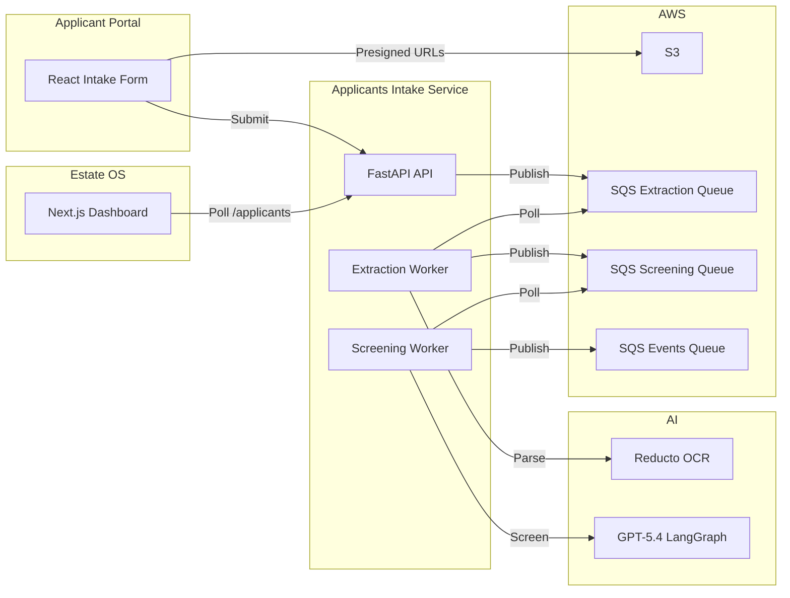
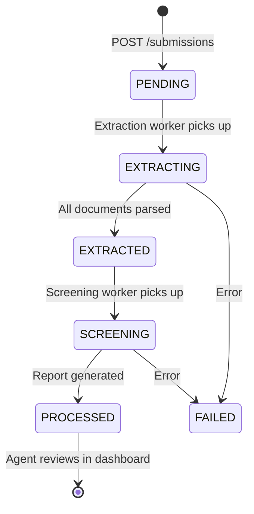
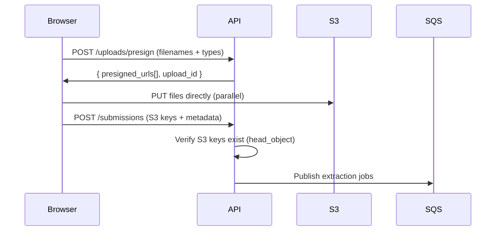
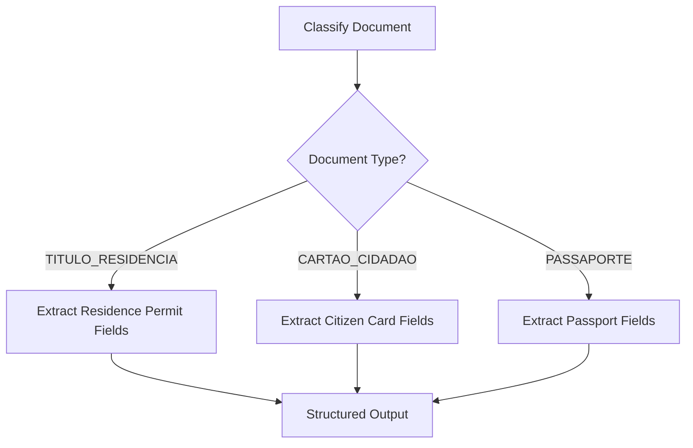
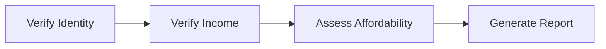
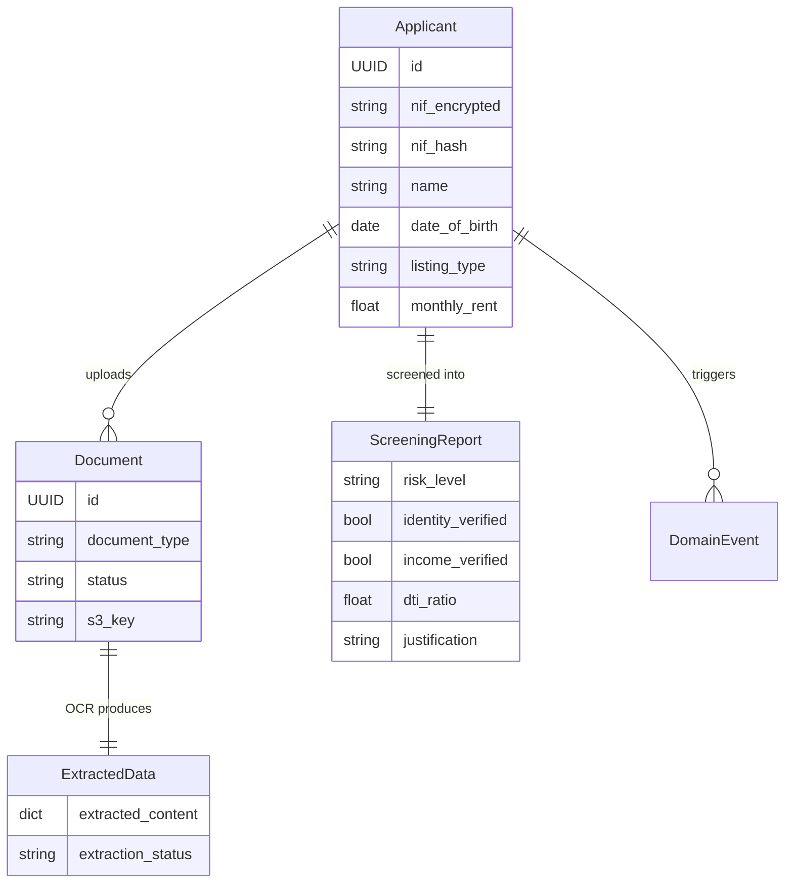

How we built a pipeline where a rental applicant uploads their ID and income receipts through a React form, and the system automatically extracts, verifies, and scores their application — using Reducto for OCR, LangGraph for multi-step assessment, and NIF encryption at rest.

## Table of contents

## The problem

When a tenant applies for a rental property in Portugal, the agency needs to verify their identity, confirm their income, and assess whether they can afford the rent. This means collecting a citizen card or residence permit, three months of payslips, cross-referencing names and NIF numbers across documents, and calculating debt-to-income ratios.

Agents do this manually. They download PDFs, open them side by side, eyeball the numbers, and write a summary. It takes 20-30 minutes per applicant, and the quality varies depending on who's reviewing.

We needed a system that could:

1. Let applicants submit documents through a self-service portal
2. OCR and extract structured data from each document
3. Classify ID documents by type (citizen card, passport, residence permit) and route to type-specific extraction
4. Verify identity by cross-referencing applicant claims against extracted fields
5. Verify income continuity and calculate average monthly earnings
6. Assess affordability using debt-to-income ratio
7. Produce a risk-scored report the agent can review in seconds

## Architecture overview

The applicant screening system spans three services: a React intake form, a FastAPI screening backend, and the Estate OS dashboard where agents review results.



The pipeline flows through three async phases:



## Project structure

```
src/applicant_management/
├── domain/
│   └── models/
│       ├── applicant.py          # Applicant entity + listing/property enums
│       ├── document.py           # Document entity + status machine
│       ├── extracted_data.py     # Raw OCR + structured extraction
│       ├── screening_report.py   # Risk-scored assessment
│       └── domain_event.py       # Cross-service events
├── application/
│   ├── config.py                 # Settings (env vars)
│   ├── crypto.py                 # RSA encryption + HMAC blind index
│   └── services/
│       ├── submission_service.py
│       ├── extraction_service.py
│       └── screening_service.py
├── adapters/
│   ├── inbound/
│   │   ├── api/routes.py         # FastAPI endpoints
│   │   └── workers/
│   │       ├── extraction_worker.py
│   │       └── screening_worker.py
│   └── outbound/
│       ├── ai/
│       │   ├── reducto_extractor.py           # OCR
│       │   ├── langchain_id_extraction.py     # LangGraph ID pipeline
│       │   ├── langchain_screening.py         # LangGraph screening pipeline
│       │   └── langchain_translator.py        # Post-screening translation
│       ├── persistence/
│       │   ├── models.py          # SQLAlchemy models
│       │   └── repositories.py    # Encrypted repos
│       ├── storage/               # S3
│       └── sqs/                   # Message producer/consumer
└── entrypoints/
    ├── api.py                     # FastAPI app factory
    └── worker.py                  # Worker CLI
```

## Domain models

### Applicant

The `Applicant` entity captures the tenant's personal data and the property they're applying for:

```python
class ListingType(StrEnum):
    ARRENDAMENTO = "ARRENDAMENTO"  # Rental
    VENDA = "VENDA"                # Sale

class PropertyType(StrEnum):
    APARTAMENTO = "APARTAMENTO"
    MORADIA = "MORADIA"
    TERRENO = "TERRENO"

@dataclass
class Applicant:
    nif: str                        # Encrypted at rest (RSA-OAEP)
    name: str
    date_of_birth: date
    email: str
    organization_id: UUID           # Real estate agency
    form_request_id: UUID
    listing_type: ListingType
    phone: str | None = None
    property_type: PropertyType | None = None
    property_value: float | None = None
    monthly_rent: float | None = None
    property_title: str = "n/a"
    property_address: str = "n/a"
    id: UUID = field(default_factory=uuid4)
```

The NIF (Portuguese tax ID) is sensitive personal data. It's RSA-encrypted before persistence and looked up via an HMAC-SHA256 blind index — more on that later.

### Document lifecycle

Each uploaded document tracks its extraction status:

```python
class DocumentType(StrEnum):
    ID_DOCUMENT = "ID_DOCUMENT"
    PROOF_OF_INCOME = "PROOF_OF_INCOME"

class DocumentStatus(StrEnum):
    PENDING = "PENDING"
    UPLOADED = "UPLOADED"
    EXTRACTING = "EXTRACTING"
    EXTRACTED = "EXTRACTED"

@dataclass
class Document:
    applicant_id: UUID
    s3_key: str
    original_filename: str
    content_type: str
    document_type: DocumentType
    status: DocumentStatus = DocumentStatus.PENDING
    reducto_document_id: str | None = None
    id: UUID = field(default_factory=uuid4)
```

### ScreeningReport

The final output of the pipeline — a risk-scored assessment:

```python
class RiskLevel(StrEnum):
    LOW = "LOW"
    MEDIUM = "MEDIUM"
    HIGH = "HIGH"

@dataclass
class ScreeningReport:
    applicant_id: UUID
    risk_level: RiskLevel
    identity_verified: bool
    income_verified: bool
    dti_ratio: float
    justification: str
    listing_type: ListingType
    average_monthly_income: float
    id: UUID = field(default_factory=uuid4)
    property_type: PropertyType | None = None
```

## The intake form

The applicant-facing portal is a React app with a 6-step form flow: agreement, personal info, contact info, document upload, review, and success confirmation. State is managed through React Context and persisted to cookies so applicants can resume if they leave.

The critical part is the upload flow. Documents bypass the API entirely using presigned S3 URLs:



This avoids API Gateway's 10MB payload limit and keeps file transfers off the backend. The API only sees S3 keys, not file content.

## Document extraction with Reducto

The extraction worker polls SQS, downloads each document from S3, and sends it through Reducto for OCR:

```python
class ReductoDocumentExtractor:
    async def extract(
        self, document_source: str | bytes, filename: str = "document.pdf"
    ) -> dict[str, Any]:
        with tempfile.NamedTemporaryFile(suffix=".pdf", delete=False) as tmp:
            tmp.write(document_source)
            tmp_path = Path(tmp.name)
        try:
            upload = await asyncio.to_thread(self._client.upload, file=tmp_path)
            result = await asyncio.to_thread(self._client.parse.run, input=upload)
        finally:
            tmp_path.unlink(missing_ok=True)

        return {
            "document_id": result.job_id,
            "content": [chunk.model_dump() for chunk in result.chunks],
        }
```

The raw OCR content is stored in the `extracted_data` table. Once all documents for an applicant are extracted, the worker publishes a message to the screening queue.

## ID extraction with LangGraph

Raw OCR text from an ID document isn't directly useful. A citizen card has different fields than a residence permit, which has different fields than a passport. We need to classify the document type first, then extract type-specific fields.

This is a natural fit for LangGraph — a stateful graph where each node is an LLM call with its own prompt and output schema.

### The graph

```python
class IdExtractionState(TypedDict):
    raw_content: dict[str, Any]
    classification: dict[str, Any] | None
    extraction: dict[str, Any] | None

class LangChainIdDocumentExtractor:
    def _build_graph(self) -> CompiledStateGraph:
        graph = StateGraph(IdExtractionState)
        graph.add_node("classify", self._classify)
        graph.add_node("extract_titulo", self._extract_titulo)
        graph.add_node("extract_cartao", self._extract_cartao)
        graph.add_node("extract_passaporte", self._extract_passaporte)
        graph.set_entry_point("classify")
        graph.add_conditional_edges("classify", self._route_by_type)
        graph.add_edge("extract_titulo", END)
        graph.add_edge("extract_cartao", END)
        graph.add_edge("extract_passaporte", END)
        return graph.compile()
```



### Classification

The classifier determines what type of Portuguese ID document the OCR text represents:

```python
CLASSIFIER_PROMPT = """You are an expert at classifying Portuguese identity documents \
from OCR-extracted content.

Analyze the following raw OCR content and determine which type of Portuguese \
identity document it is.

The possible document types are:
- TITULO_RESIDENCIA: Look for "TITULO DE RESIDENCIA", "SEF", residence permit numbers
- CARTAO_CIDADAO: Look for "CARTAO DE CIDADAO", "REPUBLICA PORTUGUESA", \
citizen card numbers
- PASSAPORTE: Look for "PASSAPORTE", "PASSPORT", MRZ lines, passport numbers

Raw OCR content:
{raw_content}

Classify this document. Provide the document_type, your confidence (0.0 to 1.0), \
and your reasoning."""
```

### Type-specific extraction

Each document type has its own Pydantic schema and extraction prompt. The schemas share some fields but diverge where formats differ:

```python
class TituloResidenciaExtraction(BaseModel):
    full_name: str | None = None
    birth_date: str | None = None
    expiry_date: str | None = None
    tax_id_number: str | None = None
    warnings: list[str] = []
    confidence_scores: dict[str, float] = {}
    document_type_match: bool = True

class CartaoCidadaoExtraction(BaseModel):
    full_name: str | None = None
    birth_date: str | None = None
    expiry_date: str | None = None
    document_number: str | None = None
    warnings: list[str] = []
    confidence_scores: dict[str, float] = {}
    document_type_match: bool = True

class PassaporteExtraction(BaseModel):
    first_name: str | None = None
    last_name: str | None = None
    passport_number: str | None = None
    issue_date: str | None = None
    expiry_date: str | None = None
    warnings: list[str] = []
    confidence_scores: dict[str, float] = {}
    document_type_match: bool = True
```

A citizen card has a `document_number`; a passport splits the name into `first_name` and `last_name`; a residence permit has a `tax_id_number`. Each extraction includes per-field confidence scores so the screening pipeline can weight its decisions.

## The screening pipeline

This is the core of the system — a 4-node LangGraph pipeline that takes the applicant's claims and extracted document data, and produces a risk-scored report.

```python
class ScreeningState(TypedDict):
    applicant: dict[str, Any]
    extracted_data: list[dict[str, Any]]
    identity_result: dict[str, Any] | None
    income_result: dict[str, Any] | None
    affordability_result: dict[str, Any] | None
    final_result: dict[str, Any] | None

class LangChainScreeningAssessor:
    def _build_graph(self) -> CompiledStateGraph:
        graph = StateGraph(ScreeningState)
        graph.add_node("verify_identity", self._verify_identity)
        graph.add_node("verify_income", self._verify_income)
        graph.add_node("assess_affordability", self._assess_affordability)
        graph.add_node("generate_report", self._generate_report)

        graph.set_entry_point("verify_identity")
        graph.add_edge("verify_identity", "verify_income")
        graph.add_edge("verify_income", "assess_affordability")
        graph.add_edge("assess_affordability", "generate_report")
        graph.add_edge("generate_report", END)

        return graph.compile()
```



### Node 1: Identity verification

Compares the applicant's self-reported NIF and name against the structured fields extracted from their ID document:

```python
async def _verify_identity(self, state: ScreeningState) -> dict[str, Any]:
    chain = self._llm.with_structured_output(IdentityVerificationResult)

    prompt = f"""Verify the identity of this applicant by comparing their provided \
information against the structured fields extracted from their ID document.

Applicant NIF (Portuguese Tax ID): {applicant["nif"]}
Applicant Name: {applicant["name"]}

ID Document Type: {doc_type} (confidence: {confidence:.2f})

Extracted fields from ID document:
{json.dumps(extraction, default=str, indent=2)}

Compare the applicant's NIF against any tax ID / NIF field in the extraction.
Compare the applicant's name against the name fields in the extraction.
Consider the confidence scores for each field when making your assessment."""

    result = await chain.ainvoke(prompt, config=config)
    return {"identity_result": result.model_dump()}
```

```python
class IdentityVerificationResult(BaseModel):
    identity_verified: bool
    nif_match: bool
    name_match: bool
    reasoning: str
```

The model gets the raw extraction with confidence scores, so it can reason about partial matches — a name might have a typo, or the OCR might have misread a digit in the NIF.

### Node 2: Income verification

Checks that the applicant provided at least 3 sequential months of income proof and calculates the average:

```python
class IncomeVerificationResult(BaseModel):
    income_verified: bool
    months_verified: int
    average_monthly_income: float
    same_name: bool
    reasoning: str
```

The model verifies name consistency across payslips (do they all belong to the same person?) and checks for sequential months to detect gaps.

### Node 3: Affordability assessment

Calculates the debt-to-income ratio using Portuguese market conventions:

```python
class AffordabilityResult(BaseModel):
    dti_ratio: float
    monthly_obligation: float
    is_affordable: bool
    reasoning: str
```

For rentals, the monthly obligation is the rent directly. For purchases, we estimate a monthly mortgage payment over 40 years: `property_value / (40 * 12)`. The DTI threshold is 35% — standard for Portuguese banks.

### Node 4: Report generation

Aggregates all previous results into a final risk level:

- **LOW**: All checks passed — identity verified, income verified, DTI within limits
- **MEDIUM**: One check has concerns but no critical failures
- **HIGH**: Multiple checks failed or critical issues found

```python
class ScreeningAssessmentResult(BaseModel):
    risk_level: RiskLevel
    identity_verified: bool
    income_verified: bool
    dti_ratio: float
    average_monthly_income: float
    justification: str
```

The justification is then translated to Portuguese using a lightweight GPT-5-mini call, since agents work in Portuguese.

## NIF encryption at rest

The NIF is the most sensitive field in the system. We encrypt it with RSA-OAEP before it hits the database and use an HMAC-SHA256 blind index for lookups:

```python
class SqlAlchemyApplicantRepository:
    def __init__(
        self,
        session: AsyncSession,
        public_key: RSAPublicKey,
        private_key: RSAPrivateKey,
        hmac_key: bytes,
    ) -> None:
        self._session = session
        self._public_key = public_key
        self._private_key = private_key
        self._hmac_key = hmac_key

    async def save(self, applicant: Applicant) -> Applicant:
        encrypted_nif = encrypt_field(applicant.nif, self._public_key)
        nif_hash = compute_blind_index(applicant.nif, self._hmac_key)
        model = ApplicantModel(
            id=applicant.id,
            nif=encrypted_nif,        # RSA-encrypted ciphertext
            nif_hash=nif_hash,         # HMAC-SHA256 for indexed lookups
            name=applicant.name,
            # ...
        )
```

The database stores the encrypted NIF in a `VARCHAR(512)` column and the blind index in a `VARCHAR(64)` column with a unique constraint on `(nif_hash, form_request_id)`. This lets us detect duplicate submissions without ever decrypting.

## The agent dashboard

Estate OS — the Next.js dashboard — polls the applicants API every 5 seconds to pick up new submissions and screening results:

```
Next.js Server Action
  → GET /api/v1/applicants/?organization_id=...
    → ApplicantList (with screening reports)
      → ApplicantCard (risk badge, DTI ratio, verify status)
        → ApplicantDetailPanel (full report + approve/deny actions)
```

The agent sees a card for each applicant with a color-coded risk badge (green/yellow/red), identity and income verification status, DTI ratio, and the AI-generated justification. From there they can approve, deny, or request owner approval — all without opening a single PDF.

## Cross-service events

When screening completes, the service publishes an `APPLICANT_SCREENED` event to the events SQS queue. This event carries the full context needed by downstream consumers:

```python
class ApplicantScreenedEvent(BaseModel):
    event_type: str = "APPLICANT_SCREENED"
    applicant_id: UUID
    form_request_id: UUID
    organization_id: UUID
    name: str
    email: str
    listing_type: str
    has_id_document: bool
    has_proof_of_income: bool
    documents: list[DocumentPayload]
    screening: ScreeningResultPayload
    screened_at: datetime
```

This decouples the screening service from Estate OS. The dashboard doesn't need to know how screening works — it just reads the results.

## Observability

Every LLM call is traced through Langfuse with applicant-scoped metadata:

```python
@staticmethod
def _langfuse_config(
    *,
    trace_name: str,
    step_name: str,
    applicant_id: str,
    organization_id: str | None = None,
    form_request_id: str | None = None,
) -> dict[str, Any]:
    handler = LangfuseCallbackHandler()
    metadata: dict[str, Any] = {"applicant_id": applicant_id}
    if organization_id:
        metadata["langfuse_user_id"] = organization_id
    if form_request_id:
        metadata["langfuse_session_id"] = form_request_id
    metadata["langfuse_tags"] = ["screening", step_name]
    return {"callbacks": [handler], "run_name": step_name, "metadata": metadata}
```

Logfire provides OpenTelemetry tracing across the full request chain — from the FastAPI endpoint through SQS to the worker, with spans tagged by `applicant_id`. Combined with structlog's JSON output, we can trace a single applicant's journey from submission to screening report.

## Entity relationships



## Key takeaways

- **LangGraph turns multi-step LLM workflows into debuggable graphs** — each node has its own prompt, output schema, and trace. When screening produces a wrong result, we can pinpoint exactly which node failed and why, without replaying the entire pipeline.
- **Document-type routing beats generic extraction** — the classify-then-extract pattern with conditional edges means each ID format gets a tailored prompt. A citizen card prompt knows to look for `document_number`; a passport prompt knows to split first/last name. Accuracy improves significantly over a one-size-fits-all approach.
- **Presigned URLs keep files off the backend** — with documents going directly from browser to S3, the API never handles file bytes. This eliminates payload limits, reduces latency, and simplifies the backend to pure JSON processing.
- **Blind indexing enables encrypted lookups** — HMAC-SHA256 hashes of the NIF allow duplicate detection and indexed queries without ever storing plaintext. The RSA-encrypted ciphertext is only decrypted when displaying data to authorized users.
- **Event-driven architecture decouples screening from presentation** — Estate OS doesn't know or care how screening works. It polls an API endpoint and renders whatever the screening service produced. Changing the LangGraph pipeline or adding new verification nodes requires zero changes to the dashboard.
- **Idempotency is built into every service** — the extraction service skips already-extracted documents, the screening service skips already-screened applicants, and SQS messages can carry a `force=True` flag for DLQ reprocessing. At-least-once delivery is handled at every layer.
