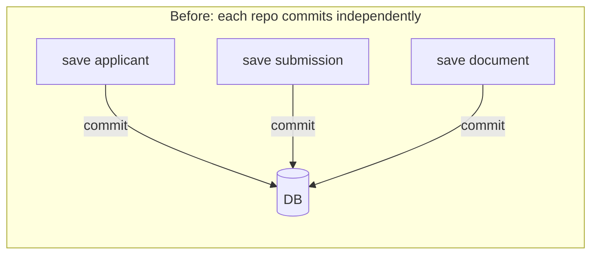
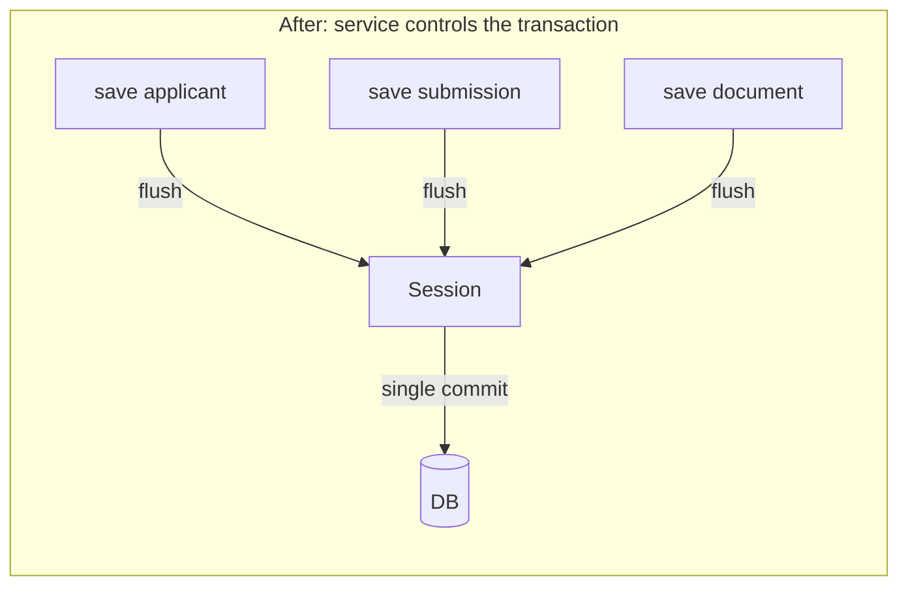

We discovered three different commit strategies in our Python backend while debugging why a contract document's status wasn't updating after a successful parse. The document would go through Reducto OCR, sections would be extracted, the parse run would be marked as succeeded — and then nothing. The status stayed `UPLOADED` forever. The fix wasn't just adding a `commit()` call. It was implementing a proper transaction boundary pattern across all three of our SQLAlchemy-backed bounded contexts.

## Table of contents

## The problem: three commit strategies

Estate OS Service has three bounded contexts that use SQLAlchemy with PostgreSQL: **screening**, **bookings**, and **contract intelligence**. When we audited the codebase, we found that each one handled transactions differently. All three were broken in different ways.

### Screening: repos auto-commit

In the screening context, every repository method called `commit()` after saving. That meant a multi-step operation like creating a submission was actually several independent transactions:

```python
# screening/application/services/submission.py (BEFORE)
applicant = await self.applicant_repo.save(applicant)   # commit #1
submission = await self.submission_repo.save(submission) # commit #2
for doc in documents:
    await self.document_repo.save(doc)                   # commit #3, #4, ...
await self.publisher.publish(extraction_queue, msg)      # if this fails,
# applicant + submission + documents are already committed with no way to roll back
```

Each `save()` was its own transaction. If the third document failed to save, we'd have an applicant, a submission, two documents, and a broken state. There was no way to roll back the earlier commits. We were building up partial, inconsistent data every time something went wrong partway through.

### Contract intelligence: flush without commit

The contract intelligence context took the opposite approach. Repositories called `flush()` to push changes to the database (so auto-generated UUIDs would be available), but nobody called `commit()`. The services assumed something else would handle it:

```python
# contract_intelligence/application/services/ingestion_service.py (BEFORE)
await self._repo.update_status(document.id, UploadStatus.PARSED)  # flush only
# ... no commit() anywhere in the service
# transaction rolls back on session close
# Result: document stays UPLOADED forever despite successful parsing
```

This is the bug that kicked off the whole refactor. `flush()` writes to the database within the current transaction, but without a `commit()`, the transaction rolls back when the session closes. The document was parsed successfully, sections were created, the parse run was recorded — and then all of it vanished. Silent data loss.

### Bookings: manual rollback gymnastics

The bookings context tried to be careful. It committed after each significant operation and manually rolled back in exception handlers:

```python
# bookings (conceptual BEFORE pattern)
slot = await self.slot_repo.mark_booked(slot_id)  # commit #1 inside repo
try:
    booking = await self.booking_repo.create(booking)  # commit #2 inside repo
except Exception:
    await self.slot_repo.mark_available(slot_id)  # commit #3 to undo #1
    raise
```

Two commits for one logical operation. If the process crashed between commit #1 and commit #2, we'd have a slot marked as booked with no corresponding booking. The manual rollback in the exception handler was a third transaction — it could also fail, leaving things in an even worse state.

### The pattern

All three problems came from the same root cause: **no clear transaction boundary**. Repositories were making their own decisions about when to commit, and services had no way to group multiple repository operations into a single atomic unit.





## Why Unit of Work

The [Unit of Work pattern](https://martinfowler.com/eaaCatalog/unitOfWork.html) gives services an explicit object that represents a transaction boundary. All database operations within a single use case go through the same Unit of Work, which manages a single database session. When the service is done, it calls `commit()` once. If anything goes wrong, everything rolls back together.

In clean architecture terms, this maps cleanly onto ports and adapters:

- The **abstract base class** (`UnitOfWork`) is a **port** — it lives in the application layer, next to the services that use it. It defines the contract: you can commit, you can rollback, and you can use it as an async context manager.
- The **SQLAlchemy implementation** (`SqlAlchemyContractUnitOfWork`, etc.) is an **adapter** — it lives in the adapters layer and depends on SQLAlchemy, which the application layer never sees.

This preserves the dependency rule: the domain and application layers depend only on abstractions, never on infrastructure.

We considered alternatives. **Transaction decorators** (wrapping service methods with `@transactional`) hide the commit point and make error handling awkward. **Middleware-managed sessions** (one session per HTTP request) don't work for our SQS workers, which process messages outside the request lifecycle. **Repository-level transactions** are what we already had, and they were the problem. The Unit of Work was the right fit.

## The base port

The base Unit of Work lives at `src/shared/ports/unit_of_work.py`. It's shared across all bounded contexts:

```python
# src/shared/ports/unit_of_work.py
from abc import ABC, abstractmethod


class UnitOfWork(ABC):
    """Base Unit of Work port.

    Provides a transaction boundary for services. Use as an async context
    manager — rollback is automatic on unhandled exceptions.

    Each bounded context defines its own subclass that exposes the
    repositories relevant to that context as attributes.
    """

    @abstractmethod
    async def commit(self) -> None: ...

    @abstractmethod
    async def rollback(self) -> None: ...

    async def __aenter__(self):
        return self

    async def __aexit__(self, exc_type, exc_val, exc_tb):
        if exc_type:
            await self.rollback()
```

Line by line:

- **`ABC`**: This is an abstract base class, not a Protocol. We chose ABC over Protocol here because the `__aenter__` and `__aexit__` methods have real default implementations. A Protocol would require every adapter to reimplement the context manager logic.
- **`commit()` and `rollback()`**: Abstract methods that subclasses must implement. These are the only two operations a service needs — everything else is handled by the context manager.
- **`__aenter__`**: Returns `self`. Subclasses override this to create a fresh session and wire up repositories. The default is a no-op so the base class is usable in tests.
- **`__aexit__`**: If an exception is propagating (`exc_type` is not None), it calls `rollback()` automatically. This is the safety net — services don't need try/except blocks just to rollback on failure.

Notice what's missing: there's no `close()` in the base class. That's a SQLAlchemy-specific concern, so it lives in the adapter.

## Context-specific Unit of Work ports

Each bounded context defines its own UoW subclass that declares which repositories are available. Here's the contract intelligence one at `src/contract_intelligence/application/ports/unit_of_work.py`:

```python
# src/contract_intelligence/application/ports/unit_of_work.py
from contract_intelligence.application.ports.repositories import (
    GeneratedContractRepository,
    SourceDocumentRepository,
    SourceSectionRepository,
    TemplateRepository,
)
from shared.ports.unit_of_work import UnitOfWork


class ContractUnitOfWork(UnitOfWork):
    """Unit of Work for the contract_intelligence bounded context.

    Exposes the four repositories as attributes; implementations must
    initialise them in ``__aenter__``.
    """

    source_documents: SourceDocumentRepository
    source_sections: SourceSectionRepository
    templates: TemplateRepository
    generated_contracts: GeneratedContractRepository
```

This is still a port — it lives in the application layer, it only references other ports (the repository protocols), and it contains no infrastructure code. The typed attributes tell services exactly which repositories they can access through this UoW. It also prevents one bounded context from accidentally reaching into another's repositories.

The screening context has seven repositories. The bookings context has three. Each UoW only exposes what its context needs:

```python
# src/bookings/application/ports/unit_of_work.py
class BookingUnitOfWork(UnitOfWork):
    slots: SlotRepository
    bookings: BookingRepository
    applicants: BookingApplicantRepository
```

```python
# src/screening/application/ports/unit_of_work.py
class ScreeningUnitOfWork(UnitOfWork):
    applicants: ApplicantRepository
    documents: DocumentRepository
    extracted_data: ExtractedDataRepository
    screening_reports: ScreeningReportRepository
    events: EventRepository
    intake_form_requests: IntakeFormRequestRepository
    submissions: SubmissionRepository
```

## The SQLAlchemy adapter

The real work happens in the adapter. Here's the contract intelligence implementation at `src/contract_intelligence/adapters/database/unit_of_work.py`:

```python
# src/contract_intelligence/adapters/database/unit_of_work.py
from sqlalchemy.ext.asyncio import AsyncSession, async_sessionmaker

from contract_intelligence.adapters.database.repositories import (
    SqlAlchemyGeneratedContractRepository,
    SqlAlchemySourceDocumentRepository,
    SqlAlchemySourceSectionRepository,
    SqlAlchemyTemplateRepository,
)
from contract_intelligence.application.ports.unit_of_work import ContractUnitOfWork


class SqlAlchemyContractUnitOfWork(ContractUnitOfWork):
    def __init__(self, session_factory: async_sessionmaker[AsyncSession]) -> None:
        self._session_factory = session_factory
        self._session: AsyncSession | None = None

    async def __aenter__(self):
        self._session = self._session_factory()
        self.source_documents = SqlAlchemySourceDocumentRepository(self._session)
        self.source_sections = SqlAlchemySourceSectionRepository(self._session)
        self.templates = SqlAlchemyTemplateRepository(self._session)
        self.generated_contracts = SqlAlchemyGeneratedContractRepository(self._session)
        return self

    async def commit(self) -> None:
        assert self._session is not None
        await self._session.commit()

    async def rollback(self) -> None:
        assert self._session is not None
        await self._session.rollback()

    async def __aexit__(self, exc_type, exc_val, exc_tb):
        assert self._session is not None
        if exc_type:
            await self.rollback()
        await self._session.close()
        self._session = None
```

Several design decisions are baked in here:

**Session-per-operation, not session-per-container.** The `__init__` method receives a `session_factory`, not a session. A fresh session is created every time `__aenter__` is called. This means each `async with self._uow:` block gets its own session with no stale state from previous operations. If we'd injected a single session at container startup, two concurrent requests would share the same session — a recipe for corrupted state in async code.

**Repositories are created in `__aenter__`.** Each repository receives the freshly-created session. This guarantees all repositories in a single `async with` block share the exact same session, which means they share the same transaction.

**`close()` in `__aexit__`.** After the block ends — whether by commit, rollback, or exception — we close the session and set it to `None`. This prevents accidental reuse of a stale session.

**The `__aexit__` override.** The base class only rolls back on exception. The adapter adds `close()` and nullifies `_session`. This is the SQLAlchemy-specific cleanup that doesn't belong in the abstract port.

The screening UoW at `src/screening/adapters/database/unit_of_work.py` follows the same pattern but with an extra twist — it passes encryption keys to the applicant repository:

```python
# src/screening/adapters/database/unit_of_work.py
class SqlAlchemyScreeningUnitOfWork(ScreeningUnitOfWork):
    def __init__(
        self,
        session_factory: async_sessionmaker[AsyncSession],
        public_key: RSAPublicKey,
        private_key: RSAPrivateKey,
        hmac_key: bytes,
    ) -> None:
        self._session_factory = session_factory
        self._public_key = public_key
        self._private_key = private_key
        self._hmac_key = hmac_key
        self._session: AsyncSession | None = None

    async def __aenter__(self):
        self._session = self._session_factory()
        self.applicants = SqlAlchemyApplicantRepository(
            self._session, self._public_key, self._private_key, self._hmac_key
        )
        self.documents = SqlAlchemyDocumentRepository(self._session)
        # ... remaining repos
        return self
```

The encryption keys are infrastructure concerns that the UoW adapter handles during wiring. The service never knows about them.

## Rewriting the ingestion service

Here's the full after-version of `src/contract_intelligence/application/services/ingestion_service.py`. This is the service that was silently losing data due to the missing `commit()`:

```python
# src/contract_intelligence/application/services/ingestion_service.py
class IngestionService:
    def __init__(
        self,
        uow: ContractUnitOfWork,
        storage: FileStoragePort,
        reducto: ReductoPort,
        *,
        sqs_analysis_queue_url: str,
        s3_bucket_name: str,
        aws_endpoint_url: str | None = None,
        publisher: MessagePublisherPort | None = None,
    ) -> None:
        self._uow = uow
        self._storage = storage
        self._reducto = reducto
        self._sqs_analysis_queue_url = sqs_analysis_queue_url
        self._s3_bucket_name = s3_bucket_name
        self._aws_endpoint_url = aws_endpoint_url
        self._publisher = publisher

    async def ingest(self, document_id: UUID) -> IngestResult:
        should_publish = False

        async with self._uow:
            document = await self._uow.source_documents.get_by_id(document_id)
            if not document:
                raise SourceDocumentNotFoundError(document_id)

            if document.upload_status != UploadStatus.UPLOADED:
                return IngestResult(parse_run_id=None, sections_created=0)

            parse_run = SourceParseRun.start(source_document_id=document.id)
            parse_run = await self._uow.source_documents.save_parse_run(parse_run)

            try:
                # ... Reducto OCR pipeline (external API call) ...
                result = await self._reducto.run_pipeline(document_input, pipeline_id="")

                parse_run.mark_succeeded(
                    completed_at=now,
                    provider_job_id=result.job_id,
                    response_json=result.parse_response_json,
                )
                await self._uow.source_documents.update_parse_run(parse_run)

                for parsed_section in result.sections:
                    section = SourceSection.from_parsed(document.id, parsed_section)
                    await self._uow.source_sections.save_section(section)

                document.mark_parsed()
                await self._uow.source_documents.update_status(
                    document.id, document.upload_status
                )
                await self._uow.commit()

                should_publish = True
                ingest_result = IngestResult(
                    parse_run_id=parse_run.id,
                    sections_created=len(result.sections),
                )

            except Exception:
                parse_run.mark_failed(completed_at=datetime.now(UTC))
                await self._uow.source_documents.update_parse_run(parse_run)
                document.mark_failed()
                await self._uow.source_documents.update_status(
                    document.id, document.upload_status
                )
                await self._uow.commit()  # persist failure state
                raise

        # Publish to analysis queue AFTER commit
        if should_publish and self._publisher and self._sqs_analysis_queue_url:
            await self._publisher.publish(
                self._sqs_analysis_queue_url,
                {"document_id": str(document.id)},
            )

        return ingest_result
```

Let's walk through the key decisions:

**`async with self._uow:` opens the transaction.** Everything between the `async with` and the end of the block is one logical transaction. If we don't call `commit()`, nothing is persisted.

**All reads go through `self._uow.source_documents`.** The service doesn't hold a direct reference to any repository. It always goes through the UoW, which guarantees the read happens on the same session that will be used for writes.

**`await self._uow.commit()` is the single commit point.** Parse run, sections, page count, document status — all of it is persisted in one atomic operation. No more silent data loss.

**SQS publish happens AFTER the `async with` block.** The `should_publish` flag is set inside the block, but the actual publish happens after the block exits — which means after the commit. This prevents a race condition where we publish a message to SQS saying "document X is parsed" before the database actually reflects that state. If a worker picks up the message immediately, the document will already be committed.

**The exception handler commits failure state, then re-raises.** When the Reducto API call fails, we want to mark the document as `FAILED` in the database. We call `self._uow.commit()` inside the except block to persist that failure state. Then we `raise` to propagate the exception. The `__aexit__` method sees the exception and calls `rollback()`, but since we already committed, the rollback is a no-op on the now-empty transaction.

## Booking atomicity

The booking service at `src/bookings/application/services/booking_service.py` is where the improvement is most dramatic. Before: two independent commits and manual rollback logic. After: one commit for both operations, automatic rollback:

```python
# src/bookings/application/services/booking_service.py
class BookingService:
    def __init__(self, uow: BookingUnitOfWork, notifier: NotificationSender) -> None:
        self._uow = uow
        self.notifier = notifier

    async def create(self, slot_id: str, applicant_id: str, notes: str = "") -> Booking:
        async with self._uow:
            slot = await self._uow.slots.find(slot_id)
            if slot is None:
                raise SlotNotFoundError(slot_id)

            if not slot.is_available():
                raise SlotNotAvailableError(slot_id)

            # Atomically mark slot as booked (optimistic lock)
            booked = await self._uow.slots.mark_booked(slot_id)
            if not booked:
                raise SlotNotAvailableError(slot_id)

            # Persist the booking
            booking = Booking(
                id=str(uuid4()),
                slot_id=slot_id,
                applicant_id=applicant_id,
                property_id=slot.property_id,
                organization_id=slot.organization_id,
                status=BookingStatus.CONFIRMED,
                notes=notes,
                created_at=now,
                updated_at=now,
            )
            created = await self._uow.bookings.create(booking)

            await self._uow.commit()  # atomic: slot + booking

        # Notify after commit
        await self.notifier.booking_confirmed(created)
        return created
```

`mark_booked()` and `bookings.create()` both happen on the same session. If creating the booking fails, the slot reservation is never committed. No manual rollback code, no third transaction to undo the first. The `__aexit__` handles it.

Cancellation works the same way — updating the booking status and freeing the slot happen in one transaction:

```python
    async def cancel_by_applicant(self, booking_id: str, applicant_id: str) -> None:
        async with self._uow:
            booking = await self._uow.bookings.find(booking_id)
            # ... validation ...
            await self._uow.bookings.update_status(booking_id, BookingStatus.CANCELLED_BY_APPLICANT)
            await self._uow.slots.mark_available(booking.slot_id)
            await self._uow.commit()

        await self.notifier.booking_cancelled(booking)
```

Two repository operations, one commit, zero manual rollback code.

## The flush vs commit distinction

Repositories still call `session.flush()` internally — but they never call `session.commit()`. This is a SQLAlchemy-specific detail that matters.

When a repository calls `flush()`, SQLAlchemy sends the SQL statements to the database within the current transaction. The rows are written, auto-generated primary keys and UUIDs are populated on the Python objects, and foreign key constraints are checked. But the transaction is not committed. The changes are only visible within the current session.

This is essential for our pattern. Consider saving a parse run:

```python
parse_run = SourceParseRun.start(source_document_id=document.id)
parse_run = await self._uow.source_documents.save_parse_run(parse_run)
# parse_run.id is now a real UUID, populated by flush()
# but it's not committed — if the next step fails, it rolls back
```

Without `flush()`, `parse_run.id` would be `None` after the save, and we couldn't reference it in subsequent operations. Without the UoW's `commit()`, the flush would be silently rolled back on session close — exactly the bug we started with.

The rule is simple: **repositories flush, services commit**. Flush gives us generated IDs. Commit makes the transaction permanent.

## Container wiring

The container creates the UoW from a session factory and passes it to all services. Here's the bookings container at `src/bookings/container.py`:

```python
# src/bookings/container.py
class Container:
    def __init__(
        self,
        uow: BookingUnitOfWork,
        notifier: NotificationSender,
        booking_secret: str,
        booking_link_url: str,
    ) -> None:
        self.slot_service = SlotService(uow, notifier)
        self.booking_service = BookingService(uow, notifier)
        self.applicant_service = ApplicantService(uow)
        self.booking_secret = booking_secret
        self.booking_link_url = booking_link_url
```

All three services share the same UoW instance. This is fine because the UoW creates a fresh session on each `async with` — the instance is reusable, but each usage is independent.

The bootstrap code at `src/shared/entrypoints/bootstrap.py` wires the actual SQLAlchemy adapter:

```python
# src/shared/entrypoints/bootstrap.py (excerpt)
async def get_booking_container() -> BookingContainer:
    settings = Settings()
    engine = create_async_engine(settings.database_url, echo=False)
    session_factory = async_sessionmaker(engine, expire_on_commit=False)

    uow = SqlAlchemyBookingUnitOfWork(session_factory)

    return BookingContainer(
        uow=uow,
        notifier=LogNotifier(),
        booking_secret=settings.booking_token_secret,
        booking_link_url=settings.booking_link_url,
    )
```

The contract intelligence container at `src/contract_intelligence/container.py` creates the UoW internally from the session factory:

```python
# src/contract_intelligence/container.py (excerpt)
class Container:
    def __init__(self, session_factory: async_sessionmaker[AsyncSession], ...) -> None:
        uow = SqlAlchemyContractUnitOfWork(session_factory)

        self.source_document_service = SourceDocumentService(uow=uow, storage=storage, ...)
        self.ingestion_service = IngestionService(uow=uow, storage=storage, reducto=reducto, ...)
        self.section_analysis_service = SectionAnalysisService(uow=uow, llm=llm)
```

Note the `expire_on_commit=False` on the session factory. Without this, SQLAlchemy would expire all loaded attributes after a commit, forcing a lazy load on the next access. In async code, lazy loads raise an error because they require a synchronous database call. Setting `expire_on_commit=False` means objects remain usable after commit — which is why we can safely return data from inside the `async with` block to code that runs after it.

## What we learned

We documented this decision in [ADR-005](https://github.com/predileto/estate-os-service/blob/main/docs/adr/005-unit-of-work-pattern.md). The key takeaways:

**Transaction boundaries belong in the application layer.** Repositories are too granular — they don't know about the business operation they're part of. Middleware is too coarse — it assumes one transaction per request, which doesn't work for queue workers. The service method is the right level of granularity for a transaction boundary.

**Explicit commit is worth the verbosity.** Every service method now has an `async with self._uow:` block and an explicit `await self._uow.commit()`. It's more code than auto-commit repos. But we can look at any service method and immediately see: where does the transaction start? Where does it commit? What happens on failure? That clarity prevented bugs and made code review straightforward.

**Infrastructure concerns shouldn't leak into services.** The service calls `self._uow.commit()`. It doesn't know about SQLAlchemy sessions, flush vs commit, or connection pooling. If we ever swap PostgreSQL for another database, the services don't change — only the adapter does.

**Side effects go after the transaction.** SQS messages, email notifications, webhook calls — anything that can't be rolled back should happen after the `async with` block, after the commit. The `should_publish` flag pattern is simple and makes the ordering explicit.

**Session-per-operation is non-negotiable in async Python.** Sharing a session across concurrent requests is a bug waiting to happen. The UoW pattern enforces session-per-operation naturally — each `async with` creates a fresh session, uses it, and closes it.

The entire refactor took a day. Most of that time was updating tests to use the UoW instead of individual repository mocks. The actual production code changes were small — replace repo constructor injection with UoW injection, wrap the method body in `async with self._uow:`, and add a `commit()` call. The hard part was understanding why we needed it. Once we saw the three broken patterns side by side, the solution was obvious.
