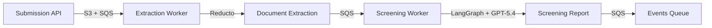
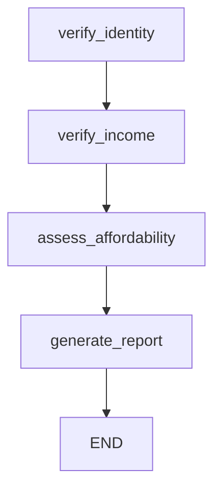

How we structured integration and unit tests for an async Python service that screens rental applicants using LangGraph, SQS workers, S3 storage, and encrypted PostgreSQL repositories — all testable without Docker.

## Table of contents

## The service under test

The applicants-intake-service handles the full screening pipeline for Portuguese real-estate applicants:



The screening worker runs a 4-step LangGraph pipeline: verify identity, verify income, assess affordability, and generate a final risk report. Each step uses structured output from GPT-5.4.

The challenge: how do you test a service that depends on PostgreSQL, S3, SQS, OpenAI, Reducto, and field-level RSA encryption — without turning your test suite into an infrastructure exercise?

## Test strategy

We split tests into two layers:

| Layer | What it tests | Database | External services |
|-------|---------------|----------|-------------------|
| **Unit** | Service logic, domain models, crypto | None | `AsyncMock` for everything |
| **Integration** | API routes, repositories, full request lifecycle | SQLite in-memory | `AsyncMock` for S3/SQS |

Both layers run with `pytest-asyncio` in `auto` mode — no `@pytest.mark.asyncio` decorators needed:

```toml file="pyproject.toml"
[tool.pytest.ini_options]
asyncio_mode = "auto"
testpaths = ["tests"]
pythonpath = ["src"]
```

## Fixture architecture

### Root fixtures: encryption and database

The root `conftest.py` provides session-scoped encryption keys and a per-test SQLite database:

```python file="tests/conftest.py"
@pytest.fixture(scope="session")
def rsa_key_pair():
    private_key = rsa.generate_private_key(public_exponent=65537, key_size=2048)
    public_key = private_key.public_key()
    return public_key, private_key

@pytest.fixture(scope="session")
def hmac_key():
    return os.urandom(32)

@pytest.fixture
async def db_session() -> AsyncGenerator[AsyncSession]:
    engine = create_async_engine("sqlite+aiosqlite:///:memory:")
    async with engine.begin() as conn:
        await conn.run_sync(Base.metadata.create_all)

    session_factory = async_sessionmaker(engine, expire_on_commit=False)
    async with session_factory() as session:
        yield session

    async with engine.begin() as conn:
        await conn.run_sync(Base.metadata.drop_all)
    await engine.dispose()
```

RSA keys are generated once per test session (they're expensive). The database is created fresh for each test — `create_all` builds all tables from SQLAlchemy models, and `drop_all` tears them down after.

### Integration fixtures: mocking infrastructure, not logic

The integration `conftest.py` wires up the full FastAPI app with mocked infrastructure:

```python file="tests/integration/conftest.py"
@pytest.fixture
def mock_storage():
    storage = AsyncMock()
    storage.verify_exists.return_value = True
    storage.get_upload_url.return_value = "https://s3.example.com/presigned"
    return storage

@pytest.fixture
def mock_publisher():
    return AsyncMock()

@pytest.fixture
async def app_with_db(encryption_keys, mock_storage, mock_publisher, monkeypatch):
    public_key, private_key, hmac_key = encryption_keys
    monkeypatch.setenv("DATABASE_URL", "sqlite+aiosqlite:///:memory:")

    engine = create_async_engine("sqlite+aiosqlite:///:memory:")
    async with engine.begin() as conn:
        await conn.run_sync(Base.metadata.create_all)

    session_factory = async_sessionmaker(engine, expire_on_commit=False)

    with patch("applicant_management.entrypoints.api.logfire") as mock_logfire:
        mock_logfire.instrument_fastapi = lambda app: None

        from applicant_management.entrypoints.api import create_app
        app = create_app()

        async def override_db_session():
            async with session_factory() as session:
                yield session

        app.dependency_overrides[get_db_session] = override_db_session

        with (
            patch("...dependencies.get_encryption_keys",
                  side_effect=lambda: (public_key, private_key, hmac_key)),
            patch("...dependencies.get_storage", return_value=mock_storage),
            patch("...dependencies.get_publisher", return_value=mock_publisher),
        ):
            yield app, session_factory

    async with engine.begin() as conn:
        await conn.run_sync(Base.metadata.drop_all)
    await engine.dispose()
```

The key pattern: **mock infrastructure (S3, SQS, Logfire), keep business logic real**. The app runs with actual FastAPI routing, actual Pydantic validation, actual SQLAlchemy queries — just against SQLite instead of PostgreSQL, and `AsyncMock` instead of AWS.

### Repository factories

Integration tests need to seed data directly through repositories. We use factory fixtures that receive a session:

```python file="tests/integration/conftest.py"
@pytest.fixture
def applicant_repo(session_factory, encryption_keys):
    public_key, private_key, hmac_key = encryption_keys

    class _Factory:
        def __call__(self, session):
            return SqlAlchemyApplicantRepository(session, public_key, private_key, hmac_key)

    return _Factory()

@pytest.fixture
def report_repo():
    class _Factory:
        def __call__(self, session):
            return SqlAlchemyScreeningReportRepository(session)

    return _Factory()
```

This lets tests create data through the same encrypted repository code that production uses:

```python
async def test_get_screening_status_completed(client, session_factory, applicant_repo, report_repo):
    async with session_factory() as session:
        repo = applicant_repo(session)
        applicant = Applicant(
            nif="222222222",
            name="Completed User",
            date_of_birth=date(1990, 6, 15),
            email="completed@example.com",
            organization_id=uuid4(),
            form_request_id=uuid4(),
            listing_type=ListingType.ARRENDAMENTO,
            property_type=PropertyType.APARTAMENTO,
            monthly_rent=800.0,
        )
        applicant = await repo.save(applicant)

        rr = report_repo(session)
        report = ScreeningReport(
            applicant_id=applicant.id,
            risk_level=RiskLevel.LOW,
            identity_verified=True,
            income_verified=True,
            dti_ratio=0.25,
            justification="Todas as verificações passaram",
            listing_type=ListingType.ARRENDAMENTO,
            property_type=PropertyType.APARTAMENTO,
            average_monthly_income=3200.0,
        )
        await rr.save(report)

    response = await client.get(f"/api/v1/applicants/submissions/{applicant.id}/status")
    assert response.status_code == 200
    data = response.json()
    assert data["status"] == "COMPLETED"
    assert data["report"]["risk_level"] == "LOW"
    assert data["report"]["dti_ratio"] == 0.25
```

## Unit testing the screening service

The screening service is the most complex piece — it orchestrates repositories, a LangGraph assessor, a translator, and an event publisher. Unit tests mock every port and verify the orchestration logic:

```python file="tests/unit/test_screening_service.py"
@pytest.fixture
def mock_deps():
    report_repo = AsyncMock()
    report_repo.get_by_applicant_id.return_value = None
    return {
        "applicant_repo": AsyncMock(),
        "document_repo": AsyncMock(),
        "extracted_data_repo": AsyncMock(),
        "report_repo": report_repo,
        "assessor": AsyncMock(),
        "publisher": AsyncMock(),
        "event_repo": AsyncMock(),
        "events_queue_url": "http://localhost:4566/000000000000/events-queue",
        "translator": AsyncMock(),
    }

@pytest.fixture
def service(mock_deps):
    return ScreeningService(**mock_deps)
```

Every dependency is an `AsyncMock`. The service constructor takes `Protocol`-typed ports, so mocks slot in without any adapter code:

```python
class ScreeningAssessor(Protocol):
    async def assess(self, applicant: Applicant, extracted_data: list[ExtractedData]) -> ScreeningReport: ...
```

### Happy path

```python
async def test_screen_applicant_happy_path(self, service, mock_deps):
    applicant_id = uuid4()
    applicant = Applicant(
        id=applicant_id, nif="123456789", name="Test User",
        date_of_birth=date(1990, 1, 1), email="test@example.com",
        organization_id=uuid4(), form_request_id=uuid4(),
        listing_type=ListingType.ARRENDAMENTO,
        property_type=PropertyType.APARTAMENTO, monthly_rent=800.0,
    )
    mock_deps["applicant_repo"].get_by_id.return_value = applicant

    doc = Document(
        applicant_id=applicant_id, s3_key="test/doc.pdf",
        original_filename="doc.pdf", content_type="application/pdf",
        document_type=DocumentType.ID_DOCUMENT, status=DocumentStatus.EXTRACTED,
    )
    mock_deps["document_repo"].get_by_applicant_id.return_value = [doc]

    extracted = ExtractedData(
        document_id=doc.id, extracted_content={"content": "test"},
        extraction_status=ExtractionStatus.SUCCESS,
    )
    mock_deps["extracted_data_repo"].get_by_document_id.return_value = extracted

    report = ScreeningReport(
        applicant_id=applicant_id, risk_level=RiskLevel.LOW,
        identity_verified=True, income_verified=True, dti_ratio=0.25,
        justification="All checks passed",
        listing_type=ListingType.ARRENDAMENTO,
        property_type=PropertyType.APARTAMENTO, average_monthly_income=3200.0,
    )
    mock_deps["assessor"].assess.return_value = report
    mock_deps["report_repo"].save.return_value = report
    mock_deps["translator"].translate.return_value = "Todas as verificações passaram"

    await service.screen_applicant(applicant_id)

    mock_deps["assessor"].assess.assert_called_once()
    mock_deps["translator"].translate.assert_called_once_with(
        "All checks passed", "European Portuguese (pt-PT)"
    )
    saved_report = mock_deps["report_repo"].save.call_args[0][0]
    assert saved_report.justification == "Todas as verificações passaram"
```

### Idempotency: dedup and force re-screening

SQS delivers messages at least once. The service checks for existing reports before doing work:

```python
async def test_screen_applicant_skips_when_already_screened(self, service, mock_deps):
    """Duplicate SQS messages should not trigger redundant screening."""
    existing_report = ScreeningReport(
        applicant_id=uuid4(), risk_level=RiskLevel.LOW,
        identity_verified=True, income_verified=True, dti_ratio=0.25,
        justification="Already screened",
        listing_type=ListingType.ARRENDAMENTO,
        property_type=PropertyType.APARTAMENTO, average_monthly_income=3200.0,
    )
    mock_deps["report_repo"].get_by_applicant_id.return_value = existing_report

    await service.screen_applicant(existing_report.applicant_id)

    mock_deps["assessor"].assess.assert_not_called()
    mock_deps["report_repo"].save.assert_not_called()
```

But DLQ reprocessing needs to bypass the dedup:

```python
async def test_screen_applicant_force_bypasses_dedup(self, service, mock_deps):
    """DLQ reprocessing with force=True should re-run screening."""
    mock_deps["report_repo"].get_by_applicant_id.return_value = existing_report
    # ... setup applicant, docs, new report ...

    await service.screen_applicant(applicant_id, force=True)

    mock_deps["assessor"].assess.assert_called_once()
```

The service code that makes this work:

```python file="application/services/screening.py"
async def screen_applicant(self, applicant_id: UUID, *, force: bool = False) -> None:
    if not force:
        existing_report = await self._report_repo.get_by_applicant_id(applicant_id)
        if existing_report:
            logger.info("screening_skipped_dedup", applicant_id=str(applicant_id))
            return

    with logfire.span("screening.screen_applicant", applicant_id=str(applicant_id)):
        await self._do_screen(applicant_id)
```

### Translation failure fallback

The justification is translated to Portuguese, but translation failures shouldn't break screening:

```python
async def test_screen_applicant_translation_failure_falls_back(self, mock_deps):
    mock_deps["translator"].translate.side_effect = RuntimeError("API error")
    service = ScreeningService(**mock_deps)
    # ... setup applicant, docs, report ...

    await service.screen_applicant(applicant_id)

    mock_deps["translator"].translate.assert_called_once()
    saved_report = mock_deps["report_repo"].save.call_args[0][0]
    assert saved_report.justification == "All checks passed"  # English fallback
```

The production code wraps translation in a try/except:

```python
if self._translator and report.justification:
    try:
        report.justification = await self._translator.translate(
            report.justification, "European Portuguese (pt-PT)"
        )
    except Exception:
        logger.warning("translation_failed", applicant_id=str(applicant_id), exc_info=True)
```

## Integration testing the full API

Integration tests hit the actual FastAPI routes via `httpx.AsyncClient` with ASGI transport — no HTTP server needed:

```python file="tests/integration/conftest.py"
@pytest.fixture
async def client(app_with_db):
    app, _ = app_with_db
    transport = ASGITransport(app=app)
    async with AsyncClient(transport=transport, base_url="http://test") as ac:
        yield ac
```

### End-to-end flow test

The most valuable integration test covers the full lifecycle:

```python file="tests/integration/test_api.py"
async def test_full_intake_to_submission_flow(client, mock_publisher):
    """End-to-end: create intake form request, submit applicant docs, check status."""
    mock_publisher.reset_mock()
    org_id = str(uuid4())

    # 1. Agency creates intake form request
    form = await _create_intake_form_request(
        client, organization_id=org_id,
        property_type="APARTAMENTO", property_title="T3 no Porto", property_price=750.0,
    )
    assert form["organization_id"] == org_id
    form_id = form["id"]

    # 2. Applicant submits documents
    submission = await _create_submission(
        client, organization_id=org_id, form_request_id=form_id,
        nif="888888888", name="Maria Santos", email="maria@example.com",
        monthly_rent=750, property_title="T3 no Porto",
    )
    applicant_id = submission["applicant_id"]
    assert submission["documents_uploaded"] == 1

    # 3. Check screening status (should be PROCESSING)
    response = await client.get(f"/api/v1/applicants/submissions/{applicant_id}/status")
    assert response.status_code == 200
    assert response.json()["status"] == "PROCESSING"

    # 4. Verify applicant appears in org listing
    response = await client.get("/api/v1/applicants/", params={"organization_id": org_id})
    assert response.status_code == 200
    applicants = response.json()
    assert len(applicants) == 1
    assert applicants[0]["name"] == "Maria Santos"

    # 5. Verify intake form request now has a submission
    response = await client.get(f"/api/v1/applicants/intake-form-requests/{form_id}")
    assert response.status_code == 200
    assert response.json()["submission"] is not None

    # 6. Extraction messages were published
    assert mock_publisher.publish.call_count == 1
```

This test exercises: intake form creation, document submission with S3 key validation, NIF validation, applicant creation with encryption, status tracking, organization-scoped listing, and SQS message publishing — all in one flow.

### Validation edge cases

```python
async def test_create_submission_invalid_nif(client):
    response = await client.post(
        "/api/v1/applicants/submissions",
        json=_submission_payload(str(uuid4()), str(uuid4()), nif="12345"),
    )
    assert response.status_code == 422  # Pydantic rejects NIF < 9 digits

async def test_create_submission_invalid_s3_key(client):
    response = await client.post(
        "/api/v1/applicants/submissions",
        json=_submission_payload(str(uuid4()), form_request_id,
            documents=[{"s3_key": "wrong-prefix/file.pdf", ...}]),
    )
    assert response.status_code == 400
    assert "Invalid S3 key" in response.json()["detail"]

async def test_create_submission_file_not_in_s3(client, mock_storage):
    mock_storage.verify_exists.return_value = False
    # ... submit with valid S3 key format ...
    assert response.status_code == 400
    assert "File not found in S3" in response.json()["detail"]
    mock_storage.verify_exists.return_value = True  # Reset for other tests
```

## The screening pipeline (what we're testing around)

For context, the LangGraph pipeline that unit tests mock out looks like this:

```python file="adapters/outbound/langchain_screening.py"
class LangChainScreeningAssessor:
    def __init__(self, openai_api_key: str) -> None:
        self._llm = ChatOpenAI(model="gpt-5.4", api_key=openai_api_key)
        self._graph = self._build_graph()

    def _build_graph(self) -> CompiledStateGraph:
        graph = StateGraph(ScreeningState)
        graph.add_node("verify_identity", self._verify_identity)
        graph.add_node("verify_income", self._verify_income)
        graph.add_node("assess_affordability", self._assess_affordability)
        graph.add_node("generate_report", self._generate_report)

        graph.set_entry_point("verify_identity")
        graph.add_edge("verify_identity", "verify_income")
        graph.add_edge("verify_income", "assess_affordability")
        graph.add_edge("assess_affordability", "generate_report")
        graph.add_edge("generate_report", END)

        return graph.compile()
```



Each node uses `with_structured_output()` to get typed Pydantic responses. The `assess()` method converts the final state into a `ScreeningReport` domain model. In tests, we mock the entire `ScreeningAssessor` protocol — we don't test OpenAI's ability to return valid JSON, we test our service's ability to orchestrate the result correctly.

## Docker Compose for local development

While tests use in-memory SQLite and mocks, local development uses the real stack:

```yaml file="docker-compose.yml"
services:
  postgres:
    image: postgres:15
    ports:
      - "5432:5432"
    environment:
      POSTGRES_USER: postgres
      POSTGRES_PASSWORD: postgres
      POSTGRES_DB: applicant_management

  localstack:
    image: localstack/localstack:latest
    ports:
      - "4566:4566"
    environment:
      - SERVICES=s3,sqs

  worker-extraction:
    build: .
    command: uv run python -m applicant_management.entrypoints.worker --queue extraction
    depends_on: [postgres, localstack]

  worker-screening:
    build: .
    command: uv run python -m applicant_management.entrypoints.worker --queue screening
    depends_on: [postgres, localstack]
```

LocalStack provides S3 and SQS locally. Workers consume queues just like they do in production. The `--queue` flag selects which worker type to run.

## Key takeaways

- **Mock infrastructure, not logic** — `AsyncMock` for S3/SQS, real SQLAlchemy against SQLite. This catches query bugs without Docker overhead.
- **Protocol ports make testing trivial** — every external dependency is a `Protocol` interface. `AsyncMock()` satisfies any protocol without adapter code.
- **`asyncio_mode = "auto"` removes ceremony** — no decorators, no manual event loop management. Async tests read like sync tests.
- **Factory fixtures for repositories** — callable fixtures that receive a session let tests seed data through the same encrypted code paths production uses.
- **Test idempotency explicitly** — SQS at-least-once delivery means your service will be called multiple times. Test that the second call is a no-op, and that `force=True` bypasses it.
- **ASGI transport eliminates test servers** — `httpx.AsyncClient` with `ASGITransport` tests the full request pipeline (middleware, validation, routing) without starting uvicorn.
- **Fallback behavior needs its own test** — translation failure is a graceful degradation, not an error. If you don't test it, a future refactor might turn it into a crash.
