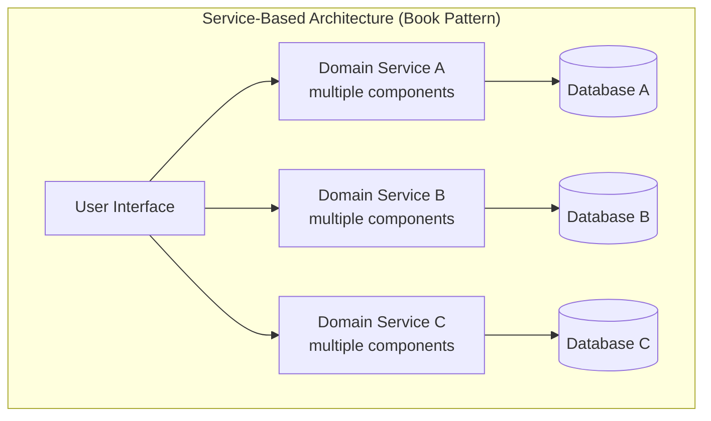
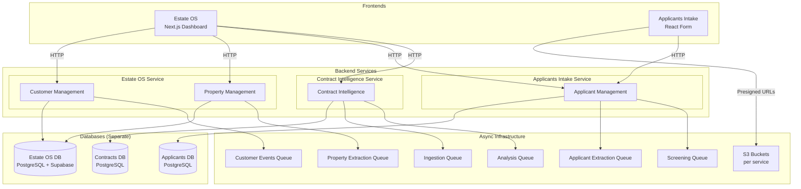
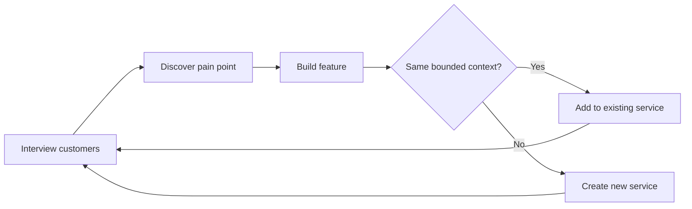
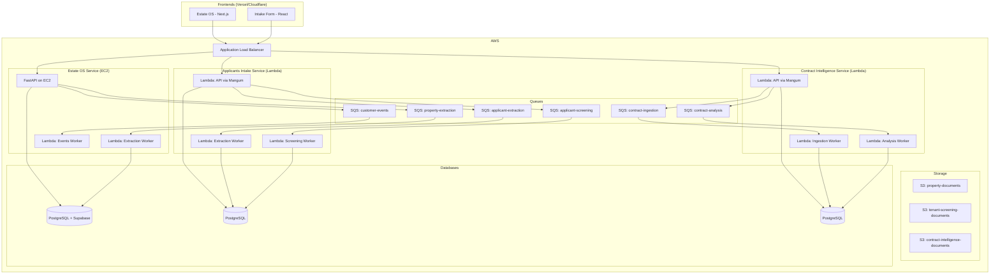

Why we landed on service-based architecture for a real estate AI platform — not microservices, not a monolith — and how iterative customer interviews shaped the system boundaries organically.

## Table of contents

## What is service-based architecture?

In "Fundamentals of Software Architecture" by Mark Richards and Neal Ford, service-based architecture is described as a pragmatic middle ground between a monolith and microservices. It consists of a small number of coarse-grained domain services (typically 4-12), each independently deployed, with either shared or separate databases.

The key difference from microservices: services are **domain-scoped**, not **function-scoped**. A single service can contain multiple components and even multiple bounded contexts. There's no dogma about "one service per aggregate" or "one database per service" — the architecture adapts to what makes sense for the team and domain.

Compare this to microservices, where you'd have 15-30+ fine-grained services, each with its own database, its own deployment pipeline, its own monitoring. For a solo developer building a new product, that's operational overhead without proportional benefit.

And compare it to a monolith, where all bounded contexts share a single deployable unit. Fast to start, but domains become coupled as the system grows — changing one context risks breaking another.

Service-based architecture gives you **independent deployability** without the **operational tax** of microservices.

## Our topology

Predileto consists of 4 backend services and 2 frontend applications:

Each service:
- Has its **own database** (separate PostgreSQL instances)
- Has its **own S3 bucket** (`property-documents`, `tenant-screening-documents`, `contract-intelligence-documents`)
- Has its **own SQS queues** for async processing
- Is **independently deployable**
- Follows **hexagonal architecture** internally (ports & adapters)
- Communicates with other services via **HTTP** (synchronous) or **SQS events** (asynchronous)

The Estate OS Service is the largest — it contains two bounded contexts (Customer Management and Property Management). The others each have one. This 2-1-1 distribution is exactly the kind of coarse granularity the book describes.

## Why not microservices?

Microservices would mean splitting the Estate OS Service into separate Customer and Property services, each with its own database, deployment pipeline, and monitoring. The Contract Intelligence Service might split further into ingestion, analysis, and template services.

For a solo developer building a product, this creates problems:

**Operational overhead scales with service count.** Each microservice needs its own CI/CD pipeline, its own CloudWatch alarms, its own health checks, its own Terraform module. With 4 services, this is manageable. With 12+, it becomes a full-time job just keeping the lights on.

**Cross-service transactions become complex.** When a property is created in the Property service and needs a customer notification, you need sagas or choreography. With both contexts in one service, it's a function call with a shared database transaction.

**Team size doesn't justify the decomposition.** Microservices solve an organizational problem — independent teams shipping independently. With one developer, there are no coordination costs to eliminate. The architecture would serve an organizational structure that doesn't exist.

**Premature decomposition is worse than premature optimization.** Splitting services before you understand the domain means you'll draw boundaries in the wrong places, then spend months migrating data between services to fix it.

## Why not a monolith?

A monolith would have been the fastest way to start. One codebase, one database, one deployment. But Predileto didn't start with a clear picture of what it would become.

The first feature was property ingestion — upload documents, extract data, register properties. That could have been a module in a monolith. Then came applicant screening — a completely different workflow with different data, different users (tenants vs. agents), and different regulatory requirements (NIF encryption, GDPR).

If both lived in a monolith:
- The applicant's encrypted NIF would share a database with property data that has no encryption requirements
- Deployment of a property feature would risk breaking the screening pipeline
- The screening service's heavier LLM processing (LangGraph with 4 sequential nodes) would compete for resources with the property API's fast CRUD operations

More importantly, the bounded contexts **weren't known upfront**. Each one emerged from a different customer interview, a different pain point, a different discovery. A monolith would have coupled these domains before I understood they were separate.

## How domain discovery shaped the architecture

I didn't start with a service map. I started with a problem — finding apartments in Portugal was terrible — and built from there.

**Phase 1: Property management.** After talking to agencies, I learned they spend hours manually registering properties from paper documents. I built the Estate OS Service with a Property Management context: upload PDFs, OCR with Reducto, extract with GPT-5.4, register in database. Customer Management lived alongside it because agencies needed accounts and organizations.

**Phase 2: Applicant screening.** More interviews revealed that tenant screening was another massive time sink. But this was fundamentally different: different users (tenants, not agents), different documents (ID cards and payslips, not property deeds), different workflows (multi-step LangGraph assessment, not single-shot extraction), and different compliance requirements (encrypted PII). It became its own service from day one.

**Phase 3: Contract intelligence.** Agencies told me they draft contracts by copy-pasting from templates and manually filling fields. The contract parsing and template generation workflow was complex enough — Reducto pipeline, LLM section classification, Jinja template promotion — that it deserved its own service with its own SQS queues and DLQ handling.

Each phase followed the same pattern:

This iterative process is exactly what service-based architecture accommodates. You don't need to know all your services upfront. You start with one, discover new domains through use, and split when the domain boundaries become clear. The architecture **emerges** rather than being designed in advance.

With microservices, I would have needed to commit to service boundaries before understanding the domain. With a monolith, I would have coupled contexts that turned out to be independent. Service-based architecture let me discover the right boundaries at my own pace.

## Architecture characteristics ratings

The book rates service-based architecture on a 1-5 star scale across key architecture characteristics. Here's how those ratings map to Predileto's reality:

| Characteristic | Rating | Predileto Context |
|---|---|---|
| **Overall agility** | 4/5 | High. Adding a new feature means either extending an existing service or creating a new one. No coordination overhead. |
| **Deployment** | 4/5 | Each service deploys independently. Estate OS Service on EC2 + Lambda workers. Intake and Contract services are Lambda-only. Zero-downtime deployments. |
| **Testability** | 4/5 | Hexagonal architecture in every service means domain logic is testable without infrastructure. Integration tests use LocalStack and SQLite. |
| **Performance** | 3/5 | Adequate. The bottleneck is LLM calls (Reducto OCR, GPT-5.4), not inter-service communication. HTTP between services adds minimal latency. |
| **Scalability** | 3/5 | Each service scales independently. Lambda-based services auto-scale. The EC2-based Estate OS Service is the constraint, but handles current load. |
| **Simplicity** | 3/5 | Simpler than microservices, more complex than a monolith. 4 services is manageable for one developer. Each follows the same hexagonal pattern, reducing cognitive load. |
| **Overall cost** | 4/5 | Lambda-first for two services keeps costs near zero at low traffic. EC2 for the main API is a fixed cost but avoids Lambda cold starts for the most-used endpoints. |
| **Fault tolerance** | 4/5 | Service isolation means a screening pipeline failure doesn't affect property management. SQS with DLQ handling ensures no messages are lost. |
| **Elasticity** | 3/5 | Lambda services are elastic by default. EC2 service would need auto-scaling groups for true elasticity, but current traffic doesn't warrant it. |

The ratings that matter most for Predileto are **agility** (shipping features fast as a solo developer), **deployment** (independent releases without risk), and **fault tolerance** (one service failing doesn't take down the platform).

## Deployment topology

The deployment follows a hybrid pattern:

- **Estate OS Service** runs on EC2 with Lambda workers. The API handles the most traffic (property CRUD, customer auth) and benefits from always-warm instances. Long-running extraction jobs offload to Lambda via SQS.
- **Applicants Intake and Contract Intelligence** are fully Lambda-based — API (via Mangum) and workers. Traffic is lower and bursty, making Lambda's pay-per-request model cost-effective.
- **Frontends** deploy to Vercel/Cloudflare Pages — static hosting with edge caching.

All services sit behind a single ALB that routes by path prefix. This gives a unified API surface to the frontends while keeping services independently deployable.

## Key takeaways

- **Service-based architecture is the pragmatic default for small teams.** You get independent deployability and fault isolation without the operational overhead of microservices. The book recommends 4-12 services — Predileto has 4, which is manageable for one developer.
- **Domain boundaries emerge through use, not upfront design.** I didn't know the bounded contexts when I started. Customer interviews revealed each one. Service-based architecture accommodates this organic growth — you split when the domain tells you to, not when an architecture diagram says you should.
- **Coarse-grained services reduce coordination costs.** The Estate OS Service has two bounded contexts in one deployable unit. They share a database transaction boundary, which is simpler than distributed sagas. If they grow apart, splitting is straightforward — the hexagonal architecture already separates them internally.
- **Hexagonal architecture inside each service enables future decomposition.** Every service follows ports & adapters. If a bounded context outgrows its service, extracting it means moving code between packages and wiring up a new database — not rewriting business logic.
- **Match deployment topology to traffic patterns.** High-traffic, latency-sensitive services (property API) run on always-warm EC2. Low-traffic, bursty services (applicant screening) run on Lambda. The architecture doesn't prescribe one deployment model for all services.
- **Start with one service and let the architecture grow.** The worst outcome is designing a 12-service microservices topology for a domain you don't yet understand. Build the first feature, talk to customers, build the next. The service boundaries will reveal themselves.
